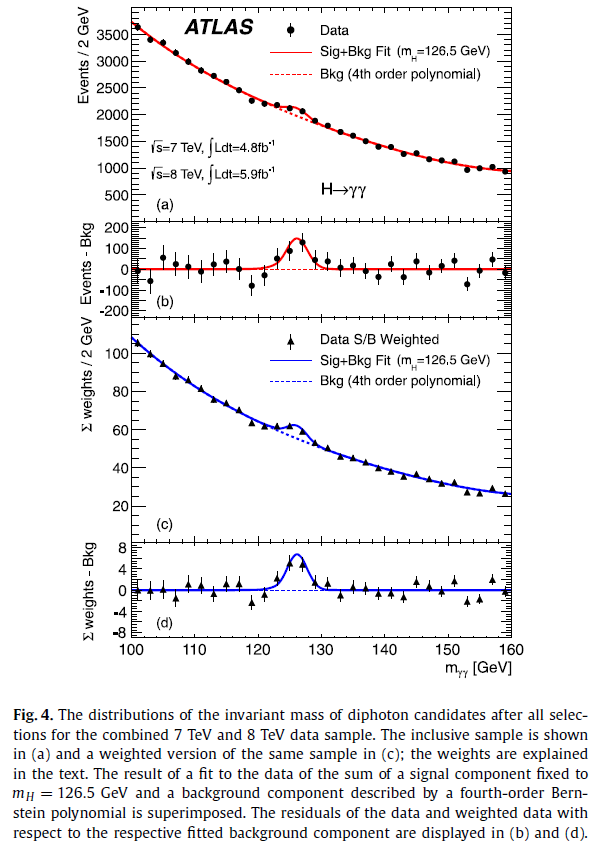
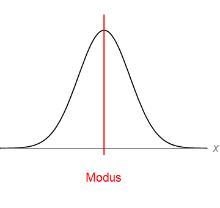
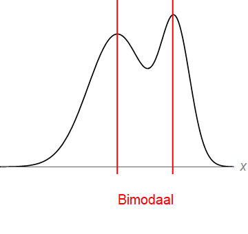
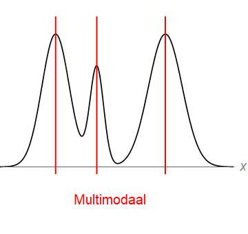

# Basisbegrippen in de statistiek

1. Ordered TOC
{:toc}

## Introductie

Statistiek is een belangrijk onderdeel in vele werkvelden. Als wetenschapper zul je later hoogstwaarschijnlijk te maken krijgen met het verzamelen van data bij het onderzoek dat je uitvoert. Deze data wordt dan verzameld om een antwoord te vinden op de onderzoeksvraag. Maar wanneer kun je zeggen dat het antwoord ook juist is? Wanneer heb je genoeg data verzameld? Hierbij gaat het erom dat andere wetenschappers er ook van overtuigd moeten raken dat jouw onderzoek gedegend is uitgevoerd, en dat de conclusie die uit de resultaten wordt getrokken ook correct is.

Denk bijvoorbeeld eens terug aan het moment waarop aan de wereld kenbaar werd gemaakt dat, met grote waarschijnlijkheid, het Higgs deeltje was gevonden (ATLAS en CMS teams op CERN in 2012). In 1964 is het bestaan van dit deeltje al voorspeld om de massa van de elementaire deeltjes zoals elektronen, muonen en quarks te kunnen verklaren (deze voorspelling is trouwens niet alleen door Peter Higgs gedaan maar ook (iets) eerder al door Robert Brout en François Englert).

Het higgs deeltje is niet te zien met het menselijk oog, dus je kunt het alleen vinden door de eventuele sporen die het deeltje achterlaat (botsingen met andere deeltjes). Om deze sporen te kunnen vinden en hier een patroon in te ontdekken, is het nodig om heel veel data te verzamelen. De bulk data wordt in eerste instantie verzameld in grote tabellen. Het is echter lastig om hier patronen in te vinden, de data moet verwerkt worden tot een visuele weergave. Hieronder staat de visueel weergegeven data, waaruit is geconcludeerd dat het Higgs deeltje met grote waarschijnlijkheid bestaat (Bron: ATLAS Collaboration / Physics Letters B 716 (2012) 1–29, [Link](https://doi.org/10.1016/j.physletb.2012.08.020)):

{:width = "30%"}{:width = "30%"}

Het visueel weergeven van de data alleen is niet genoeg, de data moet ook vergeleken worden met de achtergrondenergie (linker figuur) of met een model (rechter figuur). Daarnaast kun je niet zoveel met de figuur als er geen uitleg wordt gegeven, daarom wordt in het onderschrift en het artikel zelf, toegelicht wat er te zien is in de figuren. Dan zijn de vragen 'wat zien we?' en 'ten opzichte van wat zien we dat dan?' beantwoord, maar nu moet de vraag nog beantwoord worden of het waargenomen verschil in energie (het piekje) wel groot genoeg is om te kunnen spreken van een nieuw deeltje. Is het niet gewoon de achtergrondenergie die waargenomen is? Om deze vragen te kunnen beantwoorden is de data statistisch geanalyseerd. De uiteindelijke conclusie was dat er met 97% zekerheid gezegd kan worden dat het waargenomen deeltje ook daadwerkelijk het Higgs deeltje is.  

In deze cursus zullen we gaan kijken naar statistische data-analyse.

Deze week beginnen we met een aantal basisbegrippen in de statistiek. We gaan kijken naar het gemiddelde, variantie, de standaardafwijking, en coëfficient van variantie. Daarnaast bekijken we het verschil tussen een grafiek, een staafdiagram en een histogram en plotten we deze in Python voor verschillende datasets.

## Datasets beschrijven
Het verzamelen van data zelf is niet genoeg. Als we de data hebben moeten we deze kunnen beschrijven aan anderen. Stel we hebben een dataset met de temperatuur op elk van de 37 meetpunten van het KNMI in Nederland in de afgelopen twintig jaar.  Het is dan niet zo inzichtelijk om dit aan medewetenschappers te presenteren d.m.v. een enorme tabel (elke 10 minuten wordt een meting gedaan door de weerstations) met de mededeling 'dit was de temperatuur in de afgelopen twintig jaar'. 
Een dataset heeft verschillende eigenschappen, zo zouden we bijvoorbeeld iets kunnen zeggen over het midden van de dataset, de waarden die de temperatuur minimaal en maximaal aanneemt, en hoe ver elke temperatuur van het midden af zit.

In de secties hieronder behandelen we verscheidene begrippen.

### Populatie versus steekproef

Een *populatie* bestaat uit alle personen/dieren/objecten binnen de groep waarin we geïnteresseerd zijn. Dit zouden bijvoorbeeld *alle* mensen in Nederland kunnen zijn tussen de 30 en 40 jaar, of *alle* lieveheersbeestjes die in Noorwegen leven. Nu is het zo dat het vaak lastig is om van *alle* personen/dieren/objecten (hierna uniform aangeduid met 'elementen') in een groep data te verzamelen. Het kost bijvoorbeeld erg veel tijd (en geld) om data te verzamelen over alle personen tussen de 30 en 40 jaar in Nederland (of om alle lieveheersbeestjes in Noorwegen te vangen). Het is dan veel makkelijker om data over een deel van deze groep te verzamelen en om zo iets te zeggen over de gehele doelgroep. Zo zouden we bijvoorbeeld data kunnen verzamelen van een random selectie van 200 personen in Nederland tussen de 30 en 40 jaar. Dit wordt een *steekproef* genoemd, de deelgroep wordt in het Engels vaak aangeduid met een *sample*. Een steekproef is dus een gedeelte van de populatie.

### Het gemiddelde

Het gemiddelde van een dataset geeft een maat voor het centrum van de waarden die de dataset aanneemt. We onderscheiden het populatiegemiddelde en het steekproefgemiddelde.

#### Populatiegemiddelde

Als we metingen kunnen doen voor een gehele populatie, en we bepalen het gemiddelde, dan spreken we van het *populatiegemiddelde*. Het populatiegemiddelde wordt vaak aangegeven met het symbool $$\mu$$. Het populatiegemiddelde wordt ook wel de *verwachtingswaarde* genoemd, deze wordt aangegeven met $$E(X)$$.

Als de dataset *discreet* verdeeld is (d.w.z. dat de uitkomsten alleen 'losse' waarden aan kunnen nemen en niet alle tussenwaarden in een interval) dan wordt het populatiegemiddelde/ de verwachtingswaarde gegeven door:

$$\mu=E(X)={\displaystyle \sum_{i=1}^{N}x_{i}\,p(x_i)} $$

Hierbij is $$N$$ het aantal elementen in de populatie, $$x_i,\dots,x_n$$ zijn de uitkomsten en $$p(x_i)$$ is de kans op elke uitkomst. Een Poissonverdedeling is een voorbeeld van een discrete verdeling (komen we later nog op terug), maar ook het gooien van kop of munt levert een discrete verdeling op.
Is de kans op elke uitkomst gelijk dan wordt het populatiegemiddelde, bij een discrete verdeling, gegeven door:

$$\mu=E(X)= \frac{1}{N}{\displaystyle \sum_{i=1}^{N}x_{i}}$$

De kans op elke uitkomst is dan immers gelijk aan $$\frac{1}{N}$$.

Als de dataset *continu* is (d.w.z. dat alle waarden in een interval aangenomen kunnen worden; dit is bijvoorbeeld het geval bij metingen die decimale waarden opleveren) dan heeft deze verdeling een kansdichtheidsfunctie $$f(x)$$. Deze kansdichtheidsfunctie geeft aan welke kans er is op de waarden in de verdeling. Het verschil met de discrete verdeling is dat het bij een continue verdeling niet mogelijk is om de kans op *precies* een waarde $$a$$ binnen de verdeling te bepalen. Hierbij kun je bijvoorbeeld denken aan de verdeling van de lengte van alle mensen in Nederland. De kans om iemand te vinden met een lengte van *precies* 1 meter en 85 centimeter, is gelijk aan nul. Zelfs als een persoon hier dicht bij zit qua lengte zal er altijd een verschil zitten in de orde van millimeters, micrometers, nanometers, etc.   
Bij een continue verdeling kan wel de kans bepaald worden dat een waarde in een interval zit. Het populatiegemiddelde/ de verwachtingswaarde wordt daarom gegeven door de integraal over de waarden $$x$$ in de continue verdeling vermenigvuldigd met de kansdichtheidsfunctie $$f(x)$$:

$$\mu=E(X)={\displaystyle \int_{-\infty}^{\infty}x\,f(x)\,dx} $$

Een normale verdeling (komen we later op terug) is een voorbeeld van een continue verdeling, ook het meten van de tijd die het duurt voordat je aan de beurt bent bij de kassa levert een continue verdeling op.

#### Steekproefgemiddelde

Het is vaak onmogelijk om metingen te doen van een gehele populatie. Daarom wordt er vaak een steekproef gedaan waarbij er aselect (willekeurig) elementen uit de gewenste doelgroep worden gekozen. Uiteindelijk wordt deze steekproef dan gebruikt om iets te kunnen zeggen over de gehele populatie. Hierbij is het echter wel opletten, want de steekproef moet een representatieve doorsnede zijn van de hele populatie. De steekproef moet groot genoeg zijn en de elementen van de steekproef moeten aselect gekozen worden. Je kunt je voorstellen dat als we de lengte van drie mensen in nederland meten, we nog niet zoveel kunnen zeggen over de lengte van de gehele populatie die bestaat uit alle mensen in Nederland. Als we de lengte van 1000 mensen zouden meten dan krijgen we al een beter beeld van de verdeling van lichaamslengte in Nederland, en kiezen we 100000 mensen dan krijgen we een nog veel beter beeld van de verdeling.

Het steekproefgemiddelde $$\overline{x}$$ van een dataset is de som van de waarden $$x_1,\dots,x_n$$ in de set gedeeld door het aantal datapunten $$n$$:

$$\overline{x}=\frac{1}{n}{\displaystyle \sum_{i=1}^{n}x_{i}}$$

Het steekproefgemiddelde wordt zo vaak gebruikt dat dit veelal wordt aangeduid als 'het gemiddelde'. Je ziet dat het steekproefgemiddelde erg lijkt op de uitdrukking voor het populatiegemiddelde van een discrete verdeling. Het verschil is dat het steeksproefgemiddelde niet gelijk is aan de verwachtingswaarde van de populatie. Het is wel zo dat, hoe beter de steekproef overeenkomt met de populatie, des te dichter komt het steekproefgemiddelde bij de verwachtingswaarde van de populatie. Dit geldt zowel voor steekproeven met een discrete als een continue verdedeling. Met behulp van een goed uitgevoerde steekproef kan het statistische gedrag van een populatie dus benaderd worden.

### De mediaan

De mediaan is een maat voor het midden van de elementen in een dataset of verdeling. Hierbij is de data van lage naar hoge waarde gesorteerd.

#### Populatiemediaan

Als we data verzamelen voor een gehele populatie dan is de mediaan $$m$$ de waarde die hoort bij het punt waarop de kans om een element te vinden met een waarde $$x\leq m$$, gelijk is aan 50%. In andere woorden wil dit zeggen, dat de helft van de populatie voldoet aan de voorwaarde $$x \leq m$$. Als bijvoorbeeld de helft van de Nederlanders een lengte heeft kleiner of gelijk aan 1 meter en 85 centimeter, dan is deze 1.85 meter de mediaan $$m$$ van de populatie.  

Voor een symmetrische distributie (zoals een normale verdeling), is de mediaan gelijk aan het populatiegemiddelde $$\mu$$.

#### Steekproefmediaan

Als we alle datapunten in een dataset sorteren van lage naar hoge waarde, dan is de mediaan de waarde van het element in het midden van de set. Is er sprake van een oneven aantal elementen dan is de mediaan de gemiddelde waarde van de twee elementen in het midden van de set.

Neem bijvoorbeeld de volgende datapunten: 

$$10,11,12,13,14$$ 

De data is al gesorteerd van laag naar hoog, en het derde element is in dit geval het middelste element. Het derde element heeft de waarde $$12$$. De mediaan van deze set is dus gelijk aan $$12$$.
Hebben we een set met een even aantal datapunten, bijvoorbeeld

$$ 8,9,10,11,12,13,14,15$$ 

dan zitten het 4e en het 5e element in het midden. De mediaan is nu gelijk aan de gemiddelde waarde van deze elementen. De elementen hebben waarde $$11$$ en $$12$$, wat betekent dat de mediaan gelijk is aan $$\frac{11+12}{2} = 11.5$$.

Voor symmetrische datasets zijn het gemiddelde en de mediaan gelijk aan elkaar.

### De modus

#### Steekproefmodus

De modus van een dataset is de waarde die met de grootste frequentie in de dataset voorkomt. Hebben we bijvoorbeeld de dataset 

$$2,2,3,4,7,7,7,9$$ 

dan komen de 3, de 4 en de 9 elk één keer voor, het getal 2 komt twee keer voor en het getal 7 komt drie keer voor. Het meest voorkomende getal is dus de 7 en dit is de modus van de dataset. Als een dataset één modus heeft dan wordt deze *unimodaal* genoemd.

het komt ook voor dat er twee of meer getallen zijn die even vaak voorkomen. Een dataset met twee getallen als modus wordt ook wel *bimodaal* genoemd, een dataset met meer dan twee getallen als modus wordt *multimodaal* genoemd.

Een voorbeeld van een bimodale dataset is:

$$1,2,3,3,4,4,4,5,6,11,11,11,15$$

zowel het getal 4 als het getal 11 komen drie keer voor in de set. De set is dus bimodaal met modus 4 en modus 11.

#### Populatiemodus

Voor een continue verdeling met dichtheidsfunctie $$f(x)$$ is de modus gedefinieerd als de waarde die met de grootste frequentie in de verdeling voorkomt. Dit houdt in dat het de waarde is die hoort bij het maximum van de dichtheidsfuncite $$f(x)$$. Een voorbeeld van een verdeling (een normale verdeling) met één modus is weergegeven in het figuur hieronder:

{:width="45%"}

Bij een verdeling die beschreven kan worden met een dichtheidsfunctie is het ook mogelijk om meerdere waarden te hebben die een modus zijn. Elk van de waarden waarvoor de dichtheid lokaal maximaal is wordt in principe als een modus gezien. Hierbij hoeven de pieken dus niet gelijk van hoogte te zijn. Bij verdelingen geldt dezelfde naamgeving als bij de steekproefmodus. Heeft de verdeling één lokaal maximum dan is deze *unimodaal*, als er twee lokale maxima zijn dan is de verdeling *bimodaal*, en als er meer lokale maxima zijn dan is deze *multimodaal*. Hieronder is een voorbeeld gegeven van een bimodale en multimodale verdeling.

{: width="30%" style="float:center"}{: width="30%" style="float:center"}

### Spreiding en range

### Standaardafwijking

### Variantie

### Coëfficient van variantie

