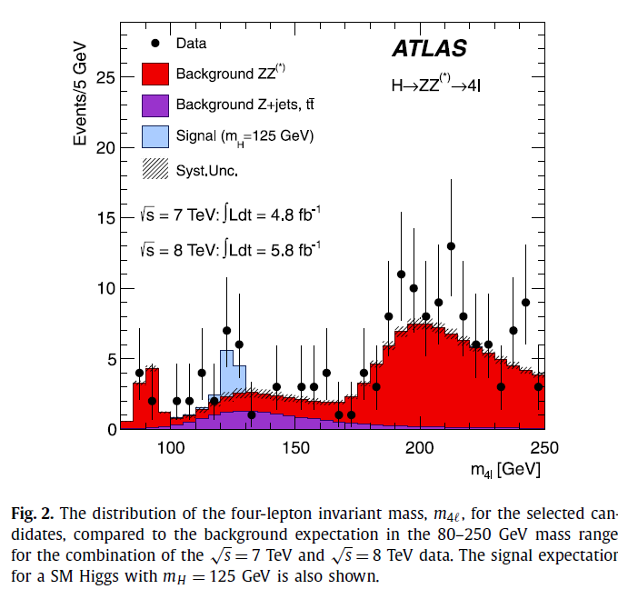

# Basisbegrippen in de statistiek

- dinges
{:toc}

## Introductie

Statistiek is een belangrijk onderdeel in vele werkvelden. Als wetenschapper zul je later hoogstwaarschijnlijk te maken krijgen met het verzamelen van data bij het onderzoek dat je uitvoert. Deze data wordt dan verzameld om een antwoord te vinden op de onderzoeksvraag. Maar wanneer kun je zeggen dat het antwoord ook juist is? Wanneer heb je genoeg data verzameld? Hierbij gaat het erom dat andere wetenschappers er ook van overtuigd moeten raken dat jouw onderzoek gedegend is uitgevoerd, en dat de conclusie die uit de resultaten wordt getrokken ook correct is.

Denk bijvoorbeeld eens terug aan het moment waarop aan de wereld kenbaar werd gemaakt dat, met grote waarschijnlijkheid, het Higgs deeltje was gevonden (ATLAS en CMS teams op CERN in 2012). In 1964 is het bestaan van dit deeltje al voorspeld om de massa van de elementaire deeltjes zoals elektronen, muonen en quarks te kunnen verklaren (deze voorspelling is trouwens niet alleen door Peter Higgs gedaan maar ook (iets) eerder al door Robert Brout en François Englert).

Het higgs deeltje is niet te zien met het menselijk oog, dus je kunt het alleen vinden door de eventuele sporen die het deeltje achterlaat (botsingen met andere deeltjes). Om deze sporen te kunnen vinden en hier een patroon in te ontdekken, is het nodig om heel veel data te verzamelen. De bulk data wordt in eerste instantie verzameld in grote tabellen. Het is echter lastig om hier patronen in te vinden, de data moet verwerkt worden tot een visuele weergave. Hieronder staat de visueel weergegeven data, waaruit is geconcludeerd dat het Higgs deeltje met grote waarschijnlijkheid bestaat (Bron: ATLAS Collaboration / Physics Letters B 716 (2012) 1–29, https://doi.org/10.1016/j.physletb.2012.08.020):

Het visueel weergeven van de data alleen is niet genoeg, de data moet ook vergeleken worden met de achtergrondenergie (linker figuur) of met een model (rechter figuur). Daarnaast kun je niet zoveel met de figuur als er geen uitleg wordt gegeven, daarom wordt in het onderschrift en het artikel zelf, toegelicht wat er te zien is in de figuren. Dan zijn de vragen 'wat zien we?' en 'ten opzichte van wat zien we dat dan?' beantwoord, maar nu moet de vraag nog beantwoord worden of het waargenomen verschil in energie (het piekje) wel groot genoeg is om te kunnen spreken van een nieuw deeltje. Is het niet gewoon de achtergrondenergie die waargenomen is? Om deze vragen te kunnen beantwoorden is de data statistisch geanalyseerd. De uiteindelijke conclusie was dat er met 97% zekerheid gezegd kan worden dat het waargenomen deeltje ook daadwerkelijk het Higgs deeltje is.  

In deze cursus zullen we gaan kijken naar statistische data-analyse.

Deze week beginnen we met een aantal basisbegrippen in de statistiek. We gaan kijken naar het gemiddelde, variantie, de standaardafwijking, en coëfficient van variantie. Daarnaast bekijken we het verschil tussen een grafiek, een staafdiagram en een histogram en plotten we deze in Python voor verschillende datasets.

## Datasets beschrijven
Het verzamelen van data zelf is niet genoeg. Als we de data hebben moeten we deze kunnen beschrijven aan anderen. Stel we hebben een dataset met de temperatuur op elk van de 37 meetpunten van het KNMI in Nederland in de afgelopen twintig jaar.  Het is dan niet zo inzichtelijk om dit aan medewetenschappers te presenteren d.m.v. een enorme tabel (elke 10 minuten wordt een meting gedaan door de weerstations) met de mededeling 'dit was de temperatuur in de afgelopen twintig jaar'. 
Een dataset heeft verschillende eigenschappen, zo zouden we bijvoorbeeld iets kunnen zeggen over het midden van de dataset, de waarden die de temperatuur minimaal en maximaal aanneemt, en hoe ver elke temperatuur van het midden af zit.

In de secties hieronder behandelen we verscheidene begrippen.

### Populatie versus steekproef

Een *populatie* bestaat uit alle personen/dieren/objecten binnen de groep waarin we geïnteresseerd zijn. Dit zouden bijvoorbeeld *alle* mensen in Nederland kunnen zijn tussen de 30 en 40 jaar, of *alle* lieveheersbeestjes die in Noorwegen leven. Nu is het zo dat het vaak lastig is om van *alle* personen/dieren/objecten (hierna uniform aangeduid met 'elementen') in een groep data te verzamelen. Het kost bijvoorbeeld erg veel tijd (en geld) om data te verzamelen over alle personen tussen de 30 en 40 jaar in Nederland (of om alle lieveheersbeestjes in Noorwegen te vangen). Het is dan veel makkelijker om data over een deel van deze groep te verzamelen en om zo iets te zeggen over de gehele doelgroep. Zo zouden we bijvoorbeeld data kunnen verzamelen van een random selectie van 200 personen in Nederland tussen de 30 en 40 jaar. Dit wordt een *steekproef* genoemd, de deelgroep wordt in het Engels vaak aangeduid met een *sample*. Een steekproef is dus een gedeelte van de populatie.

### Het gemiddelde, de mediaan en de modus 

#### Populatie

Als we metingen kunnen doen voor een gehele populatie, en we bepalen het gemiddelde, dan spreken we van het *populatiegemiddelde*. Het populatiegemiddelde wordt vaak aangegeven met het symbool $$\mu$$. Het populatiegemiddelde wordt ook wel de *verwachtingswaarde* genoemd, deze wordt aangegeven met $$E(X)$$.

Als de dataset discreet verdeeld is (d.w.z. dat de uitkomsten alleen 'losse' waarden aan kunnen nemen en niet alle tussenwaarden in een interval) dan wordt het populatiegemiddelde/ de verwachtingswaarde gegeven door:

$$\mu=E(X)={\displaystyle \sum_{i=1}^{N}x_{i}p(x_i)} $$

Hierbij is $$N$$ het aantal elementen in de populatie, $$x_i,\dots,x_n$$ zijn de uitkomsten en $$p(x_i)$$ is de kans op elke uitkomst. Een Poissonverdedeling is een voorbeeld van een discrete verdeling (komen we later nog op terug), maar ook het gooien van kop of munt levert een discrete verdeling op.
Is de kans op elke uitkomst gelijk dan wordt het populatiegemiddelde, bij een discrete verdeling, gegeven door:

$$\mu=E(X)= \frac{1}{N}{\displaystyle \sum_{i=1}^{N}x_{i}}$$

De kans op elke uitkomst is dan immers gelijk aan $$\frac{1}{N}$$.

Als de dataset continu is (d.w.z. dat alle waarden in een interval aangenomen kunnen worden) dan wordt het populatiegemiddelde/ de verwachtingswaarde gegeven door:

$$\mu=E(X)={\displaystyle \int_{-\infty}^{\infty}x\,f(x)\,dx} $$

Hierbij is $$f(x)$$ de kansdichtheidsfunctie die voor de continue verdeling met waarden $$x$$ aangeeft wat de kans is op elke waarde. Een normale verdeling (komen we later op terug) is een voorbeeld van een continue verdeling, ook het meten van de tijd die het duurt voordat je aan de beurt bent bij de kassa levert een continue verdeling op.

#### Streekproef

Het rekenkundig gemiddelde $$\overline{x}$$ van een dataset is de som van de waarden $$x_1,\dots,x_n$$ in de set gedeeld door het aantal datapunten $$n$$:

$$\overline{x}=\frac{1}{n}{\displaystyle \sum_{i=1}^{n}x_{i}}$$

Het rekenkundig gemiddelde wordt zo vaak gebruikt dat dit veelal wordt aangeduid als 'het gemiddelde'. Voor de volledigheid is het echter goed om te weten dat dit eigenlijk het *steekproefgemiddelde* is. We hebben namelijk een steekproef van $$n$$ datapunten. Zo is het meten van de temperatuur door het KNMI een steekproef omdat er elke tien minuten gemeten wordt terwijl de temperatuur doorlopend aanwezig is. Bij de meeste metingen is het gemiddelde daarom ook eigenlijk altijd het steekproefgemiddelde.

Als we metingen kunnen doen van alle elementen van een verzameling (we meten bijvoorbeeld de lengte van *alle* mensen tussen de 30 en 40 jaar in Nederland), en we bepalen het gemiddelde dan spreken we van het *populatiegemiddelde*. Als de dataset discreet verdeeld is (d.w.z. de kans op elke meetwaarde is even groot) dan wordt het populatiegemiddelde gegeven door:

$$\mu=\frac{1}{N}{\displaystyle \sum_{i=1}^{N}x_{i}}$$

Hierbij is 

voor het midden van de waarden die de dataset aan

### Spreiding en range

### Standaardafwijking

### Variantie
Hier gaan we verder met een ander leuk onderwerp. Een formule $$3+2=5$$
We weten dan dat:

$$5+3=8$$

Hier gaan we verder.

### Coëfficient van variantie

## Data visueel weergeven

### Grafieken

### Staafdiagrammen

### Histogrammen

