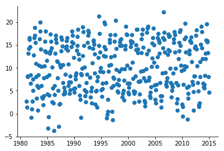

## Data visueel weergeven

In dit deel bekijken we de verschillende manieren om data visueel te representeren. Aan bod komen grafieken, staafdiagrammen en histogrammen. Daarnaast zullen we deze gaan plotten met behulp van Python.

### Grafieken

Een grafiek is over het algemeen een visuele weergave van een functieverband of van data in een tweedimensionaal assenstelsel. Hierbij kun je bijvoorbeeld denken aan het plotten van de   

Er zijn een aantal afspraken m.b.t. het plotten van een functieverband of data in een grafiek.

Als we de grafiek van een dataset plotten dan doen we dat over het algemeen met een **scatter plot** (data wordt weergegeven met punten). Lijnen zijn doorgaans voorbehouden aan theoretische verbanden en fit functies. Gemeten data plotten met een lijn is over het algemeen niet inzichtelijk. De datapunten zijn vak verspreid, en plotten met een lijn geeft dan een onoverzichtelijk resultaat. Daarnaast geeft de lijn niet het werkelijke gedrag van de gemeten data aan. Stel bijvoorbeeld dat we naar de gemiddelde temperatuur per maand van 1981 t/m 2014 in de Bilt willen kijken. Hieronder een plot met een lijn tussen elk datapunt (Bron: KNMI, gehomogeniseerde data):

{:width="40%"}

Je ziet dat dit niet erg duidelijk is. Het is bijvoorbeeld niet precies te zien waar de gemeten punten zitten, we hebben wel een vermoeden voor de plaatsen waarop de lijn abrupt van richting veranderd, maar wie weet zitten er nog wel meer datapunten tussen.

Laten we dezelfde data eens plotten als *scatterplot*:

{:width="40%"}

Vanuit de scatterplot zien we dat er inderdaad sprake is van veel meer datapunten dan er vanuit de lijnplot te zien is. De plot kan echter netter. Zo staan er geen labels op de assen. Nu kunnen we in dit geval wel raden welke as het jaar aangeeft en welke as de temperatuur, maar in veel gevallen is dat niet zo duidelijk. Om die reden moeten er altijd **labels op de assen** staan, zie het figuur hieronder:

{:width="40%"}

Een andere conventie is dat grafieken doorgaans **beginnen bij de oorsprong, tenzij de data dan onvolledig of onleesbaar wordt**. In het geval van het weergeven van de temperaturen van 1981 t/m 2014 wordt de data bijvoorbeeld onvolledig als we de temperatuur bij nul laten beginnen, we hebben immers ook temparaturen onder het vriespunt. Daarnaast wordt de data onleesbaar als we het jaartal vanaf het jaar nul laten lopen, de datapunten voor de jaren waarin we geïntereseerd zijn zullen dan over elkaar vallen. In het huidige geval is het dus niet van toepassing om in de oorsprong te beginnen, maar dit is bij elke dataset wel het uitgangspunt.

De assen kunnen nog wat netter. Zo eindigd de $$x$$-as *na* de waarde $$20$$, maar het is niet helemaal duidelijk bij welke waarde precies. De $$y$$-as begint een klein stukje voor 1980 en eindigd een klein stukje na 2015. Conventie is om assen te laten **beginnen en eindigen op een maatstreepje**. Daarnaast willen we niet te veel maatstreepjes maar ook niet te weinig. In het algemeen worden **zeven maatstreepjes** aangehouden voor de goede leesbaarheid (eentje meer of minder is niet erg). In ons geval laten we het jaartal beginnen op 1980 en eindigen op 2015, daarnaast laten we de temperatuur beginnen op $$-5$$ C&deg; en eindigen op $$25$$ C&deg;. Op de $$x$$-as hebben we 8 maatstreepjes en op de $$y$$-as hebben we 7 maatstreepjes:

{:width="40%"}

Stel we willen de temperatuur in de Bilt nu weergeven t.o.v. de 'Centraal Nederland Temperatuur' (CNT). De CNT is een combinatie van vijf weerstations representatief voor het gebied tussen de steden Utrecht, Arnhem, Breda en Eindhoven. De plot ziet er als volgt uit:

{:width="40%"}

De kleuren zijn aangepast t.o.v. eerder. Welk van de twee series hoort bij 'de Bilt' en welke hoort bij 'Centraal Nederland'? Dat is lastig te zien vanuit de plot. Om deze reden wordt er, bij twee of meer series, een **legenda** aan de plot toegevoegd. Bovenstaande plot ziet er met legenda als volgt uit:

{:width="50%"}

Tot nu toe hebben we nog geen titels toegevoegd aan de plots. Dit komt omdat dat voor verslagen en wetenschappelijke artikelen ongebruikelijk is, daar moet het onderschrift namelijk al vertellen wat er te zien is in de grafiek. In webteksten, lesteksten en presentaties kan het echter voorkomen dat een grafiek wel een titel heeft, omdat er in die context vaak geen onderschrift toegevoegd kan worden. 

Samengevat:

- Een grafiek van een dataset wordt geplot met punten (een 'scatter plot'). 
- Het resultaat van een fit of een theoretisch verband wordt met een lijn geplot.
- Bij een enkele dataset wordt geen legenda gebruikt. Als er meerdere datasets in één grafiek worden weergegeven dan is een legenda noodzakelijk.
- Aslabels geven weer wat elke as representeerd (inclusief eenheden).
- Assen beginnen in de oorsprong. Een uitzondering kan zijn als de data heel erg ver van de oorsprong af zit.
- Op elke as staan $$\pm$$ 7 maatstreepjes ('ticks').
- Een as begint en eindigd op een groot maatstreepje met een waarde ('major tick') en niet op een klein maatstreepje of een maatstreep zonder getal.
- Een grafiek voor een wetenschappelijk artikel of een verslag heeft geen titel. Een grafiek voor webteksten of lesmateriaal heeft over het algemeen wel een titel.

### Staafdiagrammen & Histogrammen

Staafdiagrammen en histogrammen lijken grafisch gezien op elkaar. Er is echter een belangrijk verschil tussen een staafdiagram en een histogram. 

Een staafdiagram wordt gebruikt om de frequentie bij een *discrete* verdeling aan de geven. Een voorbeeld van een discrete verdeling is het aantal keer dat er kop of munt gegooid wordt met een muntstuk. De discrete waarden zijn in dit geval 'kop' en 'munt'. Een ander voorbeeld van een discrete verdeling is het aantal inwoners in 'Europa', 'Amerika' en 'Azië'. 

Een histogram wordt gebruikt om het resultaat van een *continue* verdeling mee weer te geven. Dit houdt in dat alle tussenligende waarden aangenomen mogen worden. Een voorbeeld van een continue verdeling is het genereren van random kommagetallen tussen de 0 en de 1. Elke tussenliggende waarde kan aangenomen worden. Een ander voorbeeld van een continue verdeling is het gewicht van elke persoon in Nederland. 

Hieronder aan de linkerkant het resultaat van 100 keer kop/munt gooien met een muntstuk weergegeven in een staafdiagram. Aan de rechterkant het resultaat van het genereren van 1000 random kommagetallen tussen de 0 en de 100:

PLOT7PLOT8

Bij een staafdiagram heeft elke groep een staaf die de frequentie aangeeft. Zo is er bij het bovenstaande voorbeeld een staaf voor de groep 'kop' waaruit we kunnen aflezen dat er 60 keer kop is gegooid. Daarnaast kunnen we vanuit de staaf bij de groep 'munt' aflezen dat er 40 keer munt is gegooid. 

Bij het weergeven van data in een histogram wordt de data gegroepeerd in categoriën. De breedte van de staven (in het vervolg 'bins' genoemd), geeft de breedte van een categorie aan. Zo zijn de categoriën bij het histogram hierboven bijvoorbeeld de getallen van: 0-9, 10-19, 20-29, 30-39, 40-49, 50-59, 60-69, 70-79, 80-89, 90-99. Vanuit het histogram kunnen we bijvoorbeeld aflezen dat er 100 keer een getal tussen de 60 en 69 en tussen de 80 en 89 voorkomt. Daarnaast kunnen we zien dat getallen tussen de 70 en 80 het minst vaak in de dataset voorkomen en dat getallen tussen de 90 en 99 het meeste voorkomen in de dataset.

#### Breedte van de bins bij een histogram

Voor een histogram is de breedte van de categoriën van belang. Als we te weinig bins kiezen dan worden de categoriën erg groot (/breed) en is er minder te zeggen over het gedrag van de data. Als we te veel bins kiezen dan fluctueerd de hoogte van de (smalle) bins onderling erg en kan er ook minder over het gedrag van de data gezegd worden.  

Dit bekijken we aan de hand van een voorbeeld. Zo zou het kunnen zijn dat het ideale plaatje bij een gegeven dataset het volgende is:

{:width="40%"}

Als we te weinig bins kiezen dan wordt de data afgevlakt en kunnen we het bovenstaande gedrag niet meer herkennen:

{:width="40%"}

Kiezen we juist te veel bins, dan kunnen we het gedrag van de data nog wel herkennen (in dit geval) maar er is veel fluctatie in de hoogte van de bins: 

{:width="40%"}

Met het kiezen van te veel bins hebben we dus ruis geïntroduceerd. 

Voor het bepalen van het optimale aantal bins en de optimale binbreedte bestaan verschillende methodes. Hieronder geven we de 'Square' formule en 'Sturges' formule. 

Voor een dataset met $$n$$ datapunten wordt de 'Square' formule voor het aantal bins en de binbreedte gegeven door:

$$\text{Aantal bins} = \sqrt{n}$$
$$\text{binbreedte} = \frac{\text{max}(\text{waarden})-\text{min}(\text{waarden})}{\sqrt{n}}$$

Voor een dataset met $$n$$ datapunten wordt de 'Sturges' formule voor het aantal bins en de binbreedte gegeven door:

$$\text{Aantal bins} = \text{ceil}(\log_2(n)+1)$$
$$\text{binbreedte} = \frac{\text{max}(\text{waarden})-\text{min}(\text{waarden})}{ceil\left(\log_2(n)\right)+1}$$

#### Interval van de bins bij een histogram

Naast het aantal bins en de binbreedte is de grens van de bins ook van belang. Er zijn een aantal opties:

1. Alle bins hebben links een open interval en rechts een gesloten interval. 

Bijvoorbeeld $$(0,10]$$, $$(10,20]$$, $$(20,30]$$, $$\dots$$, $$(90,100]$$ 
Deze intervals geven aan dat de eerste bin de getallen 1 t/m 10 bevat. De 2e bin bevat de getallen 11 t/m 20, de derde bin bevat de getallen 21 t/m 30, de laatste bin bevat de getallen 91 t/m 100. Je ziet dat het eerste getal, in dit geval de $$0$$ daarbuiten valt.

2. Alle bins hebben links een gesloten interval en rechts een open interval.

Bijvoorbeeld $$[0,10)$$, $$[10,20)$$, $$[20,30)$$, $$\dots$$, $$[90,100)$$ 
Deze intervals geven aan dat de eerste bin de getallen 1 t/m 10 bevat. De 2e bin bevat de getallen 11 t/m 20, de derde bin bevat de getallen 21 t/m 30, de laatste bin bevat de getallen 91 t/m 100. Je ziet dat nu het laatste getal, in dit geval de $$100$$ daarbuiten valt.

Je ziet dat er bij beide opties een datapunt buiten het histogram valt. Over het algmeen wordt er gekozen voor de tweede optie waarbij de intervallen aan de linkerkant gesloten zijn en aan de rechterkant open. Om ervoor te zorgen dat het laatste datapunt ook wordt wergegeven in het histogram wordt er dan voor gekozen om de laatste bin aan beide kanten gesloten te maken. In ons geval zouden de intervallen dan als volgt zijn: 

$$[0,10)$$, $$[10,20)$$, $$[20,30)$$, $$\dots$$, $$[90,100]$$ 

In Python is de standaardoptie dat de bins links gesloten zijn en rechts open, en dat de laatste bin aan beide kanten gesloten is. Wel is het van belang om te beseffen dat als je bingrenzen handmatig aanpast, je goed moet nadenken over de intervallen van de bins zodanig dat alle datapunten meegenomen worden. 

### Data plotten met Python

#### Een grafiek plotten

Stel we hebben de hoogte van een vallende bal gemeten als functie van de tijd. In de tabel hieronder is de gemeten data weergegeven:

| t (s) | h (cm) |
|-------|--------|
| 0.0 | 180.0 |
| 0.5 | 178.8 |
| 1.0 | 175.1 |
| 1.5 | 169.0 |
| 2.0 | 160.4 |
| 2.5 | 149.3 |
| 3.0 | 135.9 |
| 3.5 | 120.0 |
| 4.0 | 102.0 |
| 4.5 | 80.7 |
| 5.0 | 57.4 |
| 5.5 | 31.6 |
| 6.0 | 3.4 |

Om in Python te kunnen plotten moeten we als eerste een library importeren die ingebouwde functies heeft voor het visueel weergeven van data. Een populair pakket is Matplotlib, deze zullen we in dit vak dan ook gebruiken (er zijn ook andere geschikte pakketten zoals Seaborn, ggplot en Plotly). 
We importeren de `pyplot` functie vanuit Matplotlib en geven deze de naam 'plt' met het volgende commando:

    import matplotlib.pyplot as plt

De naamgeving 'plt' met het commando `as plt` is optioneel, maar wel handig omdat we deze functie over het algemeen vaak zullen gebruiken (dat scheelt typen).
Nu maken we een lijst `t_data` aan voor de tijd en een lijst `v_data` voor de snelheid:

    t_data = [,,,]
    h_data = [,,,]

Daarna roepen we het `plot` commando uit matplotlib.pyplot aan:

    plt.plot(t_data, h_data, 'ro')

Met `'ro'` geven we aan dat we rode gevulde punten in de plot willen. De plot ziet er nu als volgt uit:

{:width="40%"}

Je ziet dat de assen automatisch vanaf de laagste waarde tot aan de hoogste waarden gaan, en hierbij niet eindigen op een maatstreepje. Daarnaast willen we graag labels op de assen.

De limiet van de assen kunnen we aangeven met de commando's `plt.xlim` en `plt.ylim`:

    plt.xlim(0,7)
    plt.ylim(0,200)

Labels voor de assen kunnen we als volgt specificeren:

    plt.xlabel('t(s)')
    plt.ylabel('h (cm)')
    
Het resultaat is:

{:width="40%"}

De volledige code tot nu toe is:    

    # dataset in lijsten zetten
    t_data = [0,0.5,1,1.5,2,2.5,3,3.5,4,4.5,5,5.5,6]
    h_data = [180,178.8,175.1,169.0,160.4,149.3,135.9,120,102,80.7,57.4,31.6,3.4]
    
    # data plotten, as-limieten instellen, as-labels instellen
    plt.plot(t_data, h_data, 'ro')    
    plt.xlim(0,7)
    plt.ylim(0,200)
    plt.xlabel('t(s)')
    plt.ylabel('h (cm)')

Als we nu nog een dataset hebben, bijvoorbeeld van dezelfde bal die vanaf een hoogte van 160 cm valt in plaats van een hoogte van 180 cm:

    # tweede dataset in lijsten zetten
    t_data2 = [0,0.5,1,1.5,2,2.5,3,3.5,4,4.5,5,5.5]
    h_data2 = [160,158.8,155.1,149.0,140.4,129.3,115.9,100,82,60.7,37.4,11.6]
    
Deze dataset kunnen we in de grafiek van de eerste plotten door twee keer het plot commando achter elkaar te gebruiken: daarna gebruiken we weer dezelfde eigenschappen voor de limieten en de aslabels:

    plt.plot(t_data, h_data, 'ro')
    plt.plot(t_data2, h_data2, 'bo')
   
Daarna gebruiken we weer dezelfde eigenschappen voor de as-limieten en de as-labels":

    plt.xlim(0,7)
    plt.ylim(0,200)
    plt.xlabel('t (s)')
    plt.ylabel('h (cm)')
    
De plot ziet er dan als volgt uit:

{:width="40%"}

Omdat er meerdere datasets in één grafiek zijn weergegeven is het noodzakelijk om hier een legenda bij te plaatsen. Een legenda kan op meerdere plaatsen in de figuur neergezet worden. Voordat we de legenda kunnen toevoegen moeten we de plots eerst labelen dit doen we door `label = "naam"` achteraan in de `plot` commando's toe te voegen:

    plt.plot(t_data, h_data, 'ro' , label='h(0) = 180 cm')
    plt.plot(t_data2, h_data2, 'bo', label='h(0) = 160 cm')

Nu kunnen we de legenda als volgt toevoegen (hier kiezen we ervoor om de legenda in de rechterbovenhoek neer te zetten zodat er geen overlap is met de grafieken zelf): 

    plt.legend(loc='upper right', shadow=True, ncol=1)

De grafiek is nu als volgt:

{:width="40%"}

De volledige code tot nu toe is:    

    # dataset in lijsten zetten
    t_data = [0,0.5,1,1.5,2,2.5,3,3.5,4,4.5,5,5.5,6]
    h_data = [180,178.8,175.1,169.0,160.4,149.3,135.9,120,102,80.7,57.4,31.6,3.4]
    
    # tweede dataset in lijsten zetten
    t_data2 = [0,0.5,1,1.5,2,2.5,3,3.5,4,4.5,5,5.5]
    h_data2 = [160,158.8,155.1,149.0,140.4,129.3,115.9,100,82,60.7,37.4,11.6]
    
    # data plotten, as-limieten instellen, as-labels instellen
    plt.plot(t_data, h_data, 'ro' , label='h(0) = 180 cm')
    plt.plot(t_data2, h_data2, 'bo', label='h(0) = 160 cm')
    plt.xlim(0,7)
    plt.ylim(0,200)
    plt.xlabel('t(s)')
    plt.ylabel('h (cm)')
    
    # legenda toevoegen
    plt.legend(loc='upper right', shadow=True, ncol=1)

Omdat het bovenstaand om gemeten data gaat hebben we dit geplot als een scatter plot. Stel we willen een aantal theoretische verbanden bij elkaar plotten in één grafiek. Meerdere lijnen in één grafiek plotten gaat bijvoorbeeld als volgt (onderstaande is fictieve data):

    # datasets in lijsten
    x = [0, 1, 2, 3, 4, 5, 6, 7, 8, 9, 10]
    y1 = [1, 3, 5, 7, 9, 11, 13, 15, 17, 19, 21] #2x+1
    y2 = [2, 3, 4, 5, 6, 7, 8, 9, 10, 11, 12] #x+2

    # datasets plotten als 'solid' lijnen
    plt.plot(x, y1, 'r-' , label='dataset 1')
    plt.plot(x, y2, 'b-', label='dataset 2')
    plt.xlim(0,7)
    plt.ylim(0,20)
    plt.xlabel('x')
    plt.ylabel('y')
    
    # legenda toevoegen
    plt.legend(loc='upper right', shadow=True, ncol=1)

    
De bijbehorende plot:

{:width="40%"}

#### Een staafdiagram plotten

#### Een histogram plotten

