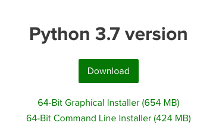

# Python op je eigen computer

## Om te beginnen

Om te kunnen programmeren op je eigen computer heb je twee verschillende programma's nodig: de taal zelf, en een goede editor:

1. **Anaconda**, een versie van Python die makkelijk te installeren is. Er zitten ook een boel *packages* bij, waarin extra functionaliteit zit voor grafieken, statistiek en nog allerlei andere dingen.

2. **Visual Studio Code**, een *editor* om code in te schrijven. Dit is in feite een soort tekstverwerker, maar dan speciaal bedoeld voor programmacode. Deze geeft bijvoorbeeld verschillende woorden verschillende kleurtjes, zodat je een goed overzicht houdt van je programmacode.

Zit je vast? Vraag je assistent!

### Stap 1: Anaconda

Dit pakket kunt je downloaden op de [website](https://www.anaconda.com/download/). Kies daar voor de "**Graphical Installer**" van **Python-versie 3.7**. De download is meer dan 500MB. Het kan dus even duren voordat het klaar is! Je hoeft trouwens je mailadres niet op te geven, ook zonder mag je Anaconda gewoon gebruiken.

{:style="max-width:35%"}

Zodra de download klaar is, moet je het gedownloade bestand uitvoeren (dubbelklik?). Volg dan de installatieinstructies en kies waar nodig voor "Install for me only"; als het goed is hoef je verder niks te veranderen.

Let op: kies op Windows altijd de "advanced" installatie en kruis onderstaande vinkje aan! Als je dit niet hebt gedaan moet je het verwijderen en opnieuw installeren!

De installatie kan een tijdje duren.

### Stap 2: Visual Studio Code

Dit pakket kun je downloaden op de website van [Microsoft](https://code.visualstudio.com/). Ook hier geldt dat je het bestand nog moet uitvoeren en installeren. Je hoeft niks aan te passen aan de installatie-opties. Heb je een Mac? Dan wordt het programma in je Downloads-map gezet. Je kunt het vanuit daar gewoon opstarten.

## Proefrit

Nu je zowel Anaconda als Visual Studio Code hebt geïnstalleerd, kunnen we gaan kijken of alles werkt. Volg de voorbeelden uit de video:

### Terminal

In Visual Studio Code kun je de terminal openen met de toetscombinatie **ctrl**+**\`**. Dat is dus tegelijkertijd de **ctrl** en **\`** (deze toets vind je meestal naast de 1 of naast de Z op je toetsenbord).

