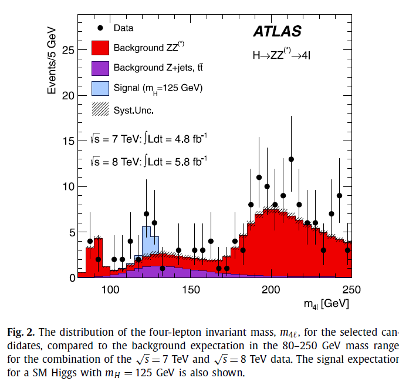

# Basisbegrippen in de statistiek

1. Ordered TOC
{:toc}

## Introductie 

Statistische data analyse is een belangrijk onderdeel in vele werkvelden.
Als wetenschapper zul je later te maken krijgen met het verzamelen van interpreteren van data bij het onderzoek, of juist bij het begrijpen van de interpretatie van andermans resultaten.
Wanneer kun je zeggen dat een hypothese moet worden verworpen of bewijs je juist dat deze correct is?
Wanneer heb je eigenlijk genoeg data verzameld? Hoe kun je een zo experiment ontwerpen dat je een hypothese kunt onderzoeken. Hoe kom je erachter wat jouw hypothese testbaar maakt - in welke observabele onderscheidt zij zich voldoende?

Alle kennis die we tot nu toe hebben over de Natuur- en Sterrenkunde is tot stand gekomen met het uitvoeren van experimenten en het analyseren van de uitkomsten.
Voor het bestuderen van Natuurkundige en Sterrenkundige theoriën is geen echter geen kennis nodig van statistiek en data analyse technieken. 
Voor het uitvoeren van de wetenschap, het vinden van bewijzen voor nieuwe theori\"en is kennis hiervan echter essentieel. 

<!--Denk bijvoorbeeld eens terug aan het moment waarop aan de wereld kenbaar werd gemaakt dat, met grote waarschijnlijkheid, het Higgs deeltje was gevonden (ATLAS en CMS teams op CERN in 2012). In 1964 is het bestaan van dit deeltje al voorspeld om de massa van de elementaire deeltjes zoals elektronen, muonen en quarks te kunnen verklaren (deze voorspelling is trouwens niet alleen door Peter Higgs gedaan maar ook (iets) eerder al door Robert Brout en François Englert).

Het Higgs deeltje is niet te zien met het menselijk oog, dus je kunt het alleen vinden door de eventuele sporen die het deeltje achterlaat (botsingen met andere deeltjes). Om deze sporen te kunnen vinden en hier een patroon in te ontdekken, is het nodig om heel veel data te verzamelen. De bulk data wordt in eerste instantie verzameld in grote tabellen. Het is echter lastig om hier patronen in te vinden, de data moet verwerkt worden tot een visuele weergave. Hieronder staat de visueel weergegeven data, waaruit is geconcludeerd dat het Higgs deeltje met grote waarschijnlijkheid bestaat (Bron: ATLAS Collaboration / Physics Letters B 716 (2012) 1–29, [Link](https://doi.org/10.1016/j.physletb.2012.08.020)):

{:height="400px"}&emsp;{:height="400px"}
-->

<!--Het visueel weergeven van de data alleen is niet genoeg, de data moet ook vergeleken worden met de achtergrondenergie (linker figuur) of met een model (rechter figuur). Daarnaast kun je niet zoveel met de figuur als er geen uitleg wordt gegeven, daarom wordt in het onderschrift en het artikel zelf, toegelicht wat er te zien is in de figuren. Dan zijn de vragen 'wat zien we?' en 'ten opzichte van wat zien we dat dan?' beantwoord, maar nu moet de vraag nog beantwoord worden of het waargenomen verschil in energie (het piekje) wel groot genoeg is om te kunnen spreken van een nieuw deeltje. Is het niet gewoon de achtergrondenergie die waargenomen is? Om deze vragen te kunnen beantwoorden is de data statistisch geanalyseerd. De uiteindelijke conclusie was dat er bijna 100% (namelijk 99.999997%) zekerheid gezegd kan worden dat als er een nieuw boson was gevonden die veel van de eigenschappen heeft zoals die voor het Higgs boson waren voorspeld.
Of beter als het Higgs boson niet zou bestaan, is de kans 1 in 3.5 miljoen dat we metingen zouden vinden zoals we ze hebben gezien.
Dat klinkt heel omslachtig, maar het is belangrijk in de wetenschap om heel precies te formuleren wat je eigenlijk hebt gedaan.-->

Bij het presenteren van onderzoeksresultaten is het belangrijk om helder uit te leggen hoe het onderzoek precies is uitgevoerd, hoe de metingen zijn genomen en wat de resultaten zijn. 
Vaak maken we hierbij gebruik van histogrammen, grafieken en tabellen. Om een hypothese te toetsen moeten we de metingen ook interpreteren. Daarvoor zijn verschillende methodes, bijvoorbeeld kunnen we de data proberen te 'fitten' met een functie. Voor alle methodes speelt statistiek een belangrijke rol.  

In deze cursus zullen we gaan vaardigheden leren van data analyse en statistiek. 

Deze week beginnen we met een aantal basisbegrippen in de beschrijvende statistiek. We gaan kijken naar het gemiddelde, variantie, de standaardafwijking, en coëfficiënt van variantie. Daarnaast bekijken we het verschil tussen een grafiek, een staafdiagram en een histogram en plotten we deze in Python voor verschillende datasets. Ook maken we een begin met kansrekening.

## Datasets beschrijven

Het verzamelen van data zelf is niet genoeg. Als we de data hebben moeten we deze kunnen beschrijven aan anderen. Stel we hebben een dataset met de temperatuur op elk van de 37 meetpunten van het KNMI in Nederland in de afgelopen twintig jaar.  Het is dan niet zo inzichtelijk om dit aan medewetenschappers te presenteren d.m.v. een enorme tabel (elke 10 minuten wordt een meting gedaan door de weerstations) met de mededeling 'dit was de temperatuur in de afgelopen twintig jaar'. 
Een dataset heeft verschillende eigenschappen, zo zouden we bijvoorbeeld iets kunnen zeggen over het midden van de dataset, de waarden die de temperatuur minimaal en maximaal aanneemt, of hoe ver elke temperatuur van het midden af zit. 

In de secties hieronder behandelen we verschillende veelvoorkomende begrippen.

### Populatie en steekproef
---

Een *populatie* bestaat uit alle personen/dieren/objecten binnen de groep waarin we geïnteresseerd zijn. Dit zouden bijvoorbeeld *alle* mensen in Nederland kunnen zijn tussen de 30 en 40 jaar, of *alle* lieveheersbeestjes die in Noorwegen leven. Nu is het zo dat het vaak lastig is om van *alle* personen/dieren/objecten (hierna uniform aangeduid met 'elementen') in een groep data te verzamelen. Het kost bijvoorbeeld erg veel tijd (en geld) om data te verzamelen over alle personen tussen de 30 en 40 jaar in Nederland (of om alle lieveheersbeestjes in Noorwegen te vangen). Het is dan veel makkelijker om data over een deel van deze groep te verzamelen en om zo iets te zeggen over de gehele doelgroep. Zo zouden we bijvoorbeeld data kunnen verzamelen van een willekeurige selectie van 200 personen in Nederland tussen de 30 en 40 jaar. Dit wordt een *steekproef* genoemd, de deelgroep wordt in het Engels vaak aangeduid met een *sample*. Een steekproef is dus een gedeelte van de populatie.

### Het gemiddelde
---

Het gemiddelde van een dataset geeft een maat voor het centrum van de waarden die de dataset aanneemt. We onderscheiden het populatiegemiddelde en het steekproefgemiddelde. Hoe groter de steekproef hoe meer het gemiddelde van de steekproef overeenkomt met het populatiegemiddelde.

#### Steekproefgemiddelde
Het is vaak onmogelijk om metingen te doen van een gehele populatie. Daarom wordt er vaak een steekproef gedaan waarbij er aselect (willekeurig) elementen uit de gewenste doelgroep worden gekozen. Uiteindelijk wordt deze steekproef dan gebruikt om iets te kunnen zeggen over de gehele populatie. Hierbij is het echter wel opletten, want de steekproef moet een representatieve doorsnede zijn van de hele populatie. De steekproef moet groot genoeg zijn en de elementen van de steekproef moeten aselect gekozen worden. Je kunt je voorstellen dat als we de lengte van drie mensen in Nederland meten, we nog niet zoveel kunnen zeggen over de lengte van de gehele populatie die bestaat uit alle mensen in Nederland. Als we de lengte van 1000 mensen zouden meten dan krijgen we al een beter beeld van de verdeling van lichaamslengte in Nederland, en kiezen we 100000 mensen dan krijgen we een nog veel beter beeld van de verdeling.

Het steekproefgemiddelde $$\overline{x}$$ van een dataset is de som van de waarden $$x_1,\dots,x_n$$ in de set gedeeld door het aantal datapunten $$n$$:

$$\overline{x}=\frac{1}{n}{\displaystyle \sum_{i=1}^{n}x_{i}}$$

Het steekproefgemiddelde wordt zo vaak gebruikt dat dit veelal wordt aangeduid als 'het gemiddelde'. 

#### Populatiegemiddelde

Als we metingen kunnen doen voor een **gehele populatie**, en we bepalen het gemiddelde, dan spreken we van het *populatiegemiddelde*. populatiegemiddelde wordt ook wel de *verwachtingswaarde* genoemd, deze wordt aangegeven met $$E(X)$$. 

<!--Als de dataset *discreet* verdeeld is (d.w.z. dat de uitkomsten alleen 'losse' waarden aan kunnen nemen en niet alle tussenwaarden in een interval) dan wordt het populatiegemiddelde/ de verwachtingswaarde gegeven door:-->

$$\mu=E(X)={\displaystyle \sum_{i=1}^{N}x_{i}\,p(x_i)} $$

Hierbij is $$N$$ het aantal elementen in de populatie, $$x_i,\dots,x_n$$ zijn de uitkomsten en $$p(x_i)$$ is de kans op elke uitkomst. 

Is de kans op elke uitkomst gelijk dan wordt het populatiegemiddelde gegeven door:

$$\mu=E(X)= \frac{1}{N}{\displaystyle \sum_{i=1}^{N}x_{i}}$$

De kans op elke uitkomst is dan immers gelijk aan $$\frac{1}{N}$$.

Je ziet dat het steekproefgemiddelde erg lijkt op de uitdrukking voor het populatiegemiddelde. Het verschil is dat het steeksproefgemiddelde niet gelijk is aan de verwachtingswaarde van de populatie. Het is wel zo dat, hoe beter de steekproef overeenkomt met de populatie, des te dichter komt het steekproefgemiddelde bij de verwachtingswaarde van de populatie. Dit geldt zowel voor steekproeven. Met behulp van een goed uitgevoerde steekproef kan het statistische gedrag van een populatie dus benaderd worden.

### De mediaan
---

De mediaan is een maat voor het midden van de elementen in een gesorteerde dataset of verdeling. In een dataset heb je exact 50\% kans om een waarde te vinden die lager is dan de mediaan en 50\% kans om een waarde te vinden die hoger is dan de mediaan.

Als we alle datapunten in een dataset sorteren van lage naar hoge waarde, dan is de mediaan de waarde van het element in het midden van de set. Is er sprake van een oneven aantal elementen dan is de mediaan de gemiddelde waarde van de twee elementen in het midden van de set.

Neem bijvoorbeeld de volgende datapunten: 

$$10,11,12,13,14$$ 

De data is al gesorteerd van laag naar hoog, en het derde element is in dit geval het middelste element. Het derde element heeft de waarde $$12$$. De mediaan van deze set is dus gelijk aan $$12$$.
Hebben we een set met een even aantal datapunten, bijvoorbeeld

$$ 8,9,10,11,12,13,14,15$$ 

dan zitten het 4e en het 5e element in het midden. De mediaan is nu gelijk aan de gemiddelde waarde van deze elementen. De elementen hebben waarde $$11$$ en $$12$$, wat betekent dat de mediaan gelijk is aan $$\frac{11+12}{2} = 11.5$$.

Voor symmetrische datasets zijn het gemiddelde en de mediaan gelijk aan elkaar.

### De modus
---

De modus van een dataset is de waarde die met de grootste frequentie in de dataset voorkomt. Hebben we bijvoorbeeld de dataset 

$$2,2,3,4,7,7,7,9$$ 

dan komen de 3, de 4 en de 9 elk één keer voor, het getal 2 komt twee keer voor en het getal 7 komt drie keer voor. Het meest voorkomende getal is dus de 7 en dit is de modus van de dataset. Als een dataset één modus heeft dan wordt deze *unimodaal* genoemd.

Het komt ook voor dat er twee of meer getallen zijn die even vaak voorkomen. Een dataset met twee getallen als modus wordt ook wel *bimodaal* genoemd, een dataset met meer dan twee getallen als modus wordt *multimodaal* genoemd.

Een voorbeeld van een bimodale dataset is:

$$1,2,3,3,4,4,4,5,6,11,11,11,15$$

zowel het getal 4 als het getal 11 komen drie keer voor in de set. De set is dus bimodaal met modus 4 en modus 11.

Bij sommige soorten dataverdelingen is het gebruikelijker om over de modus te praten dan over het gemiddelde of de mediaan. Een voorbeeld hiervan is de [Landau](https://en.wikipedia.org/wiki/Landau_distribution) distributie die een slecht gedefinïeerd gemiddelde of mediaan kent door een lange staart in de distributie.

### Spreiding van data
---

De spreiding geeft een beeld van de mate waarin datapunten in een set verspreid zijn. Er zijn verschillende maten om de spreiding van een dataset mee aan te geven. Hieronder zullen we de range, variantie, coëfficiënt van variantie en de standaardafwijking bespreken. 

#### Range (spreidingsbreedte)

De range is de afstand tussen de hoogste en de laagste waarde in een dataset. Hebben we bijvoorbeeld de dataset

$$50,70,72,76,76,80,120$$

dan is de range van deze dataset gelijk aan $$120-50=70$$.

De range geeft dus aan hoe breed de dataset in totaliteit is. De range is niet altijd een handige maat voor de spreiding van een dataset. Zo zouden we bijvoorbeeld de volgende dataset kunnen hebben:

$$1,2,3,4,5,5,5,6,6,6,7,7,10$$

De range is in dit geval $$10-1=9$$. Maar stel dat we een foutieve meting doen (of we maken een typefout in het overnemen van de data), en we hebben de volgende dataset:  

$$1,2,3,4,5,5,5,6,6,6,7,7,10,30$$

De range wordt nu $$30-1=29$$. Dus onder invloed van één foutief datapunt geeft de range nu een veel grotere mate van spreiding aan. 

#### Standaard deviatie en variantie

De standaard deviatie (ook wel de standaardafwijking) geeft aan in welke mate de data verspreid is rondom het gemiddelde van de dataset. Dit geeft met name ook een maat voor de spreiding van de datapunten onderling. Hoe groter de standaard deviatie des te groter is de spreiding tussen de afzonderlijke punten. De standaarddeviatie wordt aangeduid met $$\sigma$$.

De variantie, *var*, is direct gerelateerd aan de standaard deviatie, namelijk de variantie is gelijk aan de standaard deviatie in het kwadraat.

De variantie en standaard deviatie kunnne worden berekend met de volgende formule:

$$\sigma^2 = \displaystyle \frac{\displaystyle \sum_{i=1}^{N}(x_i - \mu)^2}{N}$$

Het verschil tussen de standaardafwijking en de variantie is de eenheid. De standaardafwijking heeft dezelfde eenheid als het gemiddelde terwijl de variantie de eenheid in het kwadraat heeft. Bij het rapporteren van resultaten wordt daarom vaak de standaarddeviatie van een verdeling of steekproef gegeven in plaats van de variantie. In het werken met een dataset maakt het echter niet uit welk van de twee je gebruikt. Bij een meer wiskundige benadering kan het eenvoudiger zijn om met de variantie te werken omdat er dan geen sprake is van een wortel. 

#### Coëfficiënt van variatie

De coëfficiënt van variatie wordt ook wel de relatieve standaardafwijking genoemd. De coëfficiënt van variatie geeft, net zoals de standaardafwijking en de variantie, een maat voor de spreiding van de populatie of dataset. 

De coëfficiënt van variatie wordt gegeven door de verhouding tussen de standaardafwijking en het gemiddelde.
Voor een populatie is de coëfficiënt van variantie $$c_v$$ dan:

$$c_{v} = \frac{\sigma}{\mu}$$

Met $$\sigma$$ de standaardafwijking van de populatie en $$\mu$$ het populatiegemiddelde.

De steekproefvariatie $$\hat{c_v}$$ wordt gegeven door:

$$\hat{c_v} = \frac{s}{\overline{x}}$$

Met $$s$$ de standaardafwijking van de steekproef en $$\overline{x}$$ het steekproefgemiddelde.

Het verschil met de variantie en de standaardafwijking is dat de coëfficiënt van variatie dimensieloos is. Dit is bijvoorbeeld handig als er meerdere datasets vergeleken moeten worden die verschillende eenheden hebben. Ook als de gemiddelde waarden van verschillende datasets erg uiteen liggen is het beter om de coëfficiënt van variatie te gebruiken i.p.v. de standaardafwijking.

Een nadeel van het gebruik van de coëfficiënt van variatie is dat er gedeeld wordt door het gemiddelde. Als dit gemiddelde vlak bij nul ligt dan gaat de coëfficiënt van variatie richting oneindig. Als het gemiddelde dan een klein beetje veranderd heeft dit een groot effect op de coëfficiënt. Als het gemiddelde van een dataset dus dicht bij nul ligt dan is het beter om de standaardafwijking of de variantie te gebruiken. 

