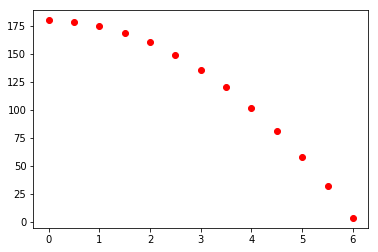

## Datasets visualiseren

1. Ordered TOC
{:toc}

In dit deel bekijken we de verschillende manieren om data visueel te presenteren. Aan bod komen grafieken en scatterplots, staafdiagrammen en histogrammen. We laten ook zien hoe je deze met behulp van python kan maken.

Als je data visualiseert dan is het de bedoeling dat iemand anders deze direct goed begrijpt. Er zijn wel een aantal vuistregels, maar het meest belangrijke is dat de data overzichtelijk is. Dat trends, of juist afwijkingen daarvan, goed zichtbaar worden gemaakt. 

### Grafieken & Scatterplots
Een grafiek laat het verband zien tussen twee (of meer) variabelen. 
Een grafiek heeft meestal een beperkt aantal punten, als er veel data is geven we dit vaak in een scatter plot weer. 

Er zijn twee grote verschillen tussen grafieken en scatterplots: 

* In scatterplots kunnen voor een ingestelde/gekozen waarde meer dan gemeten waarde bestaan. Een voorbeeld zou zijn als je een meting doet waarbij je de lengte van mensen opmeet en tegen hun leeftijd uitzet. 
* In scatterplots verbind je *nooit* punten met lijnen. Dat zou ook erg verwarrend zijn omdat je de dataset niet altijd logisch kan ordenen. In grafieken is dat meestal ook onwenselijk. 

Meestal is de waarde van de twee variabelen van te voren gekozen of ingesteld en de andere variabele gemeten. De gemeten waarde laten we zien op de verticale as en de gekozen waarde op de horizontale as. Bij grafieken kun je meestal deze stelregel gebruiken, bij scatterplots is het vaak niet zo duidelijk en moet je gewoon een keuze maken.

De waardes worden als punten of 'markers' in de grafiek of scatterplot neergezet. 

Stel bijvoorbeeld dat we naar de gemiddelde temperatuur per maand van 1981 t/m 2014 in de Bilt willen kijken. Hieronder een plot met een lijn tussen elk datapunt (Bron: KNMI, gehomogeniseerde data):

{: width="100px"} 

{: width="200px"} 

{: width="10%"} 

{: width="20%"} 

Je ziet dat dit niet erg duidelijk is. Het is bijvoorbeeld niet precies te zien waar de gemeten punten zitten, we hebben wel een vermoeden voor de plaatsen waarop de lijn abrupt van richting veranderd, maar wie weet zitten er nog wel meer datapunten tussen.

Laten we dezelfde data eens plotten zonder lijnen maar alleen met punten:  

{:width ="40px"} 

Vanuit deze grafiek zien we dat er inderdaad veel meer datapunten zijn. Dat konden we in de lijnplot niet goed zien.

De plot kan echter netter. Zo staan er geen labels op de assen. Nu kunnen we in dit geval wel raden welke as het jaar aangeeft en welke as de temperatuur, maar in veel gevallen is dat niet zo duidelijk. Om die reden moeten er altijd **labels op de assen** staan, zie het figuur hieronder:

{:width="30%"} 

Een andere conventie is dat grafieken doorgaans **beginnen bij de oorsprong, tenzij de data dan onvolledig of onleesbaar wordt**. In het geval van het weergeven van de temperaturen van 1981 t/m 2014 wordt de data bijvoorbeeld onvolledig als we de temperatuur bij nul laten beginnen, we hebben immers ook temperaturen onder het vriespunt. Daarnaast wordt de data onleesbaar als we het jaartal vanaf het jaar nul laten lopen, de datapunten voor de jaren waarin we geïnteresseerd zijn zullen dan over elkaar vallen. In het huidige geval is het dus niet van toepassing om in de oorsprong te beginnen, maar dit is bij elke dataset wel het uitgangspunt.

De assen kunnen nog wat netter. Zo eindigt de $$x$$-as *na* de waarde $$20$$, maar het is niet helemaal duidelijk bij welke waarde precies. De $$y$$-as begint een klein stukje voor 1980 en eindigt een klein stukje na 2015. Conventie is om assen te laten **beginnen en eindigen op een maatstreepje**. Daarnaast willen we niet te veel maatstreepjes maar ook niet te weinig. In het algemeen worden **zeven maatstreepjes** aangehouden voor de goede leesbaarheid (eentje meer of minder is niet erg). In ons geval laten we het jaartal beginnen op 1980 en eindigen op 2015, daarnaast laten we de temperatuur beginnen op $$-5$$ C&deg; en eindigen op $$25$$ C&deg;. Op de $$x$$-as hebben we 8 maatstreepjes en op de $$y$$-as hebben we 7 maatstreepjes:

{:width="40%"} 

Stel we willen de temperatuur in de Bilt nu weergeven t.o.v. de 'Centraal Nederland Temperatuur' (CNT). De CNT is een combinatie van vijf weerstations representatief voor het gebied tussen de steden Utrecht, Arnhem, Breda en Eindhoven. De plot ziet er als volgt uit:

{:width="40%"} 

De kleuren zijn aangepast t.o.v. eerder. Welk van de twee series hoort bij 'de Bilt' en welke hoort bij 'Centraal Nederland'? Dat is lastig te zien vanuit de plot. Om deze reden wordt er, bij twee of meer series, een **legenda** aan de plot toegevoegd. Bovenstaande plot ziet er met legenda als volgt uit:

{:width="50%"} 

Tot nu toe hebben we nog geen titels toegevoegd aan de plots. Dit komt omdat dat voor verslagen en wetenschappelijke artikelen ongebruikelijk is, daar moet het onderschrift namelijk al vertellen wat er te zien is in de grafiek. In webteksten, lesteksten en presentaties kan het echter voorkomen dat een grafiek wel een titel heeft, omdat er in die context vaak geen onderschrift toegevoegd kan worden. 

**Samengevat**:

- Een grafiek van een dataset wordt geplot met punten. 
- Het resultaat van een fit of een theoretisch verband wordt met een lijn geplot.
- Bij een enkele dataset wordt geen legenda gebruikt. Als er meerdere datasets in één grafiek worden weergegeven dan is een legenda noodzakelijk.
- Aslabels geven weer wat elke as representeert (inclusief eenheden).
- Assen beginnen in de oorsprong. Een uitzondering kan zijn als de data heel erg ver van de oorsprong af zit.
- Een as begint en eindigt op een groot maatstreepje met een waarde ('major tick') en niet op een klein maatstreepje of een maatstreep zonder getal.
- Een grafiek voor een wetenschappelijk artikel of een verslag heeft geen titel. Een grafiek voor webteksten of lesmateriaal heeft over het algemeen wel een titel.
- Als je de onzekerheid weet op de variabelen dan is het goed om deze ook weer te geven in je plot. Tenzij deze heel onoverzichtelijk wordt (zoals in een scatterplot met heel veel punten).

### Staafdiagrammen & Histogrammen

Staafdiagrammen en histogrammen worden allebei typisch gebruikt om frequenties aan te geven. 

Hieronder zie je voorbeelden van een staafdiagram en een histogram.

{:width="40%"} 

Hierboven zie je een **staafdiagram** die de hoeveelheid autos in Nederland laat zien over drie verschillende jaren opgesplitst naar drie auto categorieën. 

{:width="40%"} 

Hierboven zie je een **histogram** die de inkomensverdeling in Nederland laat zien. 

Er is een belangrijk verschil tussen een staafdiagram en een histogram. Een staafdiagram laat de frequentie zien voor *discrete* verdelingen. Een histogram wordt gebruikt om het resultaat van een *continue* verdeling mee weer te geven.

Bij het weergeven van data in een histogram wordt de data gegroepeerd in intervallen. De breedte van de staven (in het vervolg 'bins' genoemd) geeft de breedte van de intervallen. 

Bij een staafdiagram kun je de frequentie direct aflezen; voor één categorie lees je op de as af hoe vaak deze voorkomt. Voor een histogram lees je de frequentie af voor de gesommeerde data in een interval, het interval is de breedte van de bin. 

#### Breedte van de bins bij een histogram

Voor een histogram is de breedte van de intervallen van belang. Als we te weinig bins kiezen dan worden de intervallen erg groot (/breed) en is er minder te zeggen over het gedrag van de data. Als we te veel bins kiezen dan fluctueert de hoogte van de (smalle) bins onderling erg en is het ook lastiger om de trend in de data goed in te schatten.

Dit bekijken we aan de hand van een voorbeeld. Zo zou het kunnen zijn dat het ideale plaatje bij een gegeven dataset het volgende is:

{:width=100px;}

Als we te brede bins kiezen dan wordt de data afgevlakt en kunnen we het bovenstaande gedrag niet meer herkennen:

{:width="40%"}

Kiezen we juist te smalle bins, dan kunnen we het gedrag van de data nog wel herkennen (in dit geval) maar er is veel fluctuatie in de hoogte van de bins: 

{:width="40%"}

Met het kiezen van te veel bins hebben we dus visuele ruis geïntroduceerd, dit maakt het moeilijker om het gedrag op het oog te herkennen.

Bij het bepalen van het optimale aantal bins en de optimale binbreedte is het het belangrijkste dat het gedrag van de data goed zichtbaar is. Er zijn verschillende formules (bijvoorbeeld de square of de Sturges formule) ontwikkeld waarmee je het aantal bins dat je nodig hebt kunt berekenen. Echter, geen van die formules kun je blind toepassen. Het is veel beter om gewoon goed naar je dataset te kijken en een inschatting te maken van de binbreedte. 

**Bij het maken van een histogram moet je goed letten op het volgende:**

* Het bereik (de range) die je kiest op de horizontale as. Van waar tot waar plot je de data? Meestal wil je de gehele dataset laten zien, maar soms wil je juist inzoomen op een kleiner stukje. 
* De binbreedte. Meestal kies je voor het hele histogram dezelfde binbreedte, in sommige gevallen kun je verschillende binbreedtes kiezen. In elk geval geldt dat het histogram goed 'leesbaar' moet zien. Het moet duidelijk blijven hoe de data gedistribueerd is. Wat is de trend? Zijn er afwijkingen van die trend.
* Let bij histogrammen erg goed op waar de grens van een bin ligt. Vooral als je een dataset met natuurlijke getallen weergeeft is het belangrijk dat de bingrenzen netjes *tussen* de natuurlijke getallen ligt. Anders kan de distributie van de data verkeerd gerepresenteerd worden.
* Het histogram is makkelijker leesbaar als de bins een natuurlijk interval hebben. Als je range van 0 tot 10 loopt is het heel gek om deze te verdelen in 7 bins.

**Voor zowel histogrammen als staafdiagrammen geldt:**

* Natuurlijk moeten bij histogrammen en staafdiagrammen ook netjes aslabels worden gebruikt.
* Als je meer dan één dataset laat zien maak dan gebruik van een legende.

## Data plotten met Python

Om in Python te kunnen plotten moeten we als eerste een library importeren die ingebouwde functies heeft voor het visueel weergeven van data. Een populair pakket is Matplotlib, deze zullen we in dit vak dan ook gebruiken (er zijn ook andere geschikte pakketten zoals Seaborn, ggplot en Plotly). 
We importeren de `pyplot` functie vanuit Matplotlib en geven deze de naam 'plt' met het volgende commando:

    import matplotlib.pyplot as plt

De naamgeving 'plt' met het commando `as plt` is optioneel, maar wel handig omdat we deze functie over het algemeen vaak zullen gebruiken (dat scheelt typen).

###Voorbeeld: een grafiek plotten
Stel we hebben de hoogte van een vallende bal gemeten als functie van de tijd. In de tabel hieronder is de gemeten data weergegeven:

| t(s) | 0.0 | 0.5 | 1.0 | 1.5 | 2.0 | 2.5 | 3.0 | 3.5 | 4.0 | 4.5 | 5.0 | 5.5 | 6.0 |
| --- | ---| --- |--- | --- | --- | --- | --- | --- | --- | --- | --- | --- | --- |
| h(cm) | 180.0 | 178.8 | 175.1 | 169.0 | 160.4 | 149.3 | 135.9 | 120.0 | 102.0 | 80.7 | 57.4 | 31.6 | 3.4 |

Nu maken we een lijst `t_data` aan voor de tijd en een lijst `h_data` voor de hoogte van de bal:

    t_data = [,,,]
    h_data = [,,,]

Daarna roepen we het `plot` commando uit matplotlib.pyplot aan:

    plt.plot(t_data, h_data, 'ro')

Met `'ro'` geven we aan dat we rode gevulde punten in de plot willen. De plot ziet er nu als volgt uit:

{:width="40%"} 

Je ziet dat de assen automatisch vanaf de laagste waarde tot aan de hoogste waarden gaan, en hierbij niet eindigen op een maatstreepje. Daarnaast willen we graag labels op de assen.

De limiet van de assen kunnen we aangeven met de commando's `plt.xlim` en `plt.ylim`:

    plt.xlim(0,7)
    plt.ylim(0,200)

Labels voor de assen kunnen we als volgt specificeren:

    plt.xlabel('t(s)')
    plt.ylabel('h (cm)')
    
Het resultaat is:

{:width="40%"}

De volledige code tot nu toe is:    

    # dataset in lijsten zetten
    t_data = [0,0.5,1,1.5,2,2.5,3,3.5,4,4.5,5,5.5,6]
    h_data = [180,178.8,175.1,169.0,160.4,149.3,135.9,120,102,80.7,57.4,31.6,3.4]
    
    # data plotten, as-limieten instellen, as-labels instellen
    plt.plot(t_data, h_data, 'ro')    
    plt.xlim(0,7)
    plt.ylim(0,200)
    plt.xlabel('t(s)')
    plt.ylabel('h (cm)')

Als we nu nog een dataset hebben, bijvoorbeeld van dezelfde bal die vanaf een hoogte van 160 cm valt in plaats van een hoogte van 180 cm:

    # tweede dataset in lijsten zetten
    t_data2 = [0,0.5,1,1.5,2,2.5,3,3.5,4,4.5,5,5.5]
    h_data2 = [160,158.8,155.1,149.0,140.4,129.3,115.9,100,82,60.7,37.4,11.6]
    
Deze dataset kunnen we in de grafiek van de eerste plotten door twee keer het plot commando achter elkaar te gebruiken: daarna gebruiken we weer dezelfde eigenschappen voor de limieten en de aslabels:

    plt.plot(t_data, h_data, 'ro')
    plt.plot(t_data2, h_data2, 'bo')
   
Daarna gebruiken we weer dezelfde eigenschappen voor de as-limieten en de as-labels":

    plt.xlim(0,7)
    plt.ylim(0,200)
    plt.xlabel('t (s)')
    plt.ylabel('h (cm)')
    
De plot ziet er dan als volgt uit: 

{:width="40%"} 

Omdat er meerdere datasets in één grafiek zijn weergegeven is het noodzakelijk om hier een legenda bij te plaatsen. Een legenda kan op meerdere plaatsen in de figuur neergezet worden. Voordat we de legenda kunnen toevoegen moeten we de plots eerst labelen dit doen we door `label = "naam"` achteraan in de `plot` commando's toe te voegen:

    plt.plot(t_data, h_data, 'ro' , label='h(0) = 180 cm')
    plt.plot(t_data2, h_data2, 'bo', label='h(0) = 160 cm')

Nu kunnen we de legenda als volgt toevoegen (hier kiezen we ervoor om de legenda in de rechterbovenhoek neer te zetten zodat er geen overlap is met de grafieken zelf): 

    plt.legend(loc='upper right', shadow=True, ncol=1)

De grafiek is nu als volgt:

{:width="40%"} 

De volledige code tot nu toe is:    

    # dataset in lijsten zetten
    t_data = [0,0.5,1,1.5,2,2.5,3,3.5,4,4.5,5,5.5,6]
    h_data = [180,178.8,175.1,169.0,160.4,149.3,135.9,120,102,80.7,57.4,31.6,3.4]
    
    # tweede dataset in lijsten zetten
    t_data2 = [0,0.5,1,1.5,2,2.5,3,3.5,4,4.5,5,5.5]
    h_data2 = [160,158.8,155.1,149.0,140.4,129.3,115.9,100,82,60.7,37.4,11.6]
    
    # data plotten, as-limieten instellen, as-labels instellen
    plt.plot(t_data, h_data, 'ro' , label='h(0) = 180 cm')
    plt.plot(t_data2, h_data2, 'bo', label='h(0) = 160 cm')
    plt.xlim(0,7)
    plt.ylim(0,200)
    plt.xlabel('t(s)')
    plt.ylabel('h (cm)')
    
    # legenda toevoegen
    plt.legend(loc='upper right', shadow=True, ncol=1)

Een ander voorbeeld is dat we lijnen willen plotten, bijvoorbeeld van een theoretisch verband. (De conventie is dat data altijd met punten wordt uitgebeeld.) 
Dit kan je als volgt doen:

    # datasets in lijsten
    x = [0, 1, 2, 3, 4, 5, 6, 7, 8, 9, 10]
    y1 = [1, 3, 5, 7, 9, 11, 13, 15, 17, 19, 21] #2x+1
    y2 = [2, 3, 4, 5, 6, 7, 8, 9, 10, 11, 12] #x+2

    # datasets plotten als 'solid' lijnen
    plt.plot(x, y1, 'r-' , label='dataset 1')
    plt.plot(x, y2, 'b-', label='dataset 2')
    plt.xlim(0,7)
    plt.ylim(0,20)
    plt.xlabel('x')
    plt.ylabel('y')
    
    # legenda toevoegen
    plt.legend(loc='upper right', shadow=True, ncol=1)

    
De bijbehorende plot:

{:width="40%"} 

###Voorbeeld: een histogram plotten
In de allereerste opgave B1a.A ga je een histogram plotten. In die opgave staat stap voor stap uitgelegd hoe je dat moet doen. 

Maar kijk vooral ook in de [online manual](https://matplotlib.org/3.1.1/tutorials/introductory/pyplot.html) van matplotlib.

Succes!

