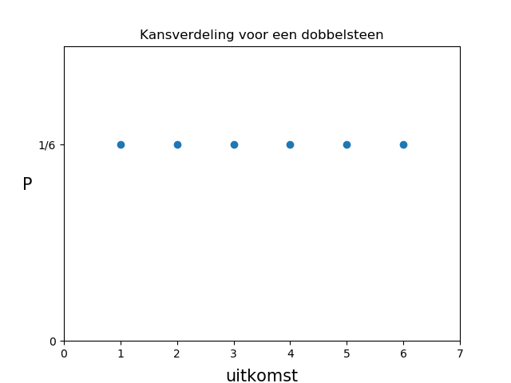
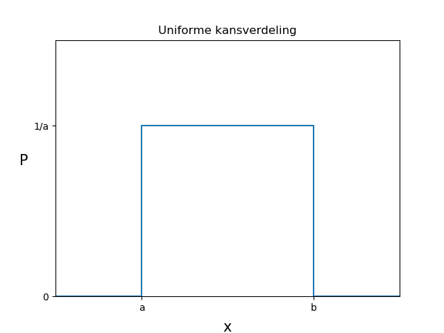
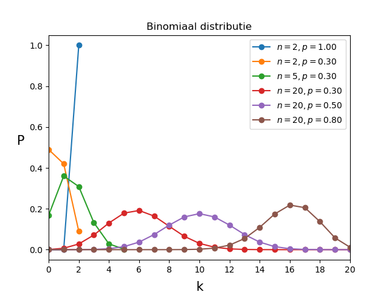
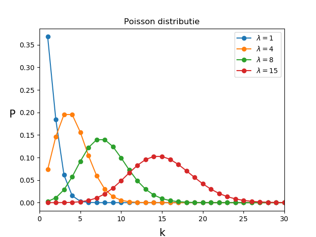

# Kanstheorie en kansdichtheidsfuncties

1. Ordered TOC
{:toc}

## Kanstheorie

Een kans is een getal tussen de $$0$$ en de $$1$$ die aangeeft hoe waarschijnlijk het is dat een bepaalde gebeurtenis zal plaatsvinden.
Een kans van $$1$$ zegt dat het **zeker** zal gebeuren en een kans van $$0$$ dat het **zeker niet** zal gebeuren. Een kans van $$0.5$$ geeft aan dat in $$50\%$$ van de gevallen de gebeurtenis zal plaatsvinden.

> Voorbeeld We kijken naar een dobbelsteen. 
Wat is de kans dat je een $$4$$ gooit als je de dobbelsteen 1 keer gooit? 
Voor een normale dobbelsteen kunnen deze kans uitrekenen met behulp van de volgende formule:  
> 
> $${\displaystyle P(\text{uitkomst is }4) = \frac{\text{aantal uitkomsten met een 4}}{\text{Het totale aantal uitkomsten}} = \frac{1}{6}}.$$  
> 
> Dit is de kans voor een normale eerlijke dobbelsteen. Met eerlijk bedoelen we hier dat de dobbelsteen niet gemanipuleerd is en dat elk vlak van de dobbelsteen evenveel kans heeft om boven te eindigen. 
>  
> Stel nu dat we een speciale eerlijke dobbelsteen zouden hebben met de volgende vlakken: {1,2,2,3,4,4}. De mogelijke uitkomsten bij een dobbelsteenworp zijn nu: {1,2,3,4}. Dit noemen we ook de **uitkomstenverzameling** waarbij alle elementen uniek zijn, en dus maar 1 keer voorkomt. De kans om nu een 4 te gooien is groter dan met een normale eerlijke dobbelsteen, namelijk: 
> 
> 
> $${\displaystyle P(\text{uitkomst is }4) = \frac{\text{aantal uitkomsten met een 4}}{\text{Totale aantal uitkomsten}} = \frac{2}{6}}$$.  
> 
>
> En stel nu dat we een normale dobbelsteen hebben die gemanipuleerd is? Dan zal de kans om een 4 te gooien anders zijn. Een goede manier om dan de kans te bepalen is met behulp van de **Frequentist** formule: 
> 
> 
> $${\displaystyle P(4) = lim_{n \to \infty} \frac{\text{uitkomst is 4}}{\text{totaal aantal worpen}}}$$.

De algemene formule voor de Frequentist definitie van kans is: 
$${\displaystyle P(\text{uitkomst A}) = \lim_{n \to \infty} \frac{\text{uitkomst A}}{n}}.$$
Waarbij we n metingen hebben verricht. 

De Frequentist definitie voor kans is een goede manier om kansen te berekenen. Het kent echter twee grote beperkingen. De eerste is dat we eigenlijk nooit een oneindig aantal metingen kunnen doen. Dit is goed te benaderen door gewoon een heel groot aantal metingen te doen. De tweede beperking is dat niet alle experimenten herhaalbaar zijn. 

### Frequentist versus Bayesiaanse methode
Het zal je daarom niet verbazen dat er nog een andere methode bestaat die wel werkt voor experimenten die niet herhaalbaar zijn of een beperkte statistiek. Deze manier noemen we ook wel de Bayesiaanse (spreek uit: Beej-sie-jaanse) methode (engels: Bayesian). 

De frequentist methode wordt in het algemeen als objectieve methode gezien en de Bayesiaanse methode een subjectieve manier. Het geeft aan wat je denkt dat de waarschijnlijkheid is. Dat klinkt misschien niet erg wetenschappelijk maar in de praktijk is dit misschien wel de meest gebruikte methode. Vooral omdat je hem ook kan gebruiken als het experiment niet herhaalbaar is. 

> Een voorbeeld In een wielerronde staat een bergklassieker op het programma van vandaag. De wedstrijd is nog niet gestart. Er staan twee sterke renners,  Verstappen en Onana, op de gedeelde eerste plaats van het klassement en de voorsprong met de derde wielrenner is meer dan 20 minuten. Het lijkt dus waarschijnlijk dat aan het einde van de dag Verstappen of Onana op de eerste plaats in het klassement zal staan. Op bergetappes wint Onana 9 van de 10 keer met een flinke voorsprong van Verstappen. Wie denk je dat er vandaag wint?   
>
> We kunnen het experiment natuurlijk niet herhalen maar het lijkt zeer waarschijnlijk dat Onana aan het einde van de dag op nummer 1 zal eindigen. 
Hier maken we gebruik van de subjectieve methode van Bayes. Om het te quantificeren kunnen we misschien zelfs wel zeggen dat de kans 0.9 is.  
>
> Maar nu zitten we aan het ontbijt en we zien dat Onana geen hap door zijn keel krijgt. Hij is duidelijk erg ziek. Verstappen daarentegen ziet er fris en sterk uit.  
Hoe waarschijnlijk denk je nu dat het is dat Onana zal winnen?
>   
> Het lijkt nu toch een stuk minder waarschijnlijk dat Onana zal winnen. Misschien schat je nu de kansen lager in dan de 0.9 waarmee je begon. Misschien heb je zelfs wel informatie uit het verleden waaruit je weet hoeveel langzamer renners zijn als ze er zo ziek uitzien als Onana. Wat voor impact dat heeft op hun performance. Dan zouden we ons kans van 0.9 kunnen 'updaten' met de nieuwe informatie. Dat is typisch een Bayesiaanse methode om kansen uit te rekenen.

Beide methodes worden dus gebruikt, maar de Bayesiaanse methode, of zelfs een hybride methode vindt vooral zijn toepassing in heel complexe modellen en voorspellingen. In dit college zullen we vooral werken met de frequentist methode.
Wat in elk geval altijd belangrijk is, is om altijd heel precies te vermelden wat de voorwaardes zijn geweest waaronder de kans is uitgerekend. 

### Rekenen met kansen

Er zijn een paar basisregels waar kansen aan voldoen. 

1.  **Behoud van kans**: Een gebeurtenis, $$A$$, kan plaatsvinden, of het kan niet plaatsvinden. De kans is behouden en dat betekent dat:  
$$ P(A) + P(\text{niet A}) = 1.$$ 
Een direct gevolg hiervan is dat $$P(\text{niet A})$$ het complement is van $$P(A)$$ ofwel: 
$$ P(\text{niet A}) = 1 - P(A) .$$ 
Dit wordt ook wel de **complementregel** genoemd. 
2. Als de uitkomst $$B$$ *bestaat* dan geldt:   
$$0 < P(B) \leq 1.$$ 
Een kans moet dus altijd groter zijn dan nul voor alle elementen in de uitkomstenverzameling. 
3.  **De *of* regel**: Als de uitkomsten $$A$$ en $$B$$ *wederzijds uitsluitend* zijn, ofwel als $$A$$ plaats vindt, dan vindt $$B$$ niet plaats, dan geldt: 
$$P(A\text{ of }B) \equiv P(A \cup B) = P(A) + P(B).$$ 
We mogen in dit geval de kansen dus optellen.
4.  **De *en* regel**: Als de uitkomsten $$A$$ en $$B$$ onafhankelijk zijn, dus als je $$A$$ een uitkomst is dan zegt dat niets over de kans op $$B$$, dan geldt:  
$$P(A\text{ en }B) = P(A) \cdot P(B).$$ 

We gaan voor elk van deze regels een voorbeeld geven. We kijken hiervoor naar een kaartendek.
De uitkomstenverzameling van een kaartendek is:   
{1♥,2♥,3♥,4♥,5♥,6♥,7♥,8♥,9♥,H♥,D♥,K♥,A♥,1♦,2♦,3♦,4♦,5♦,6♦,7♦,8♦,9♦,H♦,D♦,K♦,A♦, 1♠,2♠,3♠,4♠,5♠,6♠,7♠,8♠,9♠,H♠,D♠,K♠,A♠,1♣,2♣,3♣,4♣,5♣,6♣,7♣,8♣,9♣,H♣,D♣,K♣,A♣}  
Dit zijn in totaal 52 kaarten verdeeld over 2 kleuren: rood en zwart. We trekken in de volgende voorbeelden steeds 1 kaart.

> Voorbeeld 1** behoud van kans:**  
* De kans om een harten 5 uit een dek kaarten te trekken is precies: P(5♥)= 1/52. De kans om een *andere kaart dan een harten 5* te trekken is gelijk aan: 1-P(5♥) = 1-1/52 = 51/52. 
* De kans om een rode kaart te trekken is precies 26/52 = 1/2 en is precies gelijk aan de kans om een rode kaart te trekken (1-1/2 = 1/2).

> Voorbeeld 2 **groter dan nul:**  
* Voor elke kaart in het dek is er een kans dat je hem trekt. 

> Voorbeeld 3 **de of-regel:**  
* De kans dat je een 3 of een 5 trekt is gelijk aan P(3)+(P(5) = 1/13+1/13 = 2/13.  
* De kans dat je een 3 of een rode kaart trekt kunnen we niet zomaar optellen. Er bestaan ook rode kaarten met een 3. 

>  Voorbeeld 4 **de en-regel:**  
* De kans dat je een 3 trekt die ook een rode kaart is kunnen we uitrekenen met:  
$$P(\text{rood en }3) = P(\text{rood}) \cdot P(3) =  1/2 \cdot 4/52 = 2/52$$ 
Er zijn maar twee rode 3 kaarten in het dek, dus dat klopt. Er zijn evenveel rode drie kaarten als zwarte drie kaarten en daarom mag je ze in dit geval vermenigvuldigen. De uitkomsten zijn onafhankelijk.  
* De kans dat je een 9♥ en een A♣ trekt. Deze kansen zijn niet onafhankelijk. Als je een 9♥ trekt, zegt dat al direct iets over de kans dat deze kaart ook een A♣ is (die is namelijk gereduceerd tot 0).

## Stochastische variabelen en verdelingsfuncties

### Wat is een stochast?
Een **stochast** is een variable waarvan de waarde van een toevalsproces afhangt. Bijvoorbeeld de uitkomst van het trekken van een kaart, dan is het getrokken kaart (de uitkomst van de trekking) een stochast. Je weet van te voren niet welke kaart je gaat trekken en daarom is de uitkomst *stochastisch*.
Of als je een met een dobbelsteen gooit dan is de uitkomst van de worp een stochast. Het engelse woord (random variable) is misschien bekender. 

### Kansdichtheidsfuncties
Stochasten zijn een handig middel bij het beschrijven van experimenten. We gaan hieronder een aantal vaak voorkomende distributies van stochastische variabelen bekijken. De distributies laten zien wat de kans is dat een bepaalde stochastishe waarde wordt gevonden. Het is dus een verdeling van kansen. Deze verdelingen noemen we **kansdichtheidsfuncties** (Engels: probability density function of PDF). Een kansdichtheidsfunctie, $$f(x)$$, zegt dat de kans dat een variabele $$x$$ gevonden wordt in een gebied $$[x,x+dx]$$ gelijk is aan $$f(x)dx$$.  
De kans dat we $$x$$ terugvinden in een interval $$[a,b]$$ is gelijk aan:  
$${\displaystyle P(a\leq x \leq b) = \int_a^b f(x) dx}.$$

Er zijn **twee belangrijke voorwaardes** aan een kansdichtheidsfuncties die je misschien bekend zullen voorkomen:  
1. De kans kan nergens kleiner dan nul zijn in het uitkomstengebied.  
2. De kansdichtheidsdistributie moet genormaliseerd zijn op 1.  
In formule notatie: $$f(x) \geq 0$$ en $$\int^\infty_{-\infty} f(x) dx =1$$.

Wellicht komt dit allemaal wat abstract over en helpt het om wat concrete voorbeelden te zien. Hieronder definiëren we vier belangrijke kansdichtheidsfuncties (ook wel PDFs). Er zijn veel meer kansdichtheidsfuncties gedefinieerd, kijk bijvoorbeeld maar eens naar [deze](https://en.wikipedia.org/wiki/List_of_probability_distributions) lijst op Wikipedia. 

Voor we gaan kijken naar de voorbeelden is het handig om uit te leggen hoe we de verwachtingswaarde en de standaard deviatie kunnen uitrekenen voor kansdichtheidsfuncties. De definities hiervan heb je gezien in het hoofdstuk [Basisbegrippen](/blok-1/basisbegrippen), voor dichtheidsfuncties zien ze er net iets anders uit dan voor datasets. 

### Verwachtingswaarde en standaard deviatie
Voor **discrete** verdelingen gelden de volgende vergelijkingen:

* de verwachtingswaarde: $${\displaystyle &lt\!x\! &gt = E(x) = { \sum_i x_i P(x_i) } },$$ 
* de standaard deviatie: $${\displaystyle \sigma^2 = \sum_i (x_i - &lt\! x\! &gt)^2 P(x_i)}.$$ 

Voor **continue** verdelingen maak je gebruik van de volgende vergelijkingen: 

* de verwachtingswaarde: $$ &lt\! x\! &gt = E(x) = {\displaystyle \int^\infty_{-\infty} x f(x) dx},$$ 
* de standaard deviatie: $${\displaystyle \sigma^2 = &lt\! x^2\! &gt - {&lt\! x\! &gt}^2 = \int^{\infty}_{-\infty} (x - &lt\! x\! &gt)^2 f(x) dx }.$$

**NB** Er zijn verschillende schrijfwijze voor het gemiddelde $$\mu, &lt\! x \! &gt$$ en $$E(x)$$. Het symbool $$\mu$$ is meestal voorbehouden aan het gemiddelde van de populatie, dat wil zeggen het *echte* gemiddelde. Het gemiddelde van de steekproef is $$&lt\! x\! &gt$$, je hoopt dus dat die dicht bij het populatiegemiddelde $$\mu$$ ligt. De verwachtingswaarde $$E(x)$$ is de waarde die je verwacht te gaan meten. Deze kan je met simulaties benaderen. De verschillen worden pas echt duidelijk als je er al een tijdje mee werkt. We zullen het niet fout rekenen als je een vergissing maakt in de notatie, maar we proberen het hier wel netjes op te schrijven. 
In deze vergelijkingen is het in elk geval ook handig om $$E(x)$$ of $$&lt\! x \! &gt$$ te schrijven.  $$E(x)^2$$ is, net als $$ &lt\! x \! &gt^2$$, het kwadraat van de verwachtingswaarde van $$x$$. $$E(x^2)$$ is, net als $$ &lt\! x^2 \! &gt$$ de verwachtingswaarde van $$x^2$$. 

## Bekende kansdichtheidsfuncties

### Uniform

De uniforme distributie is een vlakke kansverdeling. De kans op elk deel van de uitkomstenverzameling is gelijk. We hebben hier al een paar voorbeelden van gezien. Bijvoorbeeld bij de eerlijke dobbelsteen waarbij de kans op elk van de 6 uitkomsten precies gelijk is. De uitkomsten van een dobbelsteen zijn discreet. Voor **discrete uniforme** verdelingen van stochastische waarden kunnen we schrijven dat de kans op uitkomst van stochast $$i$$, $$P({i})$$, gevonden kan worden met de relatie: $$P({i}) = 1/N$$. 
Waarbij N de hoeveelheid mogelijke uitkomsten is. Dit ziet er grafisch als volgt uit:

{:width="80%"}

 
Een algemene formule voor een **continue uniforme** verdeling is: 

$${\displaystyle f(x;a,b) = \frac{1}{b-a}} \quad\text{voor}\quad a \leq x \leq b.$$

Hierbij is $$f(x)$$ de kans dat je de waarde $$x$$ vindt. De stochast is hier dus $$x$$.
Hieronder zie je hoe de uniforme verdeling eruit ziet voor een continue verdeling:

{:width="80%"}

De verwachtingswaarde en de standaard deviatie van de uniforme verdeling zijn $$E(x) = (a+b)/2$$ en $$\sigma = (b-a)/\sqrt{12}$$. 
 
> De verwachtingswaarde kunnen we uitrekenen met behulp van de algemene formule:
>
> $$\begin{aligned}\displaystyle 
> E(x) & = \int^{\infty}_{-\infty} { x f(x) dx} =  \int^b_a x\cdot \frac{1}{b-a}  dx\\ 
> & = \left. \frac{1}{2} \frac{1}{(b-a)} x^2 \right|^b_a = \frac{b^2-a^2}{2(b-a)} = \frac{a+b}{2}. \end{aligned}$$ 
>
> De standaard deviatie berekenen we met de formule:
> 
> $$\begin{aligned}\displaystyle \sigma^2 &= \int^{\infty}_{-\infty} \left( x-E(x) \right) ^2 f(x) dx = \int^b_a \left( x-\frac{a+b}{2} \right)^2 \cdot \frac{1}{b-a} dx \\ &= \frac{1}{12} \cdot \frac{(b-a)^3}{b-a} = \frac{(b-a)^2}{12}. \end{aligned}$$
>
> Dit geeft de vergelijking voor de standaard deviatie: $$\sigma = \frac{(b-a)}{\sqrt{12}}$$.

### Binomiaal

Om de binomiale verdelingsfunctie uit te leggen beginnen we eerst met het Bernoulli-experiment. Dit is een experiment met maar twee uitkomsten, 'succes' en 'mislukking'. De kans op succes is $$p$$ en de kans op mislukking $$q$$ is dus $$q=1-p$$. 

Als we precies $$n$$ onafhankelijke Bernoulli experimenten uitvoeren dan is de kans op een totaal aantal malen succes uit deze $$n$$ experiment gedefinieerd als $$k$$. Dit wordt beschreven door de binomiale verdeling:  

$${\displaystyle P(k;n,p) = \left( \begin{array}{c} n\\ k \end{array} \right) p^k (1-p)^{n-k} \equiv \frac{n!}{k!(n-k)!} p^k q^{n-k} } .$$

Het gemiddelde en de standaard deviatie van de Binomiale verdeling zijn:  
$$E(k) = np$$ en $$\sigma = \sqrt{npq}$$.

> Voorbeeld  Stel dat we een oneindige grote verzameling knikkers hebben waarvan  30% gele knikkers, alle andere knikkers zijn rood gekleurd. Als we een enkele knikker trekken hebben we dus precies 30% kans ($$p=0.3$$) dat dit een gele knikker is. Als we twee knikkers trekken hebben we een kans van $$0.3\cdot 0.3 = 0.09$$ dat we twee gele knikkers hebben getrokken. Immers, omdat de verzameling oneindig groot is, heeft de eerste trekking geen invloed op de tweede trekking en zijn de twee trekkingen onafhankelijk. We mogen dus de <a href="#EnRegel">'en'-regel</a> gebruiken. 
We hebben een kans van $$(1-0.3*0.3) = 0.91$$ dat we minstens 1 rode knikker hebben, hier gebruiken we de <a href="#ComplementRegel">complement regel</a>. De kans dat we twee rode knikkers hebben (en dus geen gele knikkers) is $$(1-0.3)\cdot (1-0.3)$$ = 0.49. We kunnen nu ook redeneren dat de kans dat we 1 gele knikker en 1 rode knikker hebben getrokken precies gelijk is aan $$0.91 -0.49 = 0.42$$.  
We kunnen deze getallen ook met de Binomiaal vergelijking uitrekenen: 
2 trekkingen, 0 gele knikkers: $$P(k;n,p) = p(0;2,0.3) = \frac{2!}{(0! \cdot 2!)} 0.3^0 \cdot 0.7^2 =  0.49 $$ 
2 trekkingen, 1 gele knikkers: $$P(k;n,p) = p(1;2,0.3) = \frac{2!}{1!\cdot 1!} 0.3^1 \cdot 0.7^1 = 0.42 $$ 
2 trekkingen, 2 gele knikkers: $$P(k;n,p) = p(2;2,0.3) = \frac{2!}{2! \cdot 0!} 0.3^2 \cdot 0.7^0 = 0.09$$  
Deze kansen staan ook uitgerukt in de gele lijn in het plaatje hieronder.

De binomiale verdeling is een discrete verdeling. Deze formule kunnen we niet toepassen op fractionele waardes. Dat is ook logisch want het Bernoulli experiment kunnen we niet een fractioneel aantal keer uitvoeren. De functie is asymetrisch voor lage waardes van $$n$$ en wordt voor grotere waardes van $$n$$ steeds meer symmetrisch.

Hieronder zie je een aantal verdelingen voor de Binomiaal distributie.

{:width="80%"}

Het voorbeeld van daarnet is uitgedrukt in de gele lijn. Kijk ook eens goed naar de blauwe lijn. De kans $$p=1$$ zegt dat een de uitkomst altijd succes is. Als je het experiment twee keer uitvoert, zijn ze dus gegarandeerd allebei succesvol. En de kans is 0 dat je maar 1 uit 2 $$(n=2,k=1)$$ positieve uitslagen hebt. Dat kan immers ook niet, je kan alleen maar succes hebben, er bestaan geen andere uitslagen van het experiment.

### Poisson

De Poisson is discrete verdelingsfunctie die, in veel gevallen, de onzekerheid weergeeft op telexperimenten. Het aantal geobserveerde gebeurtenissen, $$k$$, is gerelateerd aan het verwachte aantal gebeurtenissen, $$\lambda$$ via de Poissonverdeling: 

$${\displaystyle P(k;\lambda) =  \frac{\lambda^k e^{-\lambda}}{k!}}.$$

De Poisson kent, in tegenstelling tot de binomiaal dus maar 1 parameter.
De verwachtingswaarde van de Poisson vergelijking (het gemiddelde) is $$\lambda$$ en de standaard deviatie is ook $$\lambda$$. De onzekerheid op een stochast, als deze de Poisson statistiek volgt, is gelijk aan de standaard deviatie: $$\sigma = \sqrt{\text{var}} = 1/\sqrt{\lamda}$$.

Het is dus een bijzondere vergelijking!
Hieronder zie hoe de Poisson distributie eruit ziet voor verschillende waardes van $$\lambda$$.

{:width="80%"}

De Poisson verdeling is, net als de Binomiaal vergelijking asymmetrisch voor lage waardes van $$\lambda$$ en wordt voor steeds meer symmetrisch voor hogere waardes van $$\lambda$$. 
Dat is ook geen toeval, de Poisson vergelijking is een speciale vorm van de Binomiaal. Als je hier meer over wilt weten kun je [dit](https://www.youtube.com/watch?v=eexQyHj6hEA) filmpje bekijken.

### Normaal (ofwel Gauss)

Stochastische variabelen zijn normaal verdeeld (ook wel Gaussisch) als ze door de volgende functie worden beschreven:

$${\displaystyle f(x) = \frac{1}{\sigma \sqrt{2 \pi}} e^{-\frac{1}{2}\frac{x-\mu}{\sigma}^2} }.$$

De functie heeft twee parameters, $$\mu$$ en $$\sigma$$, de notering is niet toevallig. De verwachtingswaarde van de normaal verdeling is precies $$\mu$$ en de standaard deviatie is precies $$\sigma$$. <!--Dat is zeker geen toevalligheid.--> 

Over de mathematische beginselen van de Normale verdelingsfunctie gaan we hier verder niet in. Het is wel goed om te weten dat de Normale verdelingsfunctie zonder twijfel de meest belangrijke functie is in de statische data analyse. De verdelingsfunctie komt erg vaak voor. Dat is geen toevalligheid, we zullen later in blok 3 zien waarom dit zo is.

Hieronder zie je enkele voorbeelden van de Normale verdeling met verschillende waardes voor $$\mu$$ en $$\sigma$$. 

{:width="80%"}

Het is goed om op te merken dat de Normale verdeling een symmetrische continue verdeling is. De meeste stochasten zijn gegroepeerd rond het gemiddelde en hoe meer we van het gemiddelde afwijken, hoe kleiner de kans is dat we een stochast aantreffen.

Voorbeelden van Normaal verdelingen vinden we overal om ons heen. De verdeling van lichaamslengtes van mensen (of bijvoorbeeld olifanten), de grote van zandkorrels op een strand, de luminositeit van bolhopen in het melkwegstelsel. 

