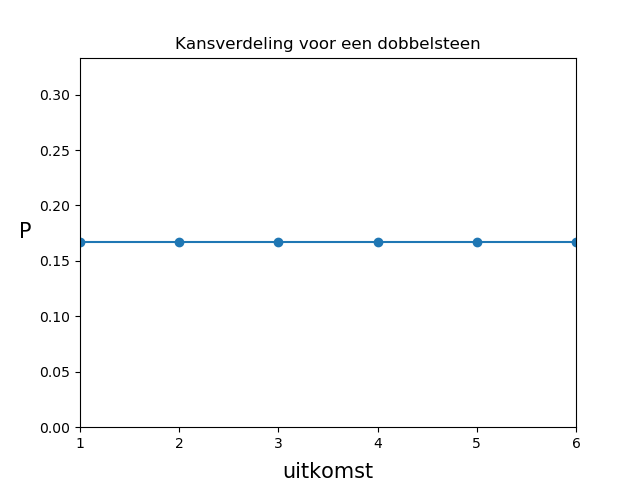
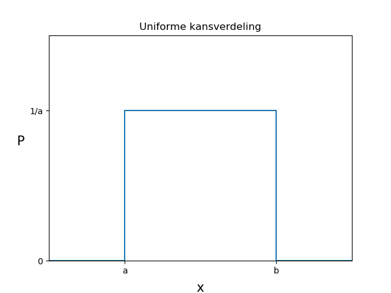
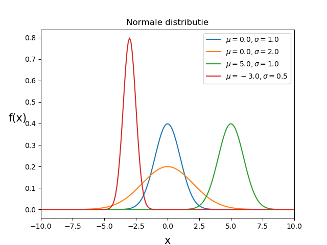

# Kanstheorie en kansdichtheidsfuncties

1. Ordered TOC
{:toc}

## Kanstheorie

Een kans is een getal tussen de $$0$$ en de $$1$$ die aangeeft hoe waarschijnlijk het is dat een bepaalde gebeurtenis zal plaatsvinden.
Een kans van $$1$$ zegt dat het **zeker** zal gebeuren en een kans van $$0$$ dat het **zeker niet** zal gebeuren. Een kans van $$0.5$$ geeft aan dat in $$50\%$$ van de gevallen de gebeurtenis zal plaatsvinden.

Als voorbeeld nemen kijken we naar een dobbelsteen. 
Wat is de kans dat je een $$4$$ gooit als je de dobbelsteen 1 keer gooit? 
Voor een normale dobbelsteen kunnen deze kans uitrekenen met behulp van de volgende formule: 

$$P(\text{uitkomst is }4) = \frac{\text{aantal uitkomsten met een 4}}{\text{Het totale aantal uitkomsten.}} = \frac{1}{6}$$ 

Dit is de kans voor een normale eerlijke dobbelsteen. Met eerlijk bedoelen we hier dat de dobbelsteen niet gemanipuleerd is en dat elk vlak van de dobbelsteen evenveel kans heeft om boven te eindigen. 

Stel nu dat we een speciale eerlijke dobbelsteen zouden hebben met de volgende vlakken: {1,2,2,3,4,4}. De mogelijke uitkomsten bij een dobbelsteenworp zijn nu: {1,2,3,4}. Dit noemen we ook de **uitkomstenverzameling** waarbij alle elementen uniek zijn, en dus maar 1 keer voorkomt. De kans om nu een 4 te gooien is groter dan met een normale eerlijke dobbelsteen, namelijk: 

$$P(\text{uitkomst is }4) = \frac{\text{aantal uitkomsten met een 4}}{\text{Totale aantal uitkomsten}} = \frac{2}{6}$$. 

En stel nu dat we een normale dobbelsteen hebben die gemanipuleerd is? Dan zal de kans om een 4 te gooien anders zijn. Een goede manier om dan de kans te bepalen is met behulp van de **Frequentist** formule: 

$$P(4) = lim_{n \to \infty} \frac{\text{uitkomst is 4}}{\text{totaal aantal worpen}}$$.

De frequentist kans is een goede manier om kansen te berekenen. Het kent echter twee grote beperkingen. De eerste is dat we eigenlijk nooit een oneindig aantal metingen kunnen doen. Dit is goed te benaderen door gewoon een heel groot aantal metingen te doen. De tweede beperking is dat niet alle experimenten herhaalbaar zijn. 

### Frequentist versus Bayesiaanse methode
Het zal je daarom niet verbazen dat er nog een andere methode bestaat die wel werkt voor experimenten die niet herhaalbaar zijn of een beperkte statistiek. Deze manier noemen we ook wel de Bayesiaanse (spreek uit: Beej-sie-jaanse) methode (engels: Bayesian). 

De frequentist methode wordt in het algemeen als objectieve methode gezien en de Bayesiaanse methode een subjectieve manier. Het geeft aan wat je denkt dat de waarschijnlijkheid is. Dat klinkt misschien niet erg wetenschappelijk maar in de praktijk is dit misschien wel de meest gebruikte methode. Vooral omdat je hem ook kan gebruiken als het experiment niet herhaalbaar is. 

Een voorbeeld. In een wielerronde staat een bergklassieker op het programma van vandaag. De wedstrijd is nog niet gestart. Er staan twee sterke renners,  Verstappen en Onana, op de gedeelde eerste plaats van het klassement en de voorsprong met de derde wielrenner is meer dan 20 minuten. Het lijkt dus waarschijnlijk dat aan het einde van de dag Verstappen of Onana op de eerste plaats in het klassement staat. Op bergetappes wint Onana 9 van de 10 keer met een flinke voorsprong van Verstappen. Wie denk je dat er wint? 

We kunnen het experiment natuurlijk niet herhalen maar het lijkt zeer waarschijnlijk dat Onana aan het einde van de dag op nummer 1 zal eindigen. 
Hier maken we gebruik van de subjectieve methode van Bayes. Om het te quantificeren kunnen we misschien zelfs wel zeggen dat de kans 0.9 is.

Maar nu zitten we aan ontbijt en we zien dat Onana geen hap door zijn keel krijgt. Hij is duidelijk erg ziek. Verstappen daarentegen ziet er fris en sterk uit. 
Hoe waarschijnlijk denk je nu dat het is dat Onana zal winnen?

Het lijkt nu toch een stuk minder waarschijnlijk dat Onana zal winnen. Misschien schat je nu de kansen lager in dan de 0.9 waarmee je begon. Misschien heb je zelfs wel informatie uit het verleden waaruit je weet hoeveel langzamer renners zijn als ze er zo ziek uitzien als Onana. Wat voor impact dat heeft op hun performance. Dan zouden we ons kans van 0.9 kunnen 'updaten' met de nieuwe informatie. Dat is typisch een Bayesiaanse methode om kansen uit te rekenen.

Beide methodes worden dus gebruikt, maar de Bayesiaanse methode, of zelfs een hybride methode vindt vooral zijn toepassing in heel complexe modellen en voorspellingen. In dit college zullen we vooral werken met de frequentist methode.
Wat in elk geval altijd belangrijk is, is om altijd heel precies te vermelden wat de voorwaardes zijn geweest waaronder de kans is uitgerekend. 

### Rekenen met kansen

Er zijn een paar basisregels waar kansen aan voldoen. 

1. **Behoud van kans**: Een gebeurtenis, $$A$$, kan plaatsvinden, of het kan niet plaatsvinden. De kans is behouden en dat betekend dat:  
$$ P(A) + P(\text{niet A}) = 1$$ 
Een direct gevolg hiervan is dat $$P(\text{niet A})$$ het complement is van $$P(A)$$ ofwel: 
$$ P(\text{niet A}) = 1 - P(A) $$. 
Dit wordt ook wel de **complementregel** genoemd.
2. Als de uitkomst $$B$$ *bestaat* dan geldt:   $$0 < P(B) \leq 1$$. Een kans moet dus altijd groter zijn dan nul voor alle elementen in de uitkomstenverzameling. 
3. **De *of* regel**: Als de uitkomsten $$A$$ en $$B$$ *wederzijds uitsluitend* zijn, ofwel als $$A$$ plaats vindt, dan vindt $$B$$ niet plaats, dan geldt: 
$$P(A\text{ of }B) \equiv P(A \cup B) = P(A) + P(B)$$. 
We mogen in de geval de kansen dus optellen.
4. **De *en* regel**: Als de uitkomsten $$A$$ en $$B$$ onafhankelijk zijn, dus als je $$A$$ een uitkomst is dan zegt dat niets over de kans op $$B$$, dan geldt:  
$$P(A\text{ en }B) = P(A) \cdot P(B)$$ 

We gaan voor elk van deze regels een voorbeeld geven. We kijken hiervoor naar een kaartendek.
De uitkomstenverzameling van een kaartendek is:  
{1♥,2♥,3♥,4♥,5♥,6♥,7♥,8♥,9♥,H♥,D♥,K♥,A♥,1♦,2♦,3♦,4♦,5♦,6♦,7♦,8♦,9♦,H♦,D♦,K♦,A♦, 1♠,2♠,3♠,4♠,5♠,6♠,7♠,8♠,9♠,H♠,D♠,K♠,A♠,1♣,2♣,3♣,4♣,5♣,6♣,7♣,8♣,9♣,H♣,D♣,K♣,A♣} 
Dit zijn in totaal 52 kaarten verdeeld over 2 kleuren: rood en zwart. 

**Voorbeeld 1, behoud van kans:**  
* De kans om een harten 5 uit een dek kaarten te trekken is precies: P(5♥)= 1/52. De kans om een *andere kaart dan een harten 5* te trekken is gelijk aan: 1-P(5♥) = 1-1/52 = 51/52. 
* De kans om een rode kaart te trekken is precies 26/52 = 1/2 en is precies gelijk aan de kans om een rode kaart te trekken (1-1/2 = 1/2)

**Voorbeeld 2, groter dan nul:**  
* Voor elke kaart in het dek is er een kans dat je hem trekt. 

**Voorbeeld 3, de of-regel:**  
* De kans dat je een 3 of een 5 trekt is gelijk aan P(3)+(P(5) = 1/13+1/13 = 2/13.  
* De kans dat je een 3 of een rode kaart trekt kunnen we niet zomaar optellen. Er bestaan ook rode kaarten met een 3. 

**Voorbeeld 4, de en-regel:**  
* De kans dat je een 3 en een rode kaart trekt kunnen we uitrekenen met: 
$$P(\text{rood en }3) = P(\text{rood}) \cdot P(3) =  1/2 \cdot 4/52 = 2/52$$ 
Er zijn maar twee rode 3 kaarten in het dek, dus dat klopt. Er zijn evenveel rode drie kaarten als zwarte 3 kaarten en daarom mag je ze in dit geval vermenigvulden. De uitkomsten zijn onafhankelijk.  
* De kans dat je een 9♥ en een A♣ trekt. Deze kansen zijn niet onafhankelijk. Als je een 9♥ trekt, zegt dat al direct iets over de kans dat deze kaart ook een A♣ is (die is namelijk gereduceerd tot 0).

## Stochastische variabelen en verdelingsfuncties

### Wat is een stochast?
Een **stochast** is een variable waarvan de waarde van een toevalsprocess afhangt. Bijvoorbeeld de uitkomst van het trekken van een kaart, dan is het getrokken kaart (de uitkomst van de trekking) een stochast. Je weet van te voren niet welke kaart je gaat trekken en daarom is de uitkomst *stochastisch*.
Of als je een met een dobbelsteen gooit dan is de uitkomst van de worp een stochast. Het engelse woord (random variable) is misschien bekender. 

### Kansdichtheidsfuncties
Stochasten zijn een handig middel bij het beschrijven van experimenten. We gaan hieronder een aantal distributies van stochastische variabelen bekijken die vaak voorkomen.
Deze distributies noemen we $$kansdichtheidsfuncties$$ (Engels: probability density function of pdf). Een kansdichtheidsfunctie, $$f(x)$$, zegt dat de kans dat een variabele $$x$$ gevonden wordt in een gebied $$[x,x+dx]$$ gelijk is aan $$f(x)dx$$.  
De kans dat we $$x$$ terugvinden in een interval $$[a,b]$$ is gelijk aan:  
$${\displaystyle P(a\leq x \leq b) = \int_a^b f(x) dx}$$.

Er zijn twee belangrijke voorwaardes aan een kansdichtheidsdistributies die je misschien bekend zullen voorkomen:  
1. De kans kan nergens kleiner dan nul zijn in het uitkomstengebied.  
2. De kansdichtheidsdistributie moet genormaliseerd zijn op 1.  
In formule notatie: $$f(x) \geq 0$$ en $$\int^\infty_{-\infty} f(x) dx =1$$.

de verwachtingswaarde: $$ <x> = E(x) = { \sum_i x_i P(x_i) } $$ 

Misschien komt dit allemaal wat abstract over en wellicht helpt het om wat concrete voorbeelden te zien. Hieronder definiëren we vier belangrijke kansdichtheidsdistributies (ook wel PDFs).

Voor we gaan kijken naar de voorbeelden is het handig om uit te leggen hoe we de verwachtingswaarde en de standaard deviatie kunnen uitrekenen voor kansdichtheidsfuncties. De definities hiervan heb je gezien in het hoofdstuk [Basisbegrippen](XX link). Voor kansdichtheidsfuncties

### Verwachtingswaarde en standaard deviatie
Voor **discrete** verdelingen kun je in principe dezelfde vergelijkingen gebruiken.  Namelijk: 
de verwachtingswaarde: $$ <x> = E(x) = { \sum_i x_i P(x_i) } $$ 
de standaard deviatie: $${\displaystyle \sigma^2 = \frac{\sum_{i}(x_i - <x>)^2P(x_{i})}$$. 

Voor **continue** verdelingen maak je gebruik van de volgende functies: 
de verwachtingswaarde: $$<x> = E(x) = {\displaystyle \int_\infty_{-\infty} x f(x) dx}$$ 
de standaard deviatie: $${\displaystyle \sigma^2 = <x^2>-<x>^2 = \int^{\infty}_{-\infty} (x-<x>)^2 f(x) dx }$$

### Uniforme verdelingsfunctie
De uniforme distributie is vlakke kansverdeling. De kans op elk deel van de uitkomstenverzameling is gelijk. We hebben hier al een paar voorbeelden van gezien. Bijvoorbeeld bij de eerlijke dobbelsteen waarbij de kans op elk van de 6 uitkomsten precies gelijk is. De uitkomsten van een dobbelsteen zijn discreet. Voor **discrete uniforme** verdelingen van stochastische waarden kunnen we schrijven dat de kans op uitkomst van stochast *i*, $$P({i})$$, gevonden kan worden met de relatie: 
$$P({i}) = 1/N$$ 
Waar N de hoeveelheid mogelijke uitkomsten is.
{:width="60%"}

Voor een **continue uniforme** verdeling geldt:  
$$f(x;a,b) = \frac{1}{b-a}$$ voor $$a\leq x \leq b$$.
Hier bij is $$f(x)$$ de kans dat je de waarde $$x$$ vindt. De stochast is hier dus $$x$$.
De functie $$f(x)$$ wordt ook wel een **kansdichtheidsfunctie** genoemd.
{:width="60%"}

### Binomiaal verdeling
{:width="60%"}

### Poisson verdeling
{:width="60%"}

### Normale verdeling of Gaussische verdeling
{:width="60%"}

