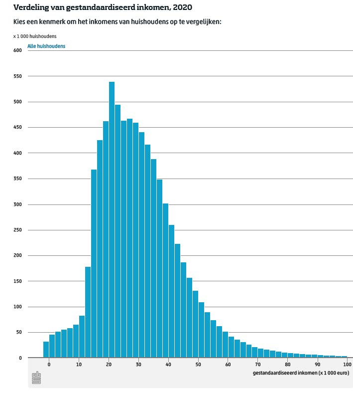

# Data visualiseren
<!--REF\label{/module-1/data-visualiseren}-->
1. Ordered TOC
{:toc}

Meetgegevens die je hebt verzameld kun je vaak ook visueel presenteren. Visualisatie is een heel krachtig middel. 

In dit deel bekijken we de verschillende manieren om data visueel te presenteren. Aan bod komen grafieken en scatterplots, staafdiagrammen en histogrammen. 

Als je data visualiseert dan is het natuurlijk de bedoeling dat iemand anders deze makkelijk en goed kan interpreteren. Er zijn bepaalde richtlijnen voor het maken van goede, inzichtelijke plots. 

De **richtlijnen zijn geen regels**. Er zijn altijd uitzonderlijke datasets die erom vragen om af te wijken van de richtlijnen. Blijf dus altijd goed nadenken over **wat** je doet en **waarom**. 

Afhankelijk van wat voor soort metingen je hebt genomen kies je uit een grafiek, een scatterplot, een staafdiagram of een histogram. Elk van deze data visualisatie methodes worden hieronder besproken. 

## Grafieken & Scatterplots

Als je een relatie tussen twee grootheden wilt onderzoeken gebruik jeen grafiek of een scatterplot. Grafieken en scatterplots zijn twee vormen van een diagram die veel op elkaar lijken. 
Bij beide vormen geef je datapunten weer die steeds twee waardes kennen, bijvoorbeeld de massa en lengte. Scatterplots gebruik je voor een waarde van de ene grootheid meerdere waardes voor kunnen komen van de andere grootheid. In het voorbeeld van lengte en massa zouden er bijvoorbeeld voor een gegeven massa meerdere waardes van de lengte kunnen voorkomen. Grafieken gebruik je als er maar één waarde voor een gegeven massa voorkomt.

Bij **grafieken** verwacht je vaak een bepaalde relatie tussen de gemeten waardes. Op de horizontale as zet je de ingestelde of gekozen waarde, op de verticale as de gemeten waarde. Bijvoorbeeld als je te temperatuur meet op verschillende tijdstippen van de dag dan komt de tijd op de horizontale as en de temperatuur op de verticale as. 
De punten in een grafiek mag je eventueel met een lijn verbinden. Maar let goed op, soms wordt het er niet duidelijker van. 

> **Voorbeeld van een grafiek**
> Bij verschillende weerstations meten we over een periode van een maand de temperatuur op een vast tijdstip op de dag. De meetgegeven geven we weer in een grafiek. Op de horizontale as zetten we de tijd en op de verticale as de gemeten temperatuur. De meetwaardes van de verschillende meetstations geven we weer met verschillende kleuren en om de grafiek duidelijker leesbaar te maken verbinden we de punten met een lijn. De legenda geeft duidelijk weer welke kleur bij welk meetstation hoort.
> {:width="100%"} 

Bij **scatterplots** kan er wel een relatie bestaan tussen de twee grootheden maar er zit geen volgorde in de datapunten. Hierom verbindt je de punten in een scatterplot *nooit*. 
 

> **Voorbeeld van een scatterplot**
> Van een bolhoop meten van een deel van de sterren zowel de oppervlakte temperatuur ($$T_{eff}$$) als de lichtkracht ($$M_v$$). De datapunten geven we weer in een scatterplot.
> 
> 

Voor het weergeven van grafieken en scatterplots in wetenschappelijke rapporten gelden een aantal richtlijnen die we hieronder samenvatten en kort uitleggen. 

#### Richtlijnen opmaak grafieken en scatterplots

- Een grafiek van een dataset wordt geplot met punten en eventueel lijnen die de datapunten verbinden. Een scatterplot alleen met punten en nooit met een lijn.
- Bij een enkele dataset wordt geen legenda gebruikt. Als er meerdere datasets in één grafiek worden weergegeven dan is een legenda noodzakelijk.
- Aslabels geven weer wat elke as representeert (inclusief eenheden!).
- Assen beginnen zo mogelijk bij de oorsprong. Een uitzondering kan zijn als de data heel erg ver van de oorsprong af zit of als er bijvoorbeeld ook negatieve waardes voorkomen.
- Op de assen vindt je maatstreepjes die de waardes op de as markeren. Er bestaan grote en kleine maatstreepjes. Een as begint en eindigt op een groot maatstreepje met een waarde en niet op een klein maatstreepje of een maatstreep zonder getal. Tenzij er een natuurlijk een goede reden is om hiervan af te wijken.  
- Een grafiek voor een wetenschappelijk artikel of een verslag heeft geen titel. Een grafiek voor webteksten of lesmateriaal heeft over het algemeen wel een titel. 
- Als je de onzekerheid op de meetpunten kent, dan is het goed om deze ook weer te geven in je plot. Tenzij deze heel onoverzichtelijk wordt (zoals in een scatterplot met heel veel punten).

*Let op!* Dit zijn weer richtlijnen en geen regels. Denk altijd goed na over wat je doet en waarom. Het eindresultaat moet goed begrijpbaar zijn en daarvoor is het soms nodig om van de richtlijnen af te wijken.

## Staafdiagrammen & Histogrammen

Als je de incidentie (of frequentie) van meetwaarden wil laten zien dan gebruik je een histogram of staafdiagram. 
Een **staafdiagram** gebruik je als de meetwaarden discreet zijn gecategoriseerd, bijvoorbeeld in het soort auto of per kleur. Een **histogram** gebruik je voor grootheden die numeriek geordend kunnen worden, zoals bijvoorbeeld een grootheid met integer of continue waardes.

> **Voorbeeld van een staafdiagram** In dit staafdiagram laten we de hoeveelheid hybride/electrische auto's zien die in Nederland in verschillende jaren in bezit zijn. De categoriën hybride/plug-in hybride en volledig electrisch zijn geen numerieke waardes en worden in  een staafdiagram weergegeven. 
>
> {:width="60%"} 

Bij het weergeven van data in een histogram wordt de data gegroepeerd in intervallen. De breedte van de staven (in het vervolg 'bins' genoemd) geeft de breedte van de intervallen. 

Bij een staafdiagram kun je de frequentie direct aflezen; voor één categorie lees je op de as af hoe vaak deze voorkomt. Voor een histogram is de frequentie gelijk aan de oppervlakte van de balken, en dus afhankelijk van de breedte van de balken. Deze breedte noemen we ook de bin breedte.

> **Voorbeeld van een histogram** In dit histogram wordt weergegeven hoe vaak een bepaald inkomen voorkomt. Het inkomen is een numeriek getal en dit is dus een histogram. De breedte van de balken moet voor de visualisatie gekozen worden. 
> 
> {:width="60%"} 

Voor een histogram is de breedte van de intervallen van belang. Als we te weinig bins kiezen dan worden de intervallen erg groot (/breed) en is er minder te zeggen over het gedrag van de data. Als we te veel bins kiezen dan fluctueert de hoogte van de (smalle) bins onderling erg en is het ook lastiger om de trend in de data goed in te schatten.

Dit bekijken we aan de hand van een voorbeeld<!--FIG , zie Fig. \ref{fig:Plot11_RandNorm_Hist_GoedeBins}-->. Zo zou het kunnen zijn dat het ideale plaatje bij een gegeven dataset het volgende is.

{:width="400px"} 

Als we te brede bins kiezen dan wordt de data afgevlakt en kunnen we het bovenstaande gedrag niet meer herkennen<!--FIG , zie Fig. \ref{fig:Plot12_RandNorm_Hist_TeWeinigBins}-->.

{:width="400px"} 

Kiezen we juist te smalle bins, <!--FIG ,zoals hieronder in Fig. \ref{fig:Plot13_RandNorm_Hist_TeVeelBins}--> dan kunnen we het gedrag van de data nog wel herkennen (in dit geval) maar er is veel fluctuatie in de hoogte van de bins. 

{:width="400px"} 

Met het kiezen van te veel bins hebben we dus visuele ruis geïntroduceerd, dit maakt het moeilijker om het gedrag op het oog te herkennen.

Bij het bepalen van het optimale aantal bins en de optimale bin breedte is het belangrijkste dat het gedrag van de data goed zichtbaar is. Er zijn verschillende formules (bijvoorbeeld de square of de Sturges formule) ontwikkeld waarmee je het aantal bins dat je nodig hebt kunt berekenen. Echter, geen van die formules kun je blind toepassen. Het is veel beter om gewoon goed naar je dataset te kijken en een inschatting te maken van de bin breedte. 
Bij het kiezen van een bin breedte moet je ook rekening houden met de waardes op de as, vaak is het goed om de breedte van de balken overeen te laten komen met de markeerstreepjes op de horizontale as.  

 
#### Richtlijnen opmaak staafdiagrammen en histogrammen

- Aslabels geven weer wat elke as representeert (inclusief eenheden!).
- Assen beginnen zo mogelijk bij de oorsprong. Een uitzondering kan zijn als de data heel erg ver van de oorsprong af zit of als er bijvoorbeeld ook negatieve waardes voorkomen.
- Op de assen vindt je maatstreepjes die de waardes op de as markeren. Er bestaan grote en kleine maatstreepjes. Een as begint en eindigt op een groot maatstreepje met een waarde en niet op een klein maatstreepje of een maatstreep zonder getal. Tenzij er een natuurlijk een goede reden is om hiervan af te wijken.  
- Een histogram of staafdiagram voor een wetenschappelijk artikel of een verslag heeft geen titel. 
- De bin breedte. Meestal kies je voor het hele histogram dezelfde bin breedte, in sommige gevallen kun je verschillende bin breedtes kiezen. In elk geval geldt dat het histogram goed 'leesbaar' moet zijn. Het moet duidelijk blijven hoe de data gedistribueerd is. Wat is de trend? Zijn er afwijkingen van die trend.
- Let bij histogrammen erg goed op waar de grens van een bin ligt. Vooral als je een dataset met natuurlijke getallen weergeeft is het belangrijk dat de bin grenzen netjes *tussen* de natuurlijke getallen ligt. Anders kan de distributie van de data verkeerd gerepresenteerd worden.
- Het histogram is makkelijker leesbaar als de bins een natuurlijk interval hebben. Als je range van 0 tot 10 loopt is het heel gek om deze te verdelen in 7 bins.

