# Data visualiseren
<!--REF\label{/module-1/data-visualiseren}-->
1. Ordered TOC
{:toc}

In dit deel bekijken we de verschillende manieren om data visueel te presenteren. Aan bod komen grafieken en scatterplots, staafdiagrammen en histogrammen. We laten ook zien hoe je deze met behulp van python kan maken.

Als je data visualiseert dan is het de bedoeling dat iemand anders deze goed kan begrijpen. Er zijn wel een aantal richtlijnen, maar het meest belangrijke is dat de data overzichtelijk is. Dat trends, of juist afwijkingen daarvan, goed zichtbaar worden gemaakt. 

De richtlijnen zijn geen regels. Er zijn altijd uitzonderlijke datasets die erom vragen om af te wijken van de richtlijnen. Blijf dus altijd goed nadenken over wat je doet en waarom. 

Afhankelijk van wat voor soort metingen je hebt genomen kies je uit een grafiek, een scatterplot, een staafdiagram of een histogram. Elk van deze data visualisatie methodes worden hieronder besproken. 

## Grafieken & Scatterplots

Grafieken en scatterplots zijn twee vormen van een diagram die veel op elkaar lijken. Ze verschillen wel op een paar punten. 

Bij **scattterplots**,

* kunnen voor een ingestelde/gekozen waarde meer dan één gemeten waarden bestaan. Een voorbeeld zou zijn als je een meting doet waarbij je de lengte van mensen opmeet en tegen hun leeftijd uitzet. 
* verbind je *nooit* punten met lijnen. Dat zou ook erg verwarrend zijn omdat je de dataset niet altijd logisch kan ordenen. In grafieken is dat vaak trouwens ook onwenselijk. 

Bij **grafieken**, 

* kies je meestal voor een van de twee grootheden een meetpunt of stel je een waarde in. De gemeten waarde laten we zien op de verticale as en de gekozen waarde op de horizontale as. 

### Richtlijnen voor de opmaak van diagrammen

Met behulp van voorbeelden laten we zien wat de richtlijnen zijn en waar je op moet letten. 

Stel bijvoorbeeld dat we naar de gemiddelde dagtemperatuur in de maand december 2019 in de Bilt kijken. Hier<!--FIG , in Fig. \ref{fig:plot1_lijn_geenOpmaak}--> een plot met een lijn tussen elk datapunt (Bron: KNMI, gehomogeniseerde data).

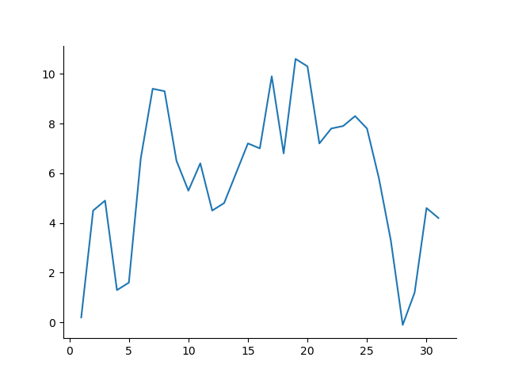{:width="60%"}

Je ziet dat dit niet erg duidelijk is. Het is bijvoorbeeld niet precies te zien waar de gemeten punten zitten, we hebben wel een vermoeden doordat er punten zijn waarop de lijn abrupt van richting verandert, maar wie weet zitten er nog wel meer datapunten tussen.

Laten we dezelfde data eens plotten zonder lijnen maar alleen met punten.  

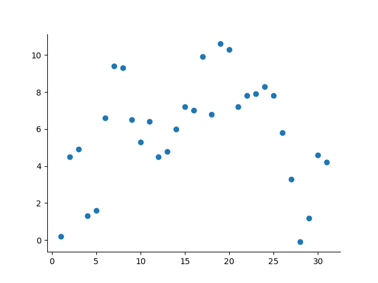{:width="60%"}

Vanuit deze grafiek<!--FIG , Fig. \ref{fig:plot2_scatter_geenOpmaak}--> zien we waar de datapunten zijn. Dat konden we in de lijnplot niet goed zien. We kunnen nu helaas de trend niet meer goed waarnemen. Omdat er op een dag maar één gemiddelde gemeten temperatuur kan bestaan, is het toch beter deze als een grafiek weer te geven. 
We kiezen ervoor om zowel een lijn als markers te gebruiken. 

De plot kan echter netter. Zo staan er geen labels op de assen. Nu kunnen we in dit geval wel raden welke as het jaar aangeeft en welke as de temperatuur, maar in veel gevallen is dat niet zo duidelijk. Om die reden moeten er altijd **labels op de assen** staan, zie het volgende figuur <!--FIG \ref{fig:plot3_grafiek_aslabel}-->.

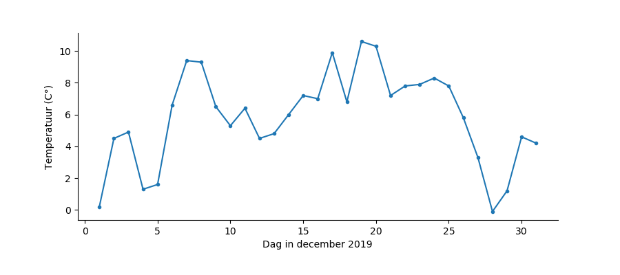{:width="100%"} 

Zoals je ziet hebben we het formaat van de grafiek ook aangepast zodat de distributie iets natuurlijker overkomt.

Een andere conventie is dat grafieken doorgaans **beginnen bij de oorsprong, tenzij de data dan onvolledig of onleesbaar wordt**. In het geval van het weergeven van de temperaturen wordt de data bijvoorbeeld onvolledig als we de temperatuur bij nul laten beginnen, we hebben immers ook temperaturen onder het vriespunt. In dit geval kunnen we de horizontale as wel bij nul laten beginnen, al is niet voor alle datums zo. 

De assen kunnen nog wat netter. Zo eindigt de verticale as net voor de waarde $$0$$, maar het is niet helemaal duidelijk bij welke waarde precies. De horizontale as begint een klein stukje voor 0 en eindigt een klein stukje na 30. Conventie is om assen te laten **beginnen en eindigen op een maatstreepje met een getal**.  In ons geval laten we het beginnen op de eerste dag van de maand en de laatste dag, daarnaast laten we de temperatuur beginnen op $$-2$$ &deg;C en eindigen op $$16$$ &deg;C. 
<!--FIG Dit tonen we in Fig. \ref{fig:plot4_grafiek_aslabel_lim}.-->

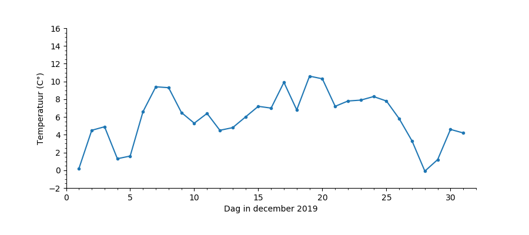{:width="100%"} 

Stel we willen de temperatuur in de Bilt nu weergeven naast de temperaturen gemeten in Vlissingen en Maastricht. De grafiek ziet er dan zo uit<!--FIG in Fig.\ref{fig:plot5_grafieken_aslabel_lim}-->.

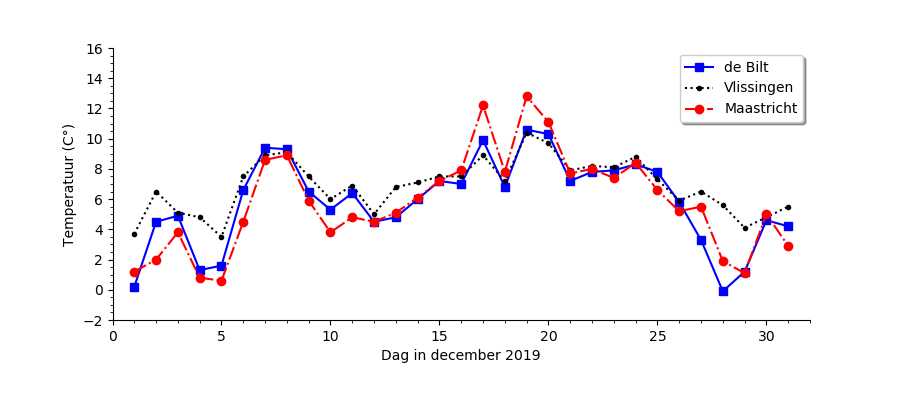{:width="100%"} 

We hebben<!--FIG in Fig.\ref{fig:plot5_grafieken_aslabel_lim}--> ook een legenda toegevoegd zodat duidelijk is welke lijn bij welk weerstation hoort. 

Tot nu toe hebben we nog geen titels toegevoegd aan de plots. Dit komt omdat dat voor verslagen en wetenschappelijke artikelen ongebruikelijk is, daar moet het onderschrift namelijk al vertellen wat er te zien is in de grafiek. In webteksten, lesteksten en presentaties kan het echter voorkomen dat een grafiek wel een titel heeft, omdat er in die context vaak geen onderschrift toegevoegd kan worden. 

**Samengevat**:

- Een grafiek van een dataset wordt geplot met punten en eventueel lijnen. 
- Het resultaat van een fit of een theoretisch verband wordt met een gladde lijn geplot.
- Bij een enkele dataset wordt geen legenda gebruikt. Als er meerdere datasets in één grafiek worden weergegeven dan is een legenda noodzakelijk.
- Aslabels geven weer wat elke as representeert (inclusief eenheden!).
- Assen beginnen in principe bij de oorsprong. Een uitzondering kan zijn als de data heel erg ver van de oorsprong af zit.
- Een as begint en eindigt op een groot maatstreepje met een waarde ('major tick') en niet op een klein maatstreepje of een maatstreep zonder getal. Tenzij er een heel goede reden is om hiervan af te wijken. (Zoals in het voorbeeld hierboven.) 
- Een grafiek voor een wetenschappelijk artikel of een verslag heeft geen titel. Een grafiek voor webteksten of lesmateriaal heeft over het algemeen wel een titel.
- Als je de onzekerheid op de meetpunten kent, dan is het goed om deze ook weer te geven in je plot. Tenzij deze heel onoverzichtelijk wordt (zoals in een scatterplot met heel veel punten).

*Let op!* Dit zijn weer richtlijnen en geen regels. Denk altijd goed na over wat je doet en waarom. Het eindresultaat moet goed begrijpbaar zijn en daarvoor is het soms nodig om van de richtlijnen af te wijken.

## Staafdiagrammen & Histogrammen

Staafdiagrammen en histogrammen worden allebei typisch gebruikt om frequenties van meetwaardes aan te geven. 

Hier zie je voorbeelden van een staafdiagram en een histogram.

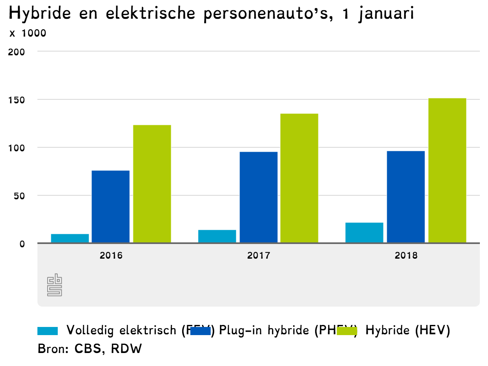{:width="60%"} 

Hier<!--FIG , in Fig. \ref{fig:autos-in-nederland}--> zie je een **staafdiagram** dat de hoeveelheid auto's in Nederland laat zien over drie verschillende jaren opgesplitst naar drie auto categorieën. 

{:width="60%"} 

Hierboven<!--FIG , in Fig. \ref{fig:verdeling-van-inkomens-2}--> zie je een **histogram** dat de inkomensverdeling in Nederland laat zien. 

Er is een belangrijk verschil tussen een staafdiagram en een histogram. Een staafdiagram laat de frequentie zien voor *gecategoriseerde* verdelingen. Een histogram wordt gebruikt om het resultaat van een *numeriek sorteerbare* verdeling mee weer te geven. In het geval van een histogram gaat het vaak om data met een continue grootheid, zoals bijvoorbeeld bij het opmeten van lengte of gewicht. In dat geval sorteer je de data per interval.

Bij het weergeven van data in een histogram wordt de data gegroepeerd in intervallen. De breedte van de staven (in het vervolg 'bins' genoemd) geeft de breedte van de intervallen. 

Bij een staafdiagram kun je de frequentie direct aflezen; voor één categorie lees je op de as af hoe vaak deze voorkomt. Voor een histogram is de frequentie gelijk aan de oppervlakte van de balken, en dus afhankelijk van de bin breedte.

### Breedte van de bins bij een histogram

Voor een histogram is de breedte van de intervallen van belang. Als we te weinig bins kiezen dan worden de intervallen erg groot (/breed) en is er minder te zeggen over het gedrag van de data. Als we te veel bins kiezen dan fluctueert de hoogte van de (smalle) bins onderling erg en is het ook lastiger om de trend in de data goed in te schatten.

Dit bekijken we aan de hand van een voorbeeld<!--FIG , zie Fig. \ref{fig:Plot11_RandNorm_Hist_GoedeBins}-->. Zo zou het kunnen zijn dat het ideale plaatje bij een gegeven dataset het volgende is.

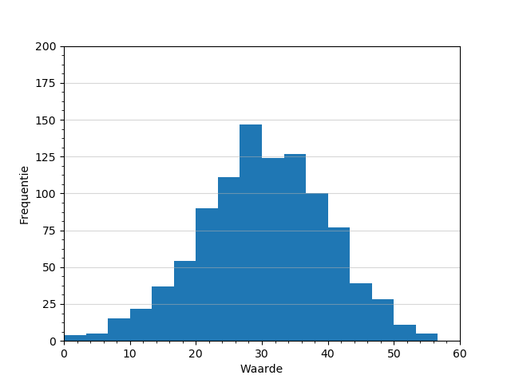{:width="400px"} 

Als we te brede bins kiezen dan wordt de data afgevlakt en kunnen we het bovenstaande gedrag niet meer herkennen<!--FIG , zie Fig. \ref{fig:Plot12_RandNorm_Hist_TeWeinigBins}-->.

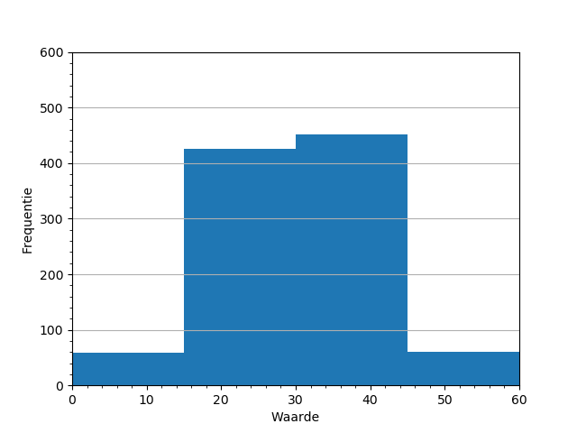{:width="400px"} 

Kiezen we juist te smalle bins, <!--FIG ,zoals hieronder in Fig. \ref{fig:Plot13_RandNorm_Hist_TeVeelBins}--> dan kunnen we het gedrag van de data nog wel herkennen (in dit geval) maar er is veel fluctuatie in de hoogte van de bins. 

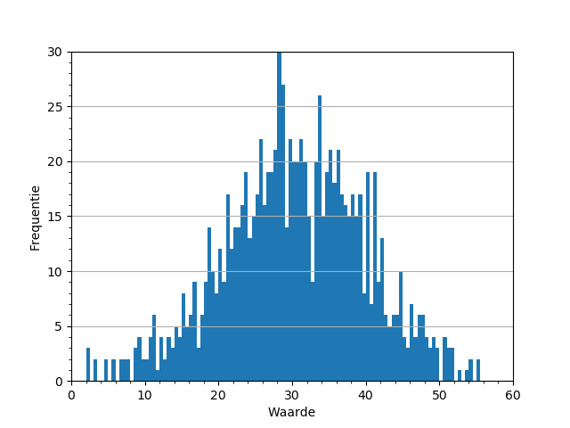{:width="400px"} 

Met het kiezen van te veel bins hebben we dus visuele ruis geïntroduceerd, dit maakt het moeilijker om het gedrag op het oog te herkennen.

Bij het bepalen van het optimale aantal bins en de optimale bin breedte is het belangrijkste dat het gedrag van de data goed zichtbaar is. Er zijn verschillende formules (bijvoorbeeld de square of de Sturges formule) ontwikkeld waarmee je het aantal bins dat je nodig hebt kunt berekenen. Echter, geen van die formules kun je blind toepassen. Het is veel beter om gewoon goed naar je dataset te kijken en een inschatting te maken van de bin breedte. 

**Bij het maken van een histogram moet je goed letten op het volgende:**

* Het bereik (de range) die je kiest op de horizontale as. Van waar tot waar plot je de data? Meestal wil je de gehele dataset laten zien, maar soms wil je juist inzoomen op een kleiner stukje. 
* De bin breedte. Meestal kies je voor het hele histogram dezelfde bin breedte, in sommige gevallen kun je verschillende bin breedtes kiezen. In elk geval geldt dat het histogram goed 'leesbaar' moet zijn. Het moet duidelijk blijven hoe de data gedistribueerd is. Wat is de trend? Zijn er afwijkingen van die trend.
* Let bij histogrammen erg goed op waar de grens van een bin ligt. Vooral als je een dataset met natuurlijke getallen weergeeft is het belangrijk dat de bin grenzen netjes *tussen* de natuurlijke getallen ligt. Anders kan de distributie van de data verkeerd gerepresenteerd worden.
* Het histogram is makkelijker leesbaar als de bins een natuurlijk interval hebben. Als je range van 0 tot 10 loopt is het heel gek om deze te verdelen in 7 bins.

**Voor zowel histogrammen als staafdiagrammen geldt:**

* Natuurlijk moeten bij histogrammen en staafdiagrammen ook netjes aslabels worden gebruikt.
* Als je meer dan één dataset laat zien maak dan gebruik van een legenda.

## Wanneer gebruik je wat?

1. Als je de incidentie (of frequentie) van meetwaarden wil laten zien dan gebruik je een histogram of staafdiagram. 
	* Een staafdiagram gebruik je als de meetwaarden discreet zijn gecategoriseerd, bijvoorbeeld in het soort auto of per kleur. 
	* Een histogram gebruik je voor grootheden die numeriek geordend kunnen worden, zoals bijvoorbeeld een grootheid met integer of continue waardes.

2.  Als je de relatie tussen twee grootheden wil tonen kies je voor een grafiek of een scatterplot. 
	*	Je gebruikt een grafiek als de afhankelijke grootheid (meestal de langs de x-as) unieke waardes kent. Dus voor een bepaalde waarde van x is maar één uitkomst van y mogelijk. Andersom zijn er wellicht meerdere waardes voor x voor een bepaalde gemeten grootheid y. Bijvoorbeeld de gemeten temperatuur om 12 uur 's middags op een bepaalde locatie. Er kan maar 1 gemeten temperatuur bestaan.
	*  Je gebruikt een scatterplot als er geen unieke waarde is per afhankelijke grootheid. Bijvoorbeeld als je de lengte van een student meet in relatie met de leeftijd. Er zijn waarschijnlijk meerdere studenten met dezelfde leeftijd in de groep die hoogstwaarschijnlijk in lengte van elkaar verschillen.

	

## Data plotten met Python

Om in Python te kunnen plotten moeten we als eerste een library importeren die ingebouwde functies heeft voor het visueel weergeven van data. Een populair pakket is Matplotlib, deze zullen we in dit vak dan ook gebruiken (er zijn ook andere geschikte pakketten zoals Seaborn, geplot en Plotly). 
We importeren de **`pyplot`** functie vanuit Matplotlib en geven deze de naam 'plt' met het volgende commando:

    import matplotlib.pyplot as plt

De naamgeving **`plt`** met het commando **`as plt`** is optioneel, maar wel handig omdat we deze functie over het algemeen vaak zullen gebruiken (dat scheelt typen).

### Voorbeeld: een grafiek plotten
Stel we hebben de hoogte van een vallende bal gemeten als functie van de tijd. In de tabel is de gemeten data weergegeven:

| t (s) | 0.0 | 0.5 | 1.0 | 1.5 | 2.0 | 2.5 | 3.0 | 3.5 | 4.0 | 4.5 | 5.0 | 5.5 | 6.0 |
| --- | ---| --- |--- | --- | --- | --- | --- | --- | --- | --- | --- | --- | --- |
| h(cm) | 180.0 | 178.8 | 175.1 | 169.0 | 160.4 | 149.3 | 135.9 | 120.0 | 102.0 | 80.7 | 57.4 | 31.6 | 3.4 |

Nu maken we een lijst **`t_data`** aan voor de tijd en een lijst **`h_data`** voor de hoogte van de bal:

    t_data = [0.0, 0.5, 1.0, 1.5, 2.0, 2.5, 3.0, 3.5, 4.0, 4.5, 5.0, 5.5, 6.0]
    h_data = [180.0, 178.8, 175.1, 169.0, 160.4, 149.3, 135.9, 120.0, 102.0, 80.7, 57.4, 31.6, 3.4]

Daarna roepen we het **`plot`** commando uit matplotlib.pyplot aan:

    plt.plot(t_data, h_data, 'ro')

Met **`'ro'`** geven we aan dat we rode gevulde punten in de plot willen. De plot ziet er nu als volgt <!--FIG (zie Fig. \ref{fig:Plot14_Vallenbal_PlotOnopgemaakt})--> uit.

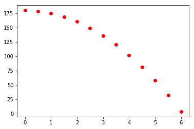{:width="400px"} 

Je ziet dat de assen automatisch vanaf de laagste waarde tot aan de hoogste waarden gaan, en hierbij niet eindigen op een maatstreepje. Daarnaast willen we graag labels op de assen.

De limiet van de assen kunnen we aangeven met de commando's **`plt.xlim`** en **`plt.ylim`**:

    plt.xlim(0,7)
    plt.ylim(0,200)

Labels voor de assen kunnen we als volgt specificeren:

    plt.xlabel('t (s)')
    plt.ylabel('h (cm)')
    
Het resultaat is<!--FIG (Fig. \ref{fig:Plot15_Vallenbal_PlotOpgemaakt})-->.

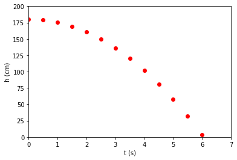{:width="400px"} 

De volledige code tot nu toe is:    

    # dataset in lijsten zetten
    t_data = [0,0.5,1,1.5,2,2.5,3,3.5,4,4.5,5,5.5,6]
    h_data = [180,178.8,175.1,169.0,160.4,149.3,135.9,120,102,80.7,57.4,31.6,3.4]
    
    # data plotten, as-limieten instellen, as-labels instellen
    plt.plot(t_data, h_data, 'ro')    
    plt.xlim(0,7)
    plt.ylim(0,200)
    plt.xlabel('t (s)')
    plt.ylabel('h (cm)')

Als we nu nog een dataset hebben, bijvoorbeeld van dezelfde bal die vanaf een hoogte van 160 cm valt in plaats van een hoogte van 180 cm:

    # tweede dataset in lijsten zetten
    t_data2 = [0,0.5,1,1.5,2,2.5,3,3.5,4,4.5,5,5.5]
    h_data2 = [160,158.8,155.1,149.0,140.4,129.3,115.9,100,82,60.7,37.4,11.6]
    
Deze dataset kunnen we in de grafiek van de eerste plotten door twee keer het plot commando achter elkaar te gebruiken: daarna gebruiken we weer dezelfde eigenschappen voor de limieten en de aslabels:

    plt.plot(t_data, h_data, 'ro')
    plt.plot(t_data2, h_data2, 'bo')
   
Daarna gebruiken we weer dezelfde eigenschappen voor de as-limieten en de as-labels:

    plt.xlim(0,7)
    plt.ylim(0,200)
    plt.xlabel('t (s)')
    plt.ylabel('h (cm)')
    
De plot ziet er dan als volgt uit<!--FIG (Fig. \ref{fig:PLOT16_MeerdereScatter})-->. 

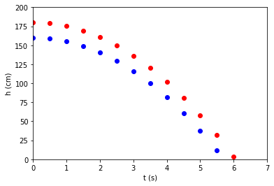{:width ="400px"} 

Omdat er meerdere datasets in één grafiek zijn weergegeven is het noodzakelijk om hier een legenda bij te plaatsen. Een legenda kan op meerdere plaatsen in de figuur neergezet worden. Voordat we de legenda kunnen toevoegen moeten we de plots eerst labelen. Dit doen we door **`label = "naam"`** achteraan in de **`plot`** commando's toe te voegen:

    plt.plot(t_data, h_data, 'ro' , label='h(0) = 180 cm')
    plt.plot(t_data2, h_data2, 'bo', label='h(0) = 160 cm')

Nu kunnen we de legenda als volgt toevoegen (hier kiezen we ervoor om de legenda in de rechterbovenhoek neer te zetten zodat er geen overlap is met de grafieken zelf): 

    plt.legend(loc='upper right', shadow=True, ncol=1)

De grafiek is nu als volgt<!--FIG (Fig. \ref{fig:PLOT18_MeerdereScatter_legenda})-->.

{:width ="400px"} 

De volledige code tot nu toe is:    

    # dataset in lijsten zetten
    t_data = [0,0.5,1,1.5,2,2.5,3,3.5,4,4.5,5,5.5,6]
    h_data = [180,178.8,175.1,169.0,160.4,149.3,135.9,120,102,80.7,57.4,31.6,3.4]
    
    # tweede dataset in lijsten zetten
    t_data2 = [0,0.5,1,1.5,2,2.5,3,3.5,4,4.5,5,5.5]
    h_data2 = [160,158.8,155.1,149.0,140.4,129.3,115.9,100,82,60.7,37.4,11.6]
    
    # data plotten, as-limieten instellen, as-labels instellen
    plt.plot(t_data, h_data, 'ro' , label='h(0) = 180 cm')
    plt.plot(t_data2, h_data2, 'bo', label='h(0) = 160 cm')
    plt.xlim(0,7)
    plt.ylim(0,200)
    plt.xlabel('t (s)')
    plt.ylabel('h (cm)')
    
    # legenda toevoegen
    plt.legend(loc='upper right', shadow=True, ncol=1)

Een ander voorbeeld is dat we lijnen willen plotten, bijvoorbeeld van een theoretisch verband. (De conventie is dat data altijd met punten wordt uitgebeeld.) 
Dit kan je als volgt doen:

    # datasets in lijsten
    x = [0, 1, 2, 3, 4, 5, 6, 7, 8, 9, 10]
    y1 = [1, 3, 5, 7, 9, 11, 13, 15, 17, 19, 21] #2x+1
    y2 = [2, 3, 4, 5, 6, 7, 8, 9, 10, 11, 12] #x+2

    # datasets plotten als 'solid' lijnen
    plt.plot(x, y1, 'r-' , label='dataset 1')
    plt.plot(x, y2, 'b-', label='dataset 2')
    plt.xlim(0,7)
    plt.ylim(0,20)
    plt.xlabel('x')
    plt.ylabel('y')
    
    # legenda toevoegen
    plt.legend(loc='upper right', shadow=True, ncol=1)

    
De bijbehorende plot<!--FIG (Fig. \ref{fig:PLOT17_MeerdereLijnen_legenda})-->.

{:width="400px"} 

### Voorbeeld een histogram plotten

In de allereerste opgave van module 1 ga je een histogram plotten. In die opgave staat stap voor stap uitgelegd hoe je dat moet doen. 

Maar kijk vooral ook in de [online manual](https://matplotlib.org/3.1.1/tutorials/introductory/pyplot.html) van matplotlib.

Succes!

