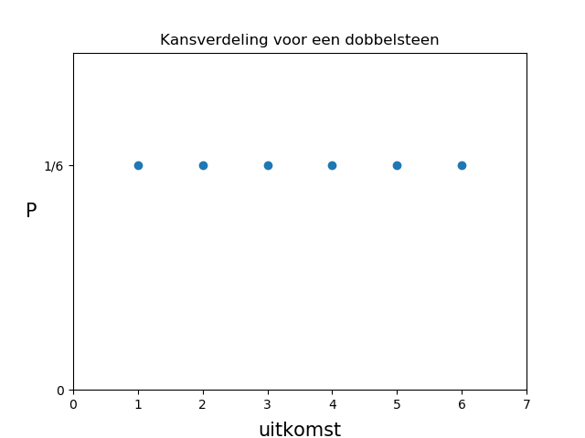
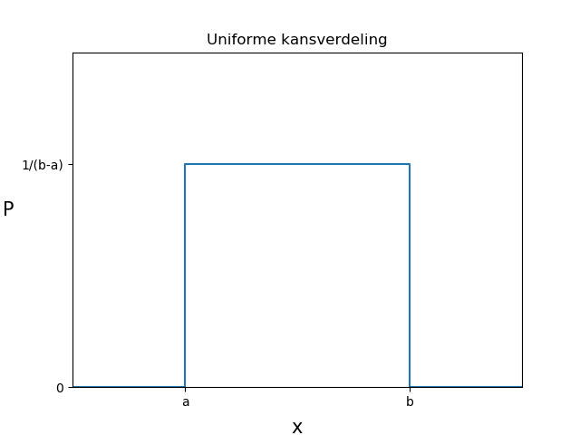
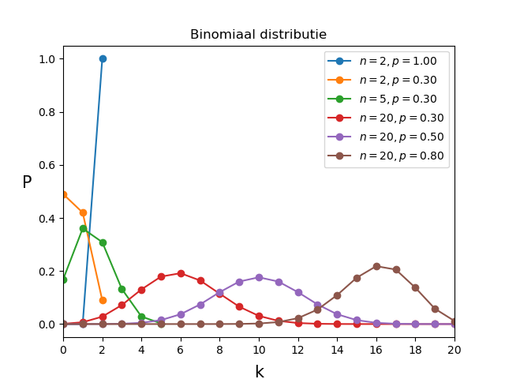

# Kansdichtheidsfuncties
<!--REF\label{/module-1/verdelingsfuncties}-->

1. Ordered TOC
{:toc}

We gaan nu kijken naar kansverdelingen. In het voorbeeld van de simpele dobbelsteen zou je kunnen kijken hoe de kansen verdeeld zijn over de verschillende uitkomsten. Voor een normale dobbelsteen is dit misschien een beetje saai, voor elke uitkomst verwacht je een andere waarde. Voor de speciale dobbelsteen die we eerder beschreven ziet het er al wat interessanter uit. 

Om over kansverdelingen te kunnen leren moeten we eerst weten wat stochasten zijn. Daarna introduceren we enkele veelgebruikte kansdichtheidsverdelingen.

## Wat is een stochast?
Een **stochast** is een (meetbare) variabele waarvan de waarde van een kans proces afhangt. Bijvoorbeeld de uitkomst van het trekken van een kaart, dan is het getrokken kaart (de uitkomst van de trekking) een stochast. Je weet van tevoren niet welke kaart je gaat trekken en daarom is de uitkomst *stochastisch*.
Of als je een met een dobbelsteen gooit dan is de uitkomst van de worp een stochast. Het Engelse woord (random variable) is misschien bekender. 

## Kansdichtheidsfuncties
Stochasten zijn een handig middel bij het beschrijven van experimenten. We gaan hieronder een aantal vaak voorkomende distributies van stochastische variabelen bekijken. De distributies laten zien wat de kans is dat een bepaalde stochastische waarde wordt gevonden. Het is dus een verdeling van kansen. Deze verdelingen noemen we **kansdichtheidsfuncties** (Engels: probability density function of PDF). Een kansdichtheidsfunctie, $$f(x)$$, zegt dat de kans dat een variabele $$x$$ gevonden wordt in een gebied $$[x,x+dx]$$ gelijk is aan $$f(x)dx$$.  
De kans dat we $$x$$ terugvinden in een interval $$[a,b]$$ is gelijk aan:  
$${\displaystyle P(a\leq x \leq b) = \int_a^b f(x) dx}.$$

Er zijn **twee belangrijke voorwaardes** aan een kansdichtheidsfuncties die je misschien bekend zullen voorkomen:  
1. De kans kan nergens kleiner dan nul zijn in het uitkomstengebied.  
2. De kansdichtheidsdistributie moet genormaliseerd zijn op 1.  
In formule notatie: $$f(x) \geq 0$$ en $$\int^\infty_{-\infty} f(x) dx =1$$.

Wellicht komt dit allemaal wat abstract over en helpt het om wat concrete voorbeelden te zien. Hieronder definiëren we vier belangrijke kansdichtheidsfuncties. Er zijn veel meer kansdichtheidsfuncties gedefinieerd, kijk bijvoorbeeld maar eens naar [deze](https://en.wikipedia.org/wiki/List_of_probability_distributions) lijst op Wikipedia. 

Voor we gaan kijken naar de voorbeelden is het handig om uit te leggen hoe we de verwachtingswaarde en de standaardafwijking kunnen uitrekenen voor kansdichtheidsfuncties. De definities hiervan heb je gezien in het hoofdstuk [Basisbegrippen](/module-1/basisbegrippen), voor dichtheidsfuncties zien de formules er net iets anders uit dan voor datasets. 

## Verwachtingswaarde en standaardafwijking
Voor **discrete** verdelingen gelden de volgende vergelijkingen:

* de verwachtingswaarde: $$ \mu = E(x) = { \sum_{i=1}^{N} x_i P(x_i) } ,$$ 
* de variantie:   $$\sigma^2 = \sum_{i=1}^N (x_i - E(x))^2 P(x_i).$$ 

Voor **continue** verdelingen maak je gebruik van de volgende vergelijkingen: 

* de verwachtingswaarde: $$\mu = E(x) =  \int^\infty_{-\infty} x f(x) dx,$$ 
* de variantie: $$\sigma^2 = E(x^2) - E(x)^2 = \int^{\infty}_{-\infty} (x - E(x))^2 f(x) dx .$$

**NB** Herinner je nog het verschil tussen parameters (voor de kenmerken van een populatie) en statistieken (voor de kenmerken van een steekproef). Afhankelijk van wat we beschrijven zijn verschillende schrijfwijze voor het gemiddelde $$\mu, <{x}>$$ en $$E(x)$$. Het symbool $$\mu$$ is meestal voorbehouden aan het gemiddelde van de populatie, dat wil zeggen het *echte* gemiddelde. Het gemiddelde van de steekproef is $$<{x}>$$, je hoopt dus dat die dicht bij het populatie gemiddelde $$\mu$$ ligt. De verwachtingswaarde $$E(x)$$ is de waarde die je verwacht te gaan meten. Deze kan je met simulaties benaderen. De verschillen worden pas echt duidelijk als je er al een tijdje mee werkt. We zullen het niet fout rekenen als je een vergissing maakt in de notatie, maar we proberen het hier wel netjes op te schrijven. 
In deze vergelijkingen is het in elk geval ook gewoon handiger om $$E(x)$$ of $$<{x}> $$ te schrijven.  $$E(x)^2$$ is, net als $$<{x}>^2$$, het kwadraat van de verwachtingswaarde van $$x$$. $$E(x^2)$$ is, net als $$<{x^2}>$$ de verwachtingswaarde van $$x^2$$. 

## Bekende kansdichtheidsfuncties

### Uniform

De uniforme distributie is een vlakke kansverdeling. De kans op elk deel van de uitkomstenverzameling is gelijk. We hebben hier al een paar voorbeelden van gezien. Bijvoorbeeld bij de eerlijke dobbelsteen waarbij de kans op elk van de 6 uitkomsten precies gelijk is. De uitkomsten van een dobbelsteen zijn discreet. Voor **discrete uniforme** verdelingen van stochastische waarden kunnen we schrijven dat de kans op uitkomst van stochast $$i$$, $$P({i})$$, gevonden kan worden met de relatie: $$P({i}) = 1/N$$. 
Waarbij N de hoeveelheid mogelijke uitkomsten is. Dit ziet er grafisch als volgt uit <!--FIG (zie Fig. \ref{fig:UniformeDistributieDobbelsteen}-->.

{:width="80%"}

 
Een algemene formule voor een **continue uniforme** verdeling is: 

$${\displaystyle f(x;a,b) = \frac{1}{b-a}} \quad\text{voor}\quad a \leq x \leq b.$$

Hierbij is $$f(x)$$ de kans dat je de waarde $$x$$ vindt. De stochast is hier dus $$x$$.
Hier <!--FIG in Fig. \ref{fig:UniformeDistributieAlgemeen} --> zie je hoe de uniforme verdeling eruit ziet voor een continue verdeling.

{:width="80%"}
 
De **verwachtingswaarde** kunnen we uitrekenen met behulp van de algemene formule:

$$\begin{aligned}\displaystyle E(x) & = \int^{\infty}_{-\infty} { x f(x) dx}\\ & =  \int^b_a x\cdot \frac{1}{b-a}  dx\\ & = \left. \frac{1}{2} \frac{1}{(b-a)} x^2 \right|^b_a\\ & = \frac{b^2-a^2}{2(b-a)}\\ & = \frac{a+b}{2}. \end{aligned}$$ 

De **standaardafwijking** berekenen we met de formule:
 
$$\begin{aligned}\displaystyle \sigma^2 &= \int^{\infty}_{-\infty} \left( x-E(x) \right) ^2 f(x) dx = \int^b_a \left( x-\frac{a+b}{2} \right)^2 \cdot \frac{1}{b-a} dx \\ &= \frac{1}{12} \cdot \frac{(b-a)^3}{b-a} = \frac{(b-a)^2}{12}. \end{aligned}$$

Dit geeft de vergelijking voor de standaardafwijking: 
$$\sigma = \frac{(b-a)}{\sqrt{12}}.$$

### Binomiaal

Om de binomiale verdelingsfunctie uit te leggen beginnen we eerst met het Bernoulli-experiment. Dit is een experiment met maar twee uitkomsten, 'succes' en 'mislukking'. De kans op succes is $$p$$ en de kans op mislukking $$q$$, is dan dus $$q=1-p.$$ 

Als we precies $$n$$ onafhankelijke Bernoulli experimenten uitvoeren dan is de kans op een totaal aantal malen succes uit deze $$n$$ experiment gedefinieerd als $$k$$. Dit wordt beschreven door de binomiale verdeling:  
$${\displaystyle P(k;n,p) = \left( \begin{array}{c} n\\ k \end{array} \right) p^k (1-p)^{n-k} \equiv \frac{n!}{k!(n-k)!} p^k q^{n-k} } .$$

Het gemiddelde en de standaardafwijking van de Binomiale verdeling zijn:  
$$E(k) = np$$ 
en 
$$\sigma = \sqrt{npq}$$.

> **Voorbeeld** Stel dat we een oneindige grote verzameling knikkers hebben waarvan  30% gele knikkers, alle andere knikkers zijn rood gekleurd. Als we een enkele knikker trekken hebben we dus precies 30% kans ($$p=0.3$$) dat dit een gele knikker is.  
> Als we twee knikkers trekken hebben we een kans van $$0.3\cdot 0.3 = 0.09$$ dat we precies twee gele knikkers hebben getrokken. Immers, omdat de verzameling oneindig groot is, heeft de eerste trekking geen invloed op de tweede trekking en zijn de twee trekkingen onafhankelijk. We mogen dus de 'en'-regel gebruiken.  
> We hebben een kans van $$(1-0.3 \times 0.3) = 0.91$$ dat we minstens 1 rode knikker hebben, hier gebruiken we de complement regel.  
> De kans dat we twee rode knikkers hebben (en dus geen gele knikkers) is  
> $$(1-0.3)\times (1-0.3) = 0.49.$$  
>  We kunnen nu ook redeneren dat de kans dat we 1 gele knikker en 1 rode knikker hebben getrokken precies gelijk is aan  
> $$0.91 - 0.49 = 0.42.$$  
> 
> 
> We kunnen deze kansen ook met de Binomiaal vergelijking uitrekenen:
> 
>  - 2 trekkingen, 0 gele knikkers:  
> $$P(k;n,p) = p(0;2,0.3) = \frac{2!}{(0! \cdot 2!)} 0.3^0 \cdot 0.7^2 =  0.49 $$
>  - 2 trekkingen, 1 gele knikker:  
> $$P(k;n,p) = p(1;2,0.3) = \frac{2!}{1!\cdot 1!} 0.3^1 \cdot 0.7^1 = 0.42 $$
>  - 2 trekkingen, 2 gele knikkers:  
> $$P(k;n,p) = p(2;2,0.3) = \frac{2!}{2! \cdot 0!} 0.3^2 \cdot 0.7^0 = 0.09$$
> 
> Deze kansen staan ook uitgedrukt in de gele lijn in de figuur hieronder.

De binomiale verdeling is een discrete verdeling. Deze formule kunnen we niet toepassen op fractionele waardes. Dat is ook logisch want het Bernoulli experiment kunnen we niet een fractioneel aantal keer uitvoeren. De kansverdeling is asymmetrisch voor lage waardes van $$n$$ en wordt voor grotere waardes van $$n$$ steeds meer symmetrisch.

In het figuur hier<!--FIG , in Fig. \ref{fig:BinomiaalDistributie},--> zie je een aantal Binomiaalverdelingen.

{:width="60%"}

Het voorbeeld van daarnet is uitgedrukt in de oranje lijn. Kijk ook eens goed naar de blauwe lijn. De kans $$p=1$$ zegt dat de uitkomst altijd 'succes' is. Als je het experiment twee keer uitvoert, zijn ze dus gegarandeerd allebei succesvol. En de kans is 0 dat je maar 1 uit 2 $$(n=2,k=1)$$ positieve uitslagen hebt. Dat kan immers ook niet, je kan alleen maar succes hebben, er bestaan in dit geval geen andere uitslagen van het experiment.

### Poisson

De Poisson is een discrete verdelingsfunctie die, in veel gevallen, de onzekerheid weergeeft op telexperimenten. Het aantal geobserveerde gebeurtenissen ($$k$$) is gerelateerd aan het verwachte aantal gebeurtenissen ($$\lambda$$) via de Poissonverdeling: 

$${\displaystyle P(k;\lambda) =  \frac{\lambda^k e^{-\lambda}}{k!}}.$$

De Poisson kent, in tegenstelling tot de binomiaal dus maar 1 parameter.
De verwachtingswaarde van de Poisson vergelijking (het gemiddelde) is $$\lambda$$ en de variantie is ook $$\lambda$$. De onzekerheid op een stochast, als deze de Poisson statistiek volgt, is gelijk aan de standaardafwijking: $$\sigma = \sqrt{\text{var}} = \sqrt{\lambda}$$.

Het is dus een bijzondere vergelijking!
In het figuur hier<!--FIG , Fig. \ref{fig:PoissonDistributie}--> zie hoe de Poisson distributie eruit ziet voor verschillende waardes van $$\lambda$$.

{:width="60%"}

De Poisson verdeling is, net als de Binomiaal vergelijking asymmetrisch voor lage waardes van $$\lambda$$ en wordt steeds meer symmetrisch voor hogere waardes van $$\lambda$$. 
Dat is ook geen toeval, de Poisson vergelijking is een speciale vorm van de Binomiaal. Als je hier meer over wilt weten kun je [dit](https://www.youtube.com/watch?v=eexQyHj6hEA) filmpje bekijken.

### Normaal (ofwel Gauss)

Stochastische variabelen zijn Normaal-verdeeld (ook wel Gaussisch) als ze door de volgende functie worden beschreven:

$${\displaystyle f(x) = \frac{1}{\sigma \sqrt{2 \pi}} e^{-\frac{1}{2}(\frac{x-\mu}{\sigma})^2} }.$$

De functie heeft twee parameters, $$\mu$$ en $$\sigma$$, de notering is niet toevallig. De verwachtingswaarde van de normaal verdeling is precies $$\mu$$ en de standaardafwijking is precies $$\sigma$$. <!--Dat is zeker geen toevalligheid.--> 

Over de mathematische beginselen van de Normale verdelingsfunctie gaan we hier verder niet in. Het is wel goed om te weten dat de Normale verdelingsfunctie zonder twijfel de meest belangrijke functie is in de statische data analyse. De verdelingsfunctie komt erg vaak voor. Dat is geen toevalligheid, we zullen later in module 3 zien waarom dit zo is.

In het figuur hier<!--FIG , Fig. \ref{fig:NormaleDistributie}--> zie je enkele voorbeelden van de Normale verdeling met verschillende waardes voor $$\mu$$ en $$\sigma$$. 

{:width="60%"}

Het is goed om op te merken dat de Normalverdeling een symmetrische continue verdeling is. Bij de Normalverdeling zijn de meeste uitkomst waardes gegroepeerd rond het gemiddelde en hoe meer we van het gemiddelde afwijken, hoe kleiner de kans is dat we een meetwaarde aantreffen.

Voorbeelden van Normaalverdelingen vinden we overal om ons heen. De verdeling van lichaamslengtes van mensen (of bijvoorbeeld olifanten), de grote van zandkorrels op een strand, de luminositeit van sterren in het melkwegstelsel. 

