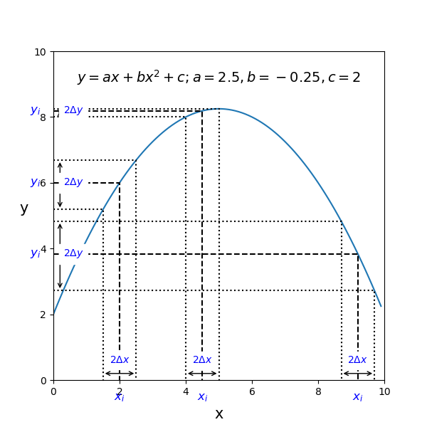

# Foutenpropagatie
<!--REF\label{/module-2/foutenpropagatiei}-->
<!--som en verschil etc niet apart kopje. Laat iedereen de basisformule gebruiken-->

1. Ordered TOC
{:toc}

Vaak kunnen we de grootheid die we willen bepalen niet direct meten, maar meten we een observabele die zich via een bepaalde functie verhoudt tot de gezochte grootheid. Of meten we zelfs twee of meer observabelen die we nodig hebben om de gewilde grootheid te bepalen. 

Dit is bijvoorbeeld het geval als we de gemiddelde snelheid van een auto willen bepalen. Dit zouden we kunnen doen door de tijd te meten die de auto nodig heeft om een bepaald traject af te leggen. We meten dan de door de auto gebruikte tijd, $$T$$ en de lengte van het traject, $$L$$, en die zetten we dan om in snelheid via de bekende formule $$v=L/T$$. Of we bepalen bijvoorbeeld de massa van een elementair deeltje (in rust) en willen dit omzetten naar de energie van het deeltje via de formule $$E=mc^2$$. 

Als we de onzekerheid (de standaardafwijking) kennen op de gemeten grootheid, dan kunnen we deze omzetten naar de onzekerheid van de grootheid die we willen bepalen. Dit noemen we het **propageren** van fouten. In dit hoofdstuk leren we je de basisregels voor het propageren van **ongecorreleerde** fouten. Dat wil zeggen dat als er meerdere onzekerheden worden gepropageerd deze onzekerheden onafhankelijk zijn; De meting van de ene heeft geen invloed op de meting van de andere observabele; de fout die we maken in het meten van de ene grootheid hangt niet af van de fout die we maken op de andere gemeten grootheid. 

Het is goed om alvast te beseffen dat er ook gecorreleerde fouten bestaan. Er zijn twee oorzaken voor het ontstaan van gecorreleerde fouten:

- Doordat er in de meting een correlatie is. Een voorbeeld van een gecorreleerde fout is als we een oppervlakte van een tafel willen weten, en we meten de lengte en de breedte met hetzelfde meetlint op. Als het meetlint een afwijking heeft waardoor we de lengte te groot opmeten, dan zullen we waarschijnlijk ook de breedte te groot opmeten. 
- Doordat er een onderliggende parameter is waar beide gemeten grootheden vanaf hangen. 

Hier behandelen we dus alleen ongecorreleerde fouten. 

## Basisregel
We beginnen met de **algemene regel voor het propageren van ongecorreleerde fouten**. Daarna zullen we laten zien hoe deze regel eruitziet voor eenvoudige relaties. Deze zou je apart kunnen leren, maar je kunt ook altijd de basisregel toepassen. Het resultaat behoort hetzelfde te zijn. 
We noteren de onzekerheid op variabele $$x$$ in dit hoofdstuk met $$\Delta x$$ waar we eerder ook wel $$\sigma_x$$ of $$s_x$$ hebben gebruikt. 

Als $$q = q(x,y,z,\dots)$$ een functie is met meerdere ongecorreleerde variabelen, dan wordt de onzekerheid op $$q$$ gegeven door:

$$\Delta q = \sqrt{\left(\frac{\partial q}{\partial x}\Delta x  \right)^2+\left(\frac{\partial q}{\partial y}\Delta y\right)^2+\left(\frac{\partial q}{\partial z}\Delta z\right)^2+\dots}$$

Hierbij zijn $$\frac{\partial q}{\partial x}$$, $$\frac{\partial q}{\partial y}$$ etc. de partiële afgeleiden van $$q$$ naar de betreffende variabele.

We zullen laten zien hoe deze formule werkt aan de hand van een paar voorbeelden.
<!--FIG \newpage-->

> **Voorbeeld 1: Factor** 
> 
> Stel we hebben een vergelijking $$y = c\cdot x$$ met een standaardafwijking op $$x$$ van $$\Delta x$$. Dan is de standaardafwijking op $$y$$, ($$\Delta y$$), gelijk aan:
> 
> $$\displaystyle \Delta y = \sqrt{\left( \frac{\partial y}{\partial x} \Delta x \right)^2} = c \cdot \Delta x.$$
> 
> In dit geval schaalt de onzekerheid op $$x$$ ($$\Delta x$$) dus met dezelfde factor $$c$$ tot de onzekerheid op $$y$$ ($$\Delta y$$). In de grafiek hieronder<!--FIG (Fig. \ref{fig:Foutenpropagatie_const})--> wordt voor een willekeurige waarde $$x_i$$ het effect van de propagatie van $$\Delta x$$ rond de waarde $$x_i$$ naar de fout $$\Delta y$$ rond $$y_i$$ visueel weergegeven. Je kunt in de grafiek zien dat de grootte $$\Delta x$$ geschaald met factor $$c$$ de grootte van $$\Delta y$$ oplevert. 
> 
> {:width="65%"}
> 
> De onzekerheid op een meting is direct gerelateerd aan de standaardafwijking van de verwachtingswaarde van de te meten grootheid (de stochast). De variantie van de is zoals gebruikelijk het kwadraat van de standaardafwijking. In dit geval is dus de variantie op $$y$$: 
> 
> $$\displaystyle{ Var(y) = (\Delta y)^2 = \left( c \cdot \Delta x\right)^2 = c^2 \cdot Var(x) .}$$

<!--FIG \newpage-->

> **Voorbeeld 2: Translatie** 
> 
> Stel we hebben een vergelijking $$y = x + a$$ met een standaardafwijking op $$x$$ van $$\Delta x$$. Dan is de standaardafwijking op $$y$$, ($$\Delta y$$), gelijk aan:   
> 
> $$\displaystyle \Delta y = \sqrt{\left( \frac{\partial y}{\partial x} \Delta x \right)^2} = \Delta x.$$
> 
> Wederom geven we het effect van de foutenpropagatie van $$\Delta x$$ rond $$x_i$$ naar $$\Delta y$$ rond $$y_i$$ grafisch weer in de grafiek  hieronder<!--FIG (Fig. \ref{fig:Foutenpropagatie_trans})-->. Je ziet dat de translatie geen effect heeft op de grootte van de onzekerheid. 
> 
> {:width="65%"}

<!--FIG \newpage-->

> **Voorbeeld 3: Macht** 
> 
> Stel we hebben een vergelijking $$y = x^3$$ met een standaardafwijking op $$x$$ van $$\Delta x$$. Dan is de standaardafwijking op $$y$$, ($$\Delta y$$), gelijk aan: 
> 
> $$\displaystyle \Delta y = \sqrt{\left( \frac{\partial y}{\partial x} \Delta x \right)^2} = 3x^2 \cdot \Delta x.$$
> 
> Het effect van de foutenpropagatie volgens deze formule van $$\Delta x$$ rond $$x_i$$ naar $$\Delta y$$ rond $$y_i$$ wordt weer grafisch weergegeven in het plaatje hieronder<!--FIG (Fig \ref{fig:Foutenpropagatie_cube})-->. Je kunt zien dat de mate waarin de grootte van $$\Delta x$$ verandert afhangt van de gekozen waarde van $$x_i$$, op sommige plekken is hij kleiner geworden, op andere plekken groter.   
> {:width="65%"}

 <!--FIG \newpage-->

> **Voorbeeld 4: Parabool** 
> 
> Stel we hebben een vergelijking $$y = ax + bx^2 + c$$ met een standaardafwijking op $$x$$ van $$\Delta x$$. Dan is de standaardafwijking op $$y$$, ($$\Delta y$$), gelijk aan: 
> 
> $$\displaystyle \Delta y = \sqrt{\left( \frac{\partial y}{\partial x} \Delta x \right)^2} = (a + 2bx) \Delta x.$$
> 
> In het plaatje hieronder<!--FIG (Fig. \ref{fig:Foutenpropagatie_func})--> geven we nu voor verschillende waardes $$x_i$$ de foutenpropagatie van $$\Delta x$$ naar $$\Delta y$$ de grafische interpretatie. We zien dat niet alleen de relatieve grootte van $$\Delta y$$ afhangt van de gekozen waarde van $$x_i$$ maar dat op sommige plaatsen de boven en ondergrens van de onzekerheid zijn geïnverteerd. 
> {:width="65%"}

<!--FIG \newpage-->

> **Voorbeeld 5: Twee dimensionaal** 
> 
> Stel we hebben een vergelijking $$z = ax + y^2$$ met standaardafwijkingen $$\Delta x$$ en $$\Delta y$$ . Dan is de standaardafwijking op $$z$$, ($$\Delta z$$), gelijk aan: 
> 
> $$\displaystyle \Delta z = \sqrt{ \left( \frac{\partial z}{\partial x} \Delta x \right)^2 + \left( \frac{\partial z}{\partial y} \Delta y \right)^2} = \sqrt{(a \Delta x)^2 + (2y \Delta y)^2}.$$

 

> **Voorbeeld 6: Twee dimensionaal** 
> 
> Stel we hebben een vergelijking $$z = ax + y^2 + 2xy$$ met standaardafwijkingen $$\Delta x$$ en $$\Delta y$$ . Dan is de standaardafwijking op $$z$$, ($$\Delta z$$), gelijk aan: 
> 
> $$\displaystyle \Delta z = \sqrt{ \left( \frac{\partial z}{\partial x} \Delta x \right)^2 + \left( \frac{\partial z}{\partial y} \Delta y \right)^2} = \sqrt{\left( (a + 2y) \cdot \Delta x \right)^2 + \left( (2y + 2x)\cdot  \Delta y \right)^2}.$$

## Som en verschil 
De algemene regel kan eenvoudig worden uitgeschreven naar de regel voor som en verschil.  
Als $$q = x + y$$ of $$q = x - y $$ dan wordt de onzekerheid op $$q$$ gegeven door: 

$$\displaystyle \Delta q = \sqrt{\left(\frac{\partial q}{\partial x} \Delta x \right)^2 + \left( \frac{\partial q}{\partial y} \Delta y \right)^2} = \sqrt{\left(\Delta x\right)^2+\left(\Delta y\right)^2}.$$

We mogen de varianties $$(\Delta x)^2 $$ en $$(\Delta y)^2$$ in het geval van een vergelijking met enkel sommen en/of verschillen dus optellen.

## Vermenigvuldigen met constante
Als $$q$$ het exacte veelvoud $$c$$ is van de gemeten waarde $$x$$, dus $$q = c \cdot x$$, dan geldt:

$$\displaystyle \Delta q = \sqrt{\left( \frac{\partial q}{\partial x} \Delta x \right) ^2} = |c| \Delta x.$$  

De onzekerheid op $$q$$ is dus gelijk aan de onzekerheid op $$x$$ geschaald met dezelfde factor $$c.$$

## Vermenigvuldigen en delen met variabelen
Als $$q$$ een vermenigvuldiging is van meerdere variabelen, dus bijvoorbeeld  $$q = x\cdot y \cdot z$$ dan geldt: 

$$\displaystyle \Delta q = \sqrt{\left( \frac{\partial q}{\partial x} \Delta x \right)^2 +\left( \frac{\partial q}{\partial y} \Delta y \right)^2 +\left( \frac{\partial q}{\partial z} \Delta z \right)^2} = \sqrt{\left( \frac{q}{x} \Delta x\right)^2 + \left( \frac{q}{y} \Delta y\right)^2 +\left( \frac{q}{z} \Delta z \right)^2 }.$$

Dit kan je eenvoudiger schrijven als: 

$$\displaystyle \frac{\Delta q}{q} = \sqrt{\left( \frac{\Delta x}{x} \right)^2 + \left(\frac{\Delta y}{y}\right)^2 + \left(\frac{\Delta z}{z} \right)^2}.$$

Ofwel de relatieve fout $$\frac{\Delta q}{q}$$ is gelijk aan de kwadratische som van de variabelen.
 

> **Voorbeeld: foutenpropagatie en afronding van de getallen**
>
> Stel dat we de lengte van het blokje hebben gemeten en we lezen de volgende waarde af:
>
> - De $$\text{lengte (l)} = 7.60 \pm 0.10 \text{ cm}$$
> - De $$\text{breedte (b)} = 4.10 \pm 0.20 \text{ cm}$$ 
> - De $$\text{hoogte (h)} = 2.00 \pm 0.20 \text{ cm}$$ 
>
> Het volume van het blokje wordt gegeven door:
>
> $$V = l\cdot b\cdot h = 7.60 \cdot 4.10 \cdot 2.00 = 62.32 \text{ cm}^3$$
>
> We gebruiken de regel dat als $$q = x\cdot y\cdot \dots$$ dan: 
>
> $$\frac{\Delta q}{|q|} = \sqrt{\left(\frac{\Delta x}{x}\right)^2 +\left(\frac{\Delta y}{y}\right)^2+\left(\frac{\Delta z}{z}\right)^2} $$
>
>Dus:
>
> $$\begin{aligned}\frac{\Delta V}{|V|} &= \sqrt{\left(\frac{\Delta l}{l}\right)^2+\left(\frac{\Delta b}{b}\right)^2+\left(\frac{\Delta h}{h}\right)^2} \\ &= \sqrt{\left(\frac{0.1}{7.6}\right)^2+\left(\frac{0.2}{4.1}\right)^2+\left(\frac{0.2}{2.0}\right)^2}\\ &= 0.01255 \dots \end{aligned}$$
>
> We ronden dit nog niet af, dat doen we pas als we de absolute fout hebben:
>
> $$\begin{aligned} \Delta V &= \frac{\Delta V}{|V|} \cdot |V| \\ &= 0.01255\dots \cdot 62.32 \\ &= 0.78228 \dots \\ &\approx 0.78\end{aligned}$$
>
> Het gemeten volume van het blokje is dus $$V = 62.32 \pm 0.78 \text{ cm}^3$$

