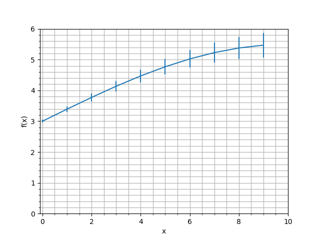
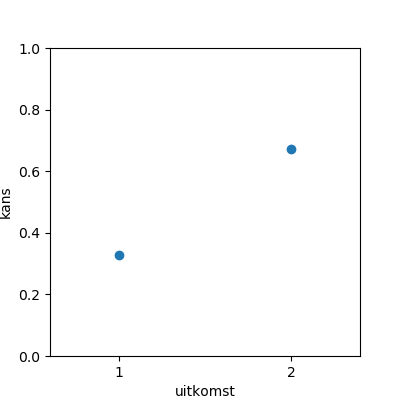

# Voorbeeld opgaves tussentoets I

Lees goed het [lijstje](/tussentoets-i/inhoud) door ter voorbereiding voor de tussentoets. **Niet voor alle element op het lijstje zijn oefenopgaves**.

-----

**1** De leeftijdsverdeling van een groep studenten is: 

18.3 19.7 20.4 19.2 18.7 19.4 17.6 20.6 18.5 20.2

**a**  Bereken het gemiddelde, de mediaan, de standaarddeviatie en de variantie. 
 Het gemiddelde is 19.3 jaar, de mediaan is 19.3 jaar, de standaarddeviatie is 0.936 jaar, de variantie is 0.876 $$\textrm{jaar}^2$$. 
**b** De docent van de groep is 44.5 jaar oud.  
Bereken nu opnieuw het gemiddelde, de standaarddeviatie en de variantie waarbij je de leeftijd van de docent ook meeneemt.  
 Het gemiddelde is 21.6 jaar, de mediaan is 19.4 jaar,  
de standaarddeviatie is 7.31 jaar en de variantie is 53.4 $$\textrm{jaar}^2$$.   
NB Zie je dat het gemiddelde niet veel groter is geworden maar de standaarddeviatie en de variantie wel?

-----

**2** Lees in de onderstaande grafiek het punt voor x=6 af en noteer het resultaat met de wetenschappelijke notatie. 
{:width="60%"} 

$$f(x) = 5.02 \pm 0.28$$ (Waarschijnlijk lukt het niet om het zo exact af te lezen.)

-----

**3** Een bepaald soort knikkers heeft een gemiddelde diameter van 1.4 cm met een variantie van 0.2 cm$$^2$$. We willen de gemiddelde diameter bepalen en meten hiervoor de diameter van een enkele knikker op en vinden 1.5 cm. Wat is de fout op deze meting en wat is de onzekerheid?  

De fout op de meting is de afstand van de gemeten waarde tot het gemiddelde: 0.1 cm. De onzekerheid is de wortel van de variantie: $$\sqrt{0.2}$$ cm.  
NB Meestal weten we het echte gemiddelde niet en kunnen dan ook de fout niet exact bepalen.

-----

**4** We trekken kaarten uit een kaartendek. 
**a** Als we 1 kaart trekken, wat is dan de kans dat we een hartenkaart trekken? 
P(♥) = 1/4 
**b** Als we 1 kaart trekken, wat is dan de kans dat we een hartenkaart of een schoppenkaart pakken? 
P(♥ of ♠) = P(♥) + P(♠) = 1/2

-----

**5** We hebben een zak met gekleurde snoepjes met een tekst erop. Er zijn 6 blauwe snoepjes en 4 rode. Er bestaan drie teksten: "Joepie", "Hoera!" en "Gefeliciteerd". De kans verdeling onder de rode snoepjes is P(Joepie) = 0.5 en P(Hoera) = 0.5. Er zijn geen rode snoepjes met gefeliciteerd.  
**a** Als je een snoepje uit de zak pakt, wat is de kans dat je een rood snoepje pakt? 
4/10 = 0.4  
**b** Als je een snoepje uit de zak pakt, wat is dan de kans dat je een rood snoepje pakt met de tekst Joepie? 
P(rood en joepie) = 0.4 x 0.5 = 0.2 

-----

**6** Uit een experiment zijn 3 uitkomsten mogelijk voor de gedefinieerde stochast X: {0,1,2}. De kans op uitkomst 0 is: P(0)= 0.56. De kans op uitkomst 2 is P(2) = 0.34. 
**a** Wat is de uitkomstenverzameling van X? 
De uitkomstenverzameling is {0,1,2} 
**b** Wat is de kans op uitkomst P(1)? 
P(1) = 1 - P(0) - P(2) = 0.10 

-----

**7** We definiëren een stochast, $$x$$, als de waarde van de worp van een eerlijke dobbelsteen. Wat is de verwachtingswaarde van deze stochast?  
$$\bar{x} = \frac{1}{6} \sum_{i=1}^{n=6} x_i = \frac{1}{6} \cdot (1+2+3+4+5+6) = \frac{21}{6} = 3.5$$.

-----

**8** We hebben een plankje. Aan een kant van het plankje zetten we een 1, aan de andere kant een 2. We laten het plankje 1000 keer vallen van steeds dezelfde hoogte en we houden bij welke kant boven ligt als het plankje gevallen is. Van de 1000 keer ligt nummer 1 slechts 327 keer boven. Geef de kans verdeling van de twee uitkomsten grafisch weer. 
{:inline:width="30%"} 
We gebruiken de Frequentist kans: P(1) = 327/1000 = 0.327 en de complement-regel dat P(2)= 1- P(1) = 0.673.

-----

**9** Je gooit 10 keer met een dobbelsteen.  
**a** Wat is de kans dat je precies 6 keer een 6 gooit?  
Gebruik de binomiaal vergelijking:  
$${\displaystyle P(k=6;n=10,p=1/6) = \frac{10!}{6!(4)!} (1/6)^6 (5/6)^{4} = 0.0022} $$
 
**b** Wat is de kans dat je precies 1 keer een 6 gooit? 
P(k=1;n=10,p=1/6) = 0.32  
**c** Wat is de kans dat je minder dan 3 keer een 6 gooit? 
P(<3maal een zes) = P(0;10,1/6) + P(1;10,1/6) + P(2;10,1/6) = 0.162 + 0.323 + 0.291 = 0.78  
**d** Wat is de kans dat vaker dan 2 keer een 6 gooit? 
P(>2maal  een zes) = 1-0.78 = 0.22  

-----

**10** Een raketschild houdt 99% van de raketten tegen.  
**a** Als door de tegenstander 20 raketten worden afgevuurd, wat is dan de kans dat het raketschild alle 20 tegen houdt?  
$$P = 0.99^{20} =  0.82$$ 
**b** Als er 50 raketten worden afgevuurd door de tegenstander, hoeveel raketten worden er dan gemiddeld tegengehouden?  
$$E = 50\cdot 0.99 = 49.5$$

-----

**11** In een call-center komen gemiddeld 100 telefoontjes per dag.  
**a** Wat is de verwachte onzekerheid op het aantal telefoontjes per dag? 
Gebruik de Poisson verdeling: $$\sigma = \sqrt{100} = 10$$. 
**b** Als er op een dag 70 telefoontjes binnenkomen. Is dat gek? 
100-70/10 = 3 $$ \sigma $$ Het is zeker uitzonderlijk het ligt $$3\sigma$$ van het gemiddelde af.

-----

**12** In een stad gebeuren jaarlijks 1020 ongelukken. Het afgelopen jaar zijn er maar 900 ongelukken geweest. De autoriteiten claimen dat dit komt door nieuwe regels in het verkeer.  
**a** Denk je dat deze verklaring klopt? 
De spreiding op het aantal ongelukken is $$\sqrt{1020} = 42$$. Het verschil is uitgedrukt in standaarddeviaties: $$\frac{1020-900}{42} \sigma = 3.8 \sigma $$. Dat is zeker uitzonderlijk, maar het komt natuurlijk weleens voor. Het is goed om voorzichtig te zijn met zo' n uitspraak.  
**b** Als de getallen tien keer zo klein zouden zijn (102 en 90), zou je denken dat de verklaring dan nog klopt? 
De standaarddeviatie is nu $$\sigma = 10$$. Het verschil is dus net iets groter dan $$1\sigma$$, zo'n afwijking komt vaak voor. De uitspraak lijkt ongegrond.  

-----

**13** We verwachten op een dag gemiddeld 4.3 poststukken bij een klein bedrijf.  
**a** Op een dag komen er wel 7 binnen. Reken de kans uit dat dit gebeurt.  
$$P(k=7;\lambda=4.3) =0.073$$ 
**b** Reken de kans uit dat er 0 binnenkomen.  
$$P(k=0;\lambda=4.3) =0.014$$ 

