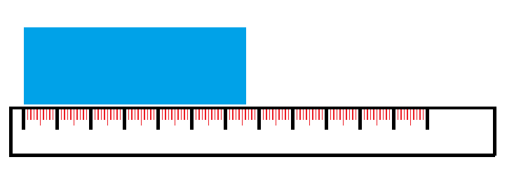

# Significantie , meetonzekerheden en foutenpropagatie 

1. Ordered TOC
{:toc}

## Significantie

De *significantie* is de nauwkeurigheid waarmee een getal/waarde wordt weergegeven. Vaak wordt gedacht dat het aantal decimale cijfers de nauwkeurigheid aangeeft, maar dit is technisch gezien de *precisie* waarmee de (meet)waarde wordt aangegeven. De nauwkeurigheid (significantie) van een getal zegt welke cijfers in het getal er toe doen. Cijfers zonder betekenis tellen we niet mee bij de significantie.

Een aantal voorbeelden:

- Het getal $$7.134$$ heeft in totaal 4 significante cijfers, de precisie is 3.
- Het getal $$0.576$$ heeft 3 significante cijfers, de precisie is ook 3.
- $$0.001$$ heeft 1 significant cijfer, de precisie is 3.
- $$1.001$$ heeft 4 significante cijfers, de precisie is 3.
- $$2.4500$$ heeft 5 significante cijfers, de precisie is 4.

Zo zie je dat de getallen (bijna) allemaal dezelfde precisie hebben, maar een variatie aan significante cijfers. Hier kun je misschien al een patroon in ontdekken. Er zijn namelijk een aantal regels m.b.t. de nullen in een getal bij de significantie:

- Nullen aan de linkerkant doen niet mee met de significantie. Het getal $$0.0056$$ heeft bijvoorbeeld twee significante cijfers.
- Nullen aan de linkerkant voorafgegaan door een getal doen wel mee met de significantie. Het getal $$100.004$$ heeft zes significante cijfers.
- Nullen aan de rechterkant doen wel mee met de significantie. Zo heeft $$10.34000$$ zeven significante cijfers. 
- Een uitzondering op de tweede regel zijn getallen zoals $$300$$, $$4000$$, $$570$$ etc. Deze getallen zijn weergeven zonder decimalen waardoor het onduidelijk is of daadwerkelijk de waarde van $$300$$ respectievelijk $$4000$$ en $$570$$ is gemeten, of dat dit met een hogere of juist lagere precisie is gebeurd. De afspraak is dat als een getal op deze manier wordt weergegeven met nullen rechts, deze nullen niet meedoen met de nauwkeurigheid. De getallen $$300$$ en $$4000$$ hebben bijvoorbeeld allebei een significantie van 1. Het getal $$570$$ heeft twee significante cijfers. Om deze getallen met een ander aantal significante cijfers weer te geven wordt vaak de *wetenschappelijke notatie* gebruikt. Hier komen we later op terug.  

Hieronder nog een aantal voorbeelden die de significantie en precisie illustreren van diverse getallen:

| Getal | Significantie | Precisie |
| --- | --- | --- |
| 1.203 | 4 significante cijfers | 3 decimalen |
| 12.03  | 4 significante cijfers | 2 decimalen |
| 0.0121 | 3 significante cijfers | 4 decimalen |
| 300 | 1 significant cijfer | honderdtallen |
| 300. | 3 significante cijfers | honderdtallen |
| 300.0 | 4 significante cijfers | 1 decimaal |
| 310 | 2 significante cijfers | honderdtallen |
| 0.310 | 3 significante cijfers | 3 decimalen |
| 0.0027 | 2 significante cijfers | 4 decimalen |

Voor het afronden van getallen, na een bewerking, op het juiste aantal significante cijfers zijn er een aantal regels:

- Bij het vermenigvuldigen of delen van getallen krijgt het resultaat de significantie van het oorspronkelijke getal dat de laagste significantie had. 
Vermenigvuldigen we bijvoorbeeld $$2.00$$ (drie significante cijfers) met $$3.5$$ (twee significante cijfers) dan is het 
resultaat gelijk aan $$2.00 \cdot 3.5 = 7.0$$ (twee significante cijfers). 
- Bij het optellen of aftrekken van getallen heeft het resultaat niet meer cijfers achter de decimale punt 
dan het gegeven met het minste aantal cijfers achter de decimale punt. Tellen we bijvoorbeeld $$1.23$$ op bij $$0.1$$ dan is het resultaat 
$$1.23 + 0.1 = 1.3 $$. 

## Wetenschappelijke notatie

Een veel gebruikte manier om getallen en meetresultaten weer te geven is met behulp van de wetenschappelijke notatie. Bij de wetenschappelijke notatie wordt elk getal in de vorm $$a\cdot 10^n$$ opgeschreven. Hierbij is $$1<|a|<10$$ en $$n$$ een geheel getal ongelijk aan nul. 
Een voordeel van deze notatie is dat je hiermee ook hele kleine getallen en hele grote getallen op een makkelijke manier op kunt schrijven. We geven een voorbeeld:

We willen het getal $$0.000000000004563$$ opschrijven met twee significante cijfers. Nu kunnen we natuurlijk $$0.0000000000046$$ opschrijven maar als we dat vaak moeten doen kost dat veel ruimte (en werk). In de wetenschappelijke notatie ziet dit getal met twee significante cijfers er als volgt uit:

$$0.000000000004563 = 4.6\cdot 10^{-12}$$

In het algemeen geldt voor de wetenschappelijke notatie het volgende:

- Je schuift de decimale punt op zodat er een getal staat dat in absolute waarde groter is dan $$1$$ en kleiner dan $$10$$. Dit is het getal $$a$$. 
- Heb je de decimale punt hierbij $$n$$ plaatsen naar links verschoven dan vermenigvuldig je het getal $$a$$ met $$10^n$$. Heb je de decimale punt $$n$$ plaatsen naar rechts verschoven dan vermenigvuldig je $$a$$ met een factor $$10^{-n}$$.
- Daarna rond je af op het gewenste aantal significante cijfers.

Hieronder nog een aantal voorbeelden:

| Getal | Gewenste significantie | Wetenschappelijke notatie |
| --- | --- | --- |
| 0.00343 | 1 significant cijfer | $$3. \cdot 10^{-3}$$ |
| 0.00343 | 2 significante cijfers | $$3.4 \cdot 10^{-3}$$ |
| 0.00343 | 3 significante cijfers | $$3.43 \cdot 10^{-3}$$ |
| 10.7 | 2 significante cijfers | $$1.1 \cdot 10^{1}$$ |
| 255 | 2 significante cijfers | $$2.6 \cdot 10^{2}$$ |
| 34590 | 2 significante cijfers | $$3.5 \cdot 10^{4}$$ |

Tot nu toe hebben we het gehad over losstaande (meet)waarden zonder meetonzekerheden. Hieronder zullen we het begrip meetonzekerheid introduceren en ook de regels m.b.t. significantie en precisie in het geval van een waarde **met meetonzekerheid**.

## Meetonzekerheden

Zodra je een meting verricht heb je te maken met meetonzekerheden. Denk bijvoorbeeld aan het 
meten van de lengte van een blokje. Hier zou je bijvoorbeeld een liniaal voor kunnen gebruiken.

{:width="80%"}

Als we naar de bovenstaande situatie kijken dan zou het blokje 7.6 cm lang kunnen zijn. Maar het is niet helemaal goed
af te lezen. Zo zou het blokje ook 7.7 cm lang kunnen zijn als we de linkerkant van het blokje aan de binnenkant van de eerste zwarte streep 
leggen, en het kan 7.5 cm zijn als we het blokje aan de buitenkant van de eerste zwarte streep leggen. 
Omdat er geen streepjes tussen de rode streepjes zijn kunnen we slechts op een mm nauwkeurig zeggen wat de lengte is van het blokje. Er is dus sprake van een meetonzekerheid.
In dit geval zouden we bijvoorbeeld noteren dat het blokje een lengte heeft van $$7.6 \pm 0.1$$ cm. het is heel
belangrijk om te beseffen dat we de precieze waarde van de lengte van het blokje dus NIET weten. Deze zullen we ook nooit weten. Met welk
instrument we de lengte ook meten, er is altijd sprake van een meetonzekerheid (hoe klein ook).  

Bij elke meting die gedaan wordt is er sprake van een meetonzekerheid. Hoe nauwkeuriger er gemeten kan worden des te kleiner is de meetonzekerheid. Zo 
zouden we de lengte van het blokje met behulp van een schuifmaat kunnen meten. In dat geval is de meetonzekerheid in de orde van een tiende mm.

Er zijn verschillende maten waarin een meetonzekerheid wordt aangegeven. Zo is de onzekerheid die we hierboven hebben weergegeven een zogenoemde
*absolute fout*. De absolute fout $$\Delta x$$ is de meetonzekerheid op een waarde $$x$$ zoals deze direct wordt afgelezen op de meetapparatuur. Ook een afronding die plaatsvindt in bijvoorbeeld een
computerprogramma resulteert in een absolute fout. De beste schatting van de waarde noemen we $$x_{best}$$ en de meetwaarde wordt dan aangegeven als:

$$\text{gemeten waarde van }x = x_{best} \pm \Delta x$$

De waarde $$x_{best} + \Delta x$$ is altijd de hoogst mogelijke waarde voor de gemeten grootheid en $$x_{best}-\Delta x$$ is
altijd de laagst mogelijke waarde voor de gemeten grootheid. 

De zogenoemde *relatieve fout* van een meetwaarde $$x$$ wordt gegeven door de waarde van de absolute fout gedeeld door de waarde van de grootheid. Omdat we deze waarde  
niet weten wordt er vaak gedeeld door de beste schatting van de gemeten waarde:

$$\text{relatieve fout} = \frac{\Delta x}{x_{best}}$$

De relatieve fout is onder andere handig als er meetwaarden vergeleken moeten worden die in een heel andere orde van grootte zitten.
Zo zouden we bijvoorbeeld de gemeten snelheid van een vliegtuig kunnen vergelijken met de gemeten snelheid van een hardloper.
Stel de gemeten snelheid van een vliegtuig is $$v_{vliegtuig} = 803 \pm 3$$ km/h. De gemeten snelheid van een hardloper is
$$v_{hardloper} = 18.3 \pm 0.2$$ km/h. Welk van de metingen heeft met een grotere precisie plaatsgevonden?

Dit is niet direct uit de absolute fout te zien, maar wel vanuit de relatieve fout. De relatieve fout behorende bij de snelheid van het vliegtuig is 
$$\frac{3}{803} = 0.004$$. De relatieve fout behorende bij de snelheidsmeting van de hardloper is $$\frac{0.2}{18.3} = 0.01$$. Dit betekend dat
de snelheidsmeting van de hardloper met een grotere precisie heeft plaatsgevonden.

### Meetonzekerheden noteren

Er zijn verschillende manieren om een meetwaarde met meetonzekerheid te noteren. Al eerder hebben we de manier gezien waarbij de beste schatting van de meetwaarde wordt weergegeven plusminus de absolute fout:

$\text{gemeten waarde van }x = x_{best} \pm \Delta x$$

Wat je ook tegen kunt komen is dat de fout tussen haakjes wordt gezet achter de decimalen waar de fout van invloed op is. Hebben we bijvoorbeeld 

$$ 1.456 \pm 0.04$$

dan kunnen we dit ook noteren als:

$$1.456(4)$$

Dit wordt met name vaak gebruikt als een meetwaarde met meetonzekerheid in de wetenschappelijke notatie wordt weergegeven. Het tussen haakjes zetten van de meetonzekerheid is dan namelijk korter dan de notatie met een plusminus. 

We kunnen in de wetenschappelijke notatie bijvoorbeeld $$4.51 \pm 0.27 \cdot 10^3 $$ schrijven. Dit kunnen we ook als $$4.51 \cdot 10^3 \pm 0.27 \cdot 10^3$$ schrijven (minder gebruikelijk). Als we de fout echter tussen haakjes zetten wordt dit een stuk korter en schrijven we:

$$4.51(27) \cdot 10^3$$

Hieronder de verschillende schrijfwijzen naast elkaar gezet in een tabel voor diverse meetwaarden met meetonzekerheden.

| Meetwaarde | Wetensch. not. met $$\pm$$ | Wetensch. not. met haakjes |
| --- | --- | --- |
| $$100.5 \pm 1.8$$  | $$1.005 \pm 0.018 \cdot 10^2$$ | $$1.005(18) \pm 10^2$$ |
| $$0.0045 \pm 0.0006$$  | $$4.5 \pm 0.6 \cdot 10^{-3}$$ | $$4.5(6) \pm 10^{-3}$$ |
| $$300.0 \pm 40$$  | $$3.0 \pm 0.4 \cdot 10^2$$ | $$3.0(4) \pm 10^2$$ |
| $$56934 \pm 160$$  | $$5.693 \pm 0.016 \cdot 10^4$$ | $$5.693(16) \pm 10^4$$ |

## Foutenpropagatie

Vaak moeten we nog berekeningen uitvoeren met een gemeten waarde. Zo zouden we bijvoorbeeld de lengte, breedte
en hoogte van het blokje kunnen bepalen om daarna uit te rekenen wat het volume is. Elk van de gemeten waarden
heeft een eigen meetonzekerheid. Als we het volume van het blokje uitrekenen dan werken deze meetonzekerheden door 
in de fout die we uiteindelijk hebben op het volume van het blokje. We noemen dit het propageren van fouten oftewel 'foutenpropagatie'.

### Basisregels

Hieronder staat hoe de fouten propageren in het geval van het optellen, aftrekken, delen en vermenigvuldigen van gemeten waarden.
Hierbij wordt ervan uitgegaan dat de meetwaarden (en fouten) onafhankelijk zijn van elkaar.

Als $$q = x + y + \dots$$ of $$q = x - y - \dots$$ dan:

$$\Delta q = \sqrt{\left(\Delta x\right)^2+\left(\Delta y\right)^2+\dots}$$

Als $$q = x\cdot y\cdot \cdot u \ cdot w \cdot \dots$$ of $$q = \frac{x\cdot u \cdot \dots}{y \cdot w \cdot \dots}$$ dan: 

$$\frac{\Delta q}{|q|} = \sqrt{\left(\frac{\Delta x}{x}\right)^2+\left(\frac{\Delta y}{y}\right)^2+\left(\frac{\Delta u}{u}\right)^2+\left(\frac{\Delta w}{w}\right)^2} $$

Als $$q$$ een exact veelvoud $$c$$ is van de gemeten data, dus $$q = c \cdot x$$, dan:

$$\Delta q = |c|x$$ 

Daarnaast is de relatieve fout in $$q$$ dan gelijk aan de relatieve fout in $$x$$.

Als $$q=x^n$$ dan:

$$\frac{\Delta q}{|q|} = |n| \frac{\Delta x}{|x|}$$

Als $$q=q(x)$$ een functie van $$x$$ is dan:

$$\Delta q = \left|\frac{dq}{dx}\right|\Delta x$$

Hierbij is $$\frac{dq}{dx}$$ de afgeleide van de functie naar $$x$$.

Als $$q = q(x,y,z,\dots)$$ een functie in meerdere variabelen is dan wordt de onzekerheid gegeven door:

$$\Delta q = \sqrt{\left(\frac{\delta q}{\delta x}\Delta x\right)^2+\left(\frac{\delta q}{\delta y}\Delta y\right)^2+\left(\frac{\delta q}{\delta z}\Delta z\right)^2+\dots}$$

Hierbij zijn $$\frac{\delta q}{\delta x}$$, \frac{\delta q}{\delta y} etc. de partiële afgeleiden van $$q$$ naar de betreffende variabele.

Met bovenstaande rekenregels kan de propagatie van fouten bepaald worden. 

### Afronding meetonzekerheden en meetwaarden bij foutenpropagatie

Voor het afronden van meetonzekerheden op het juiste aantal significante cijfers geldt het volgende:

- Is de meetonzekerheid kleiner dan $$3\cdot 10^n$$ met $$n\,\varepsilon\, \mathbb{Z}$$ dan wordt de meetonzekerheid afgerond op twee significante cijfers. Zo wordt de meetonzekerheid 
$$0.12367$$ afgerond op twee decimalen tot $$0.12$$. Is de meetonzekerheid gelijk aan 23.4 dan wordt dit afgerond op $$23$$.
- Is de meetonzekerheid groter of gelijk aan $$3\cdot 10^n$$ met $$n\,\varepsilon\, \mathbb{Z}$$ dan wordt  
de meetonzekerheid afgerond op één significant cijfer. Zo wordt de meetonzekerheid $$0.6321$$ bijvoorbeeld afgerond tot $$0.6$$.  

Bij foutenpropagatie bepaald de afronding van de doorberekende (absolute) fout op hoeveel decimalen het doorberekende resultaat wordt afgerond. De **significantie** van de meetonzekerheid bepaald dus de **precisie** waarmee de meetwaarde wordt weergegeven. 
Is het doorberekende resultaat (onafgerond) bijvoorbeeld $$8.956$$ en de doorberekende (onafgeronde) absolute fout is $$0.68$$ dan wordt de absolute fout afgerond tot $$0.7$$ volgens bovenstaande regels. Dit betekent dan ook dat het doorberekende resultaat wordt afgerond tot een getal met één decimaal, namelijk $$9.0$$. De doorberekende waarde met bijbehorende fout wordt dan weergegeven als $$9.0 \pm 0.7$$ of als $$9.0(7)$$.

Stel we hebben als (onafgeronde) doorberekende waarde bijvoorbeeld $$45.326$$, met de bijbehorende absolute fout $$0.123$$. Omdat de absolute fout volgens bovenstaande regels wordt afgerond op twee decimalen, noteren dit resultaat dan als $$45.33 \pm 0.12$$. 

**Voorbeeld foutenpropagatie en afronding**

Stel dat we de lengte van het blokje hebben gemeten en we lezen de volgende waarde af:

- De $$\text{lengte = l} = 7.6 \pm 0.1 \text{ cm}$$
- De $$\text{breedte = b} = 4.1 \pm 0.2 \text{ cm}$$ 
- De $$\text{hoogte = h} = 2.0 \pm 0.2 \text{ cm}$$ 

Het volume van het blokje wordt gegeven door:

$$V = l\cdot b\cdot h = 7.6 \cdot 4.1 \cdot 2.0 = 62.32 \approx 62.3 \text{ cm}^3$$

We gebruiken de regel dat als $$q = x\cdot y\cdot \dots$$ dan: 

$$\frac{\Delta q}{|q|} = \sqrt{\left(\frac{\Delta x}{x}\right)^2+\left(\frac{\Delta y}{y}\right)^2+\left(\frac{\Delta u}{u}\right)^2+\left(\frac{\Delta w}{w}\right)^2} $$

Dus:

$$\begin{aligned}\frac{\Delta V}{|V|} &= \sqrt{\left(\frac{\Delta l}{l}\right)^2+\left(\frac{\Delta b}{b}\right)^2+\left(\frac{\Delta h}{h}\right)^2} \\ 
&= \sqrt{\left(\frac{0.1}{7.6}\right)^2+\left(\frac{0.2}{4.1}\right)^2+\left(\frac{0.2}{2.0}\right)^2}\\
&= 0.01255 \dots
\end{aligned}$$

We ronden dit nog niet af, dat doen we pas als we de absolute fout hebben:

$$\begin{aligned} \Delta V &= \frac{\Delta V}{|V|} \cdot |V| \\
&= 0.01255\dots \cdot 62.32 \\
&= 0.78228 \dots \\
&\approx 0.8\end{aligned}$$

Het gemeten volume van het blokje is dus $$V = 62.3 \pm 0.8 \text{ cm}^3$$

### Foutenpropagatie bij herhaalde metingen

Zoals eerder gezegd weten we de echte exacte waarde van en grootheid nooit. Wel kunnen we deze zo goed mogelijk 
benaderen. Als een meting herhaald wordt dan krijgen we een steeds betere schatting van de waarde, maar we zullen de waarde zelf nooit
helemaal precies weten. In het geval van het blokje zou de lengte bijvoorbeeld door jouzelf en al je medestudenten gemeten kunnen worden. Iedereen leest de waarde op de liniaal
net wat anders af en daardoor verkrijgen we een collectie van meetwaarden, elk met een eigen meetonzekerheid.

Ook hierbij kan voor de foutenpropagatie de absolute fout genomen worden om tot een 
waarde met meetonzekerheid te komen. De absolute fout geeft echter een te grote waarde van de meetonzekerheid. 
Daarom wordt er bij herhaaldelijke metingen vaak gebruik gemaakt van de *standaardafwijking* als fout op de waarde. 
In de eerdere lesstof onder ['Basisbegrippen'](/blok-1/theorie-basisbegrippen) hebben we het al over de standaardafwijking gehad.
Bij de lengte van het blokje zouden we dan de gemiddelde meetwaarde bepalen en hier de standaardafwijking als meetfout bij optellen/aftrekken:

$$\text{lengte l} = l_{gemiddeld} \pm \sigma_{lengte}$$

De eerdere formules voor de foutenpropagatie zijn ook van toepassing op meetwaarden met de standaardafwijking als meetfout. Hierbij vul je de standaardafwijking in op de plekken waar de absolute fout staat.

 
