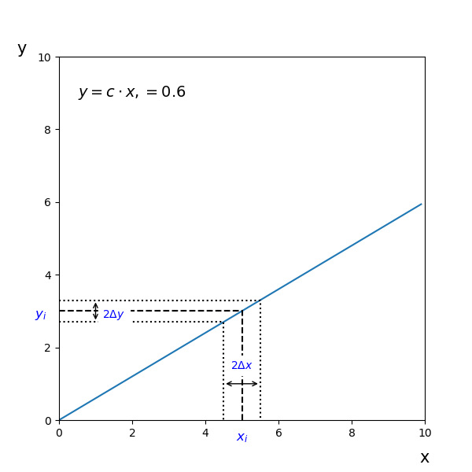

## Foutenpropagatie

1. Ordered TOC
{:toc}

Vaak kunnen we de grootheid die we willen weten niet direct meten, maar meten we een of meer observabele die zich, via een bepaalde functie, verhouden tot de grootheid. Of meten we zelfs twee of meer variabelen die we nodig hebben om de gewilde grootheid te bepalen. 

Dit is bijvoorbeeld het geval als we de gemiddelde snelheid van een auto willen bepalen. Dit zouden we kunnen doen door de tijd te meten die de auto nodig heeft om een bepaald traject af te leggen. We meten dan de door de auto gebruikte tijd, $$T$$ en de lengte van het traject, $$L$$, en die zetten we dan om in snelheid via de bekende formule $$v=L/T$$. Of we bepalen bijvoorbeeld de massa van een elementair deeltje (in rust) en willen dit omzetten naar de energie van het deeltje via de formule $$E=mc^2$$. 

Als we de onzekerheid weten op de gemeten observabele dan willen we deze omzetten naar de grootheid die we eigenlijk willen bepalen. Dit noemen we het propageren van fouten. In dit hoofdstuk leren we je de basisregels voor het propageren van **ongecorreleerde** fouten. Dat wil zeggen dat als er meerdere onzekerheden worden gepropageerd deze onzekerheden onafhankelijk zijn; De meting van de ene observabele heeft geen invloed op de meting van de andere observabele. Later zullen we nog de regel voor gecorreleerde fouten geven. 

### Basisregel
We beginnen met de **algemene regel voor het propageren van ongecorreleerde fouten**. Daarna zullen we laten zien hoe deze regel eruit ziet voor eenvoudige relaties. Deze zou je apart kunnen leren, maar je kunt ook altijd de basisregel gebruiken. Het resultaat behoort hetzelfde te zijn. 
We noteren de onzekerheid op variabele $$x$$ in dit hoofdstuk met $$\Delta x$$ waar we eerder ook wel $$\sigma_x$$ hebben gebruikt. 

Als $$q = q(x,y,z,\dots)$$ een functie is met meerdere ongecorreleerde variabelen, dan wordt de onzekerheid op $$q$$ gegeven door:

$$\Delta q = \sqrt{\left(\frac{\delta q}{\delta x}\Delta x  \right)^2+\left(\frac{\delta q}{\delta y}\Delta y\right)^2+\left(\frac{\delta q}{\delta z}\Delta z\right)^2+\dots}$$

Hierbij zijn $$\frac{\delta q}{\delta x}$$, $$\frac{\delta q}{\delta y}$$ etc. de partiële afgeleiden van $$q$$ naar de betreffende variabele.

> Voorbeeld 1 Stel we hebben een vergelijking $$y = c\cdot x$$ met een standaard deviatie op $$x$$ van $$\Delta x$$. Dan is de standaard deviatie op $$y$$, ($$\Delta y$$), gelijk aan:   
$$\displaystyle \Delta y = \sqrt{\left( \frac{\delta y}{\delta x} \Delta x \right)^2} = c \cdot \Delta x$$. 
> In het plaatje hieronder wordt voor een willekeurige waarde $$x_i$$ het effect van de propagatie van $$\Delta x$$ rond de waarde $$x_i$$ naar de fout $$\Delta y$$ rond $$y_i$$ visueel weergegeven. 
> {:width="40%",:inline}

> Voorbeeld 2 Stel we hebben een vergelijking $$y = x + a$$ met een standaard deviatie op $$x$$ van $$\Delta x$$. Dan is de standaard deviatie op $$y$$, ($$\Delta y$$), gelijk aan:   $$\displaystyle \Delta y = \sqrt{\left( \frac{\delta y}{\delta x} \Delta x \right)^2} = \Delta x$$. 
> Wederom geven we het effect van de foutenpropagatie van $$\Delta x$$ rond $$x_i$$ naar $$\Delta y$$ rond $$y_i$$, grafisch weer in het plaatje hieronder.  
> {:width="40%",:inline}

> Voorbeeld 3 Stel we hebben een vergelijking $$y = x^3$$ met een standaard deviatie op $$x$$ van $$\Delta x$$. Dan is de standaard deviatie op $$y$$, ($$\Delta y$$), gelijk aan:   $$\displaystyle \Delta y = \sqrt{\left( \frac{\delta y}{\delta x} \Delta x \right)^2} = 3x^2 \cdot \Delta x$$. 
> Het effect van de foutenpropagatie volgens deze formule van $$\Delta x$$ rond $$x_i$$ naar $$\Delta y$$ rond $$y_i$$ wordt weer grafisch weergegeven in het plaatje hieronder. 
> {:width="40%",:inline}
 
> Voorbeeld 4 Stel we hebben een vergelijking $$y = ax + bx^2 + c$$ met een standaard deviatie op $$x$$ van $$\Delta x$$. Dan is de standaard deviatie op $$y$$, ($$\Delta y$$), gelijk aan:   $$\displaystyle \Delta y = \sqrt{\left( \frac{\delta y}{\delta x} \Delta x \right)^2} = (a + 2bx) \Delta x$$. 
> In het plaatje hieronder geven we nu voor verschillende waardes $$x_i$$ de foutenpropagatie van $$\Delta x$$ naar $$\Delta y$$ de grafische interpretatie.  
> {:width="40%",:inline}

> Voorbeeld 5 Stel we hebben een vergelijking $$z = ax + y^2$$ met standaard deviaties $$\Delta x$$ en $$\Delta y$$ . Dan is de standaard deviatie op $$z$$, ($$\Delta z$$), gelijk aan:   
> $$\displaystyle \Delta z = \sqrt{ \left( \frac{\delta z}{\delta x} \Delta x \right)^2 + \left( \frac{\delta z}{\delta y} \Delta y \right)^2} = \sqrt{(a \Delta x)^2 + (2y \Delta y)^2}$$.

> Voorbeeld 6 Stel we hebben een vergelijking $$z = ax + y^2 + 2xy$$ met standaard deviaties $$\Delta x$$ en $$\Delta y$$ . Dan is de standaard deviatie op $$z$$, ($$\Delta z$$), gelijk aan:   
> $$\displaystyle \Delta z = \sqrt{ \left( \frac{\delta z}{\delta x} \Delta x \right)^2 + \left( \frac{\delta z}{\delta y} \Delta y \right)^2} = \sqrt{\left( (a + 2y) \cdot \Delta x \right)^2 + \left( (2y + 2x)\cdot  \Delta y \right)^2}$$.

### Som en verschil 
De algemene regel kan eenvoudig worden uitgeschreven naar de regel voor som en verschil. 
Als $$q = x + y$$ of $$q = x - y $$ dan wordt de onzekerheid op $$q$$ gegeven door: 

$$\displaystyle \Delta q = \sqrt{\left(\frac{\delta q}{\delta x} \Delta x \right)^2 + \left( \frac{\delta q}{\delta y} \Delta y \right)^2} = \sqrt{\left(\Delta x\right)^2+\left(\Delta y\right)^2}$$.

We mogen de varianties $$(\Delta x)^2 $$ en $$(\Delta y)^2$$ in het geval van een vergelijking met enkel sommen en/of verschillen dus optellen.

### Vermenigvuldigen met constante
Als $$q$$ een exact veelvoud $$c$$ is van de gemeten waarde $$x$$, dus $$q = c \cdot x$$, dan geldt: 
$$\displaystyle \Delta q = \sqrt{\left( \frac{\delta q}{\delta x} \Delta x \right) ^2} = |c| \Delta x$$. 

### Vermenigvuldigen met variabelen
Als $$q$$ een vermenigvuldiging is van meerdere variabelen, dus bijvoorbeeld  $$q = x\cdot y \cdot z$$ dan geldt: 

$$\displaystyle \Delta q = \sqrt{\left( \frac{\delta q}{\delta x} \Delta x \right)^2 +\left( \frac{\delta q}{\delta y} \Delta y \right)^2 +\left( \frac{\delta q}{\delta z} \Delta z \right)^2} = \sqrt{\left( \frac{q}{x} \Delta x\right)^2 + \left( \frac{q}{y} \Delta y\right)^2 +\left( \frac{q}{z} \Delta z \right)^2 }$$.

Dit kan je eenvoudiger schrijven als:  

$$\displaystyle \frac{\Delta q}{q} = \sqrt{\left( \frac{\Delta x}{x}\right)^2 + \left(\frac{\Delta z}{z}\right)^2 + \left(\frac{\Delta z}{z}\right)^2} $$.

Ofwel de relatieve fout $$\frac{\Delta q}{q}$$ is gelijk aan de kwadratische som van de variabelen.
 

## Afronding meetonzekerheden en meetwaarden bij foutenpropagatie

Voor het afronden van meetonzekerheden op het juiste aantal significante cijfers geldt het volgende:

- Is de meetonzekerheid kleiner dan $$3\cdot 10^n$$ met $$n\,\varepsilon\, \mathbb{Z}$$ dan wordt de meetonzekerheid afgerond op twee significante cijfers. Zo wordt de meetonzekerheid 
$$0.12367$$ afgerond op twee decimalen tot $$0.12$$. Is de meetonzekerheid gelijk aan $$23.4$$ dan wordt dit afgerond op $$23$$.
- Is de meetonzekerheid groter of gelijk aan $$3\cdot 10^n$$ met $$n\,\varepsilon\, \mathbb{Z}$$ dan wordt  
de meetonzekerheid afgerond op één significant cijfer. Zo wordt de meetonzekerheid $$0.6321$$ bijvoorbeeld afgerond tot $$0.6$$.  

Bij foutenpropagatie bepaalt de afronding van de doorberekende (absolute) fout op hoeveel decimalen het doorberekende resultaat wordt afgerond. De **significantie** van de meetonzekerheid bepaalt dus de **precisie** waarmee de meetwaarde wordt weergegeven. 
Is het doorberekende resultaat (onafgerond) bijvoorbeeld $$8.956$$ en de doorberekende (onafgeronde) absolute fout is $$0.68$$ dan wordt de absolute fout afgerond tot $$0.7$$ volgens bovenstaande regels. Dit betekent dan ook dat het doorberekende resultaat wordt afgerond tot een getal met één decimaal, namelijk $$9.0$$. De doorberekende waarde met bijbehorende fout wordt dan weergegeven als $$9.0 \pm 0.7$$ of als $$9.0(7)$$.

Stel we hebben als (onafgeronde) doorberekende waarde bijvoorbeeld $$45.326$$, met de bijbehorende absolute fout $$0.123$$. Omdat de absolute fout volgens bovenstaande regels wordt afgerond op twee decimalen, noteren dit resultaat dan als $$45.33 \pm 0.12$$. 

> Voorbeeld  **foutenpropagatie en afronding**
>
>Stel dat we de lengte van het blokje hebben gemeten en we lezen de volgende waarde af:
>
>- De $$\text{lengte = l} = 7.6 \pm 0.1 \text{ cm}$$
>- De $$\text{breedte = b} = 4.1 \pm 0.2 \text{ cm}$$ 
>- De $$\text{hoogte = h} = 2.0 \pm 0.2 \text{ cm}$$ 
>
>Het volume van het blokje wordt gegeven door:
>
>$$V = l\cdot b\cdot h = 7.6 \cdot 4.1 \cdot 2.0 = 62.32 \approx 62.3 \text{ cm}^3$$
>
>We gebruiken de regel dat als $$q = x\cdot y\cdot \dots$$ dan: 
>
>$$\frac{\Delta q}{|q|} = \sqrt{\left(\frac{\Delta x}{x}\right)^2+\left(\frac{\Delta y}{y}\right)^2+\left(\frac{\Delta z}{z}\right)^2} $$
>
>Dus:
>
>$$\begin{aligned}\frac{\Delta V}{|V|} &= \sqrt{\left(\frac{\Delta l}{l}\right)^2+\left(\frac{\Delta b}{b}\right)^2+\left(\frac{\Delta h}{h}\right)^2} \\ 
&= \sqrt{\left(\frac{0.1}{7.6}\right)^2+\left(\frac{0.2}{4.1}\right)^2+\left(\frac{0.2}{2.0}\right)^2}\\
&= 0.01255 \dots
\end{aligned}$$
>
>We ronden dit nog niet af, dat doen we pas als we de absolute fout hebben:
>
>$$\begin{aligned} \Delta V &= \frac{\Delta V}{|V|} \cdot |V| \\
&= 0.01255\dots \cdot 62.32 \\
&= 0.78228 \dots \\
&\approx 0.8\end{aligned}$$
>
>Het gemeten volume van het blokje is dus $$V = 62.3 \pm 0.8 \text{ cm}^3$$

 
