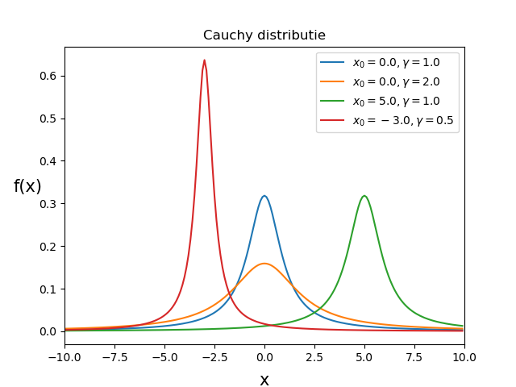

#Wet van Grote Aantallen

In opgave B1a.D hebben we gezien hoe de spreiding van een gemeten gemiddelde 
metingen steeds kleiner wordt als we meer data gebruiken om het gemiddelde te bepalen. 
Dit is een belangrijke observatie. Het geeft aan dat hoe meer data we hebben, hoe nauwkeuriger de uitkomst. Je voelt misschien al aan dat dit niet altijd op gaat. Wanneer dit wel en wanneer dit niet opgaat zullen we hier bespreken. 

## De $$\sqrt{n}$$-wet
We kijken naar twee stochasten, $$X$$ en $$Y$$. De verwachtingswaarde van $$X+Y$$ is gelijk aan: 

 $$E(X+Y)= E(X)+E(Y)$$. 
 
Als $$X$$ en $$Y$$ onafhankelijk zijn dan geldt ook: 

 $$Var(X+Y)= Var(X)+Var(Y)$$.

Het klinkt misschien ingewikkeld, maar het enige wat we doen is een nieuwe variabele definiëren die de som is van twee variabelen. De variantie vinden we via de gewone fouten propagatie regels (XX link). 

Stel nu dat we dit uitbreiden. En we nemen de som van $$N$$ onafhankelijk stochasten, $$X_1,X_2,...,X_N$$  die elk dezelfde onderliggende verdeling kennen. Dat wil zeggen dat ze allemaal dezelfde verwachtingswaarde en dezelfde variantie hebben. 
(NB. de verwachtingswaarde is niet gelijk aan de gemeten waarde. Kijk voor dit verschil nog eens naar [basisbegrippen](/blok-1/basisbegrippen) in blok 1.) 

De formule voor deze som kunnen we nu schrijven als: 

 $$S_N = X_1 + X_2 + ... + X_N$$.  

En het gemiddelde kunnen we schrijven als  

$$E( &lt X_N &gt) = S_n/N$$.  

Als de verwachtingswaarde van een enkele stochast $$E(X_i)$$ gelijk is aan $$\mu$$ en de variantie gelijk is aan  

$$Var(X_i) = \sigma^2$$. 

 Dan geldt nu voor de verwachtingswaarde van de som $$E(S_N)= \mu N$$ en voor het gemiddelde $$E( &lt X_N &gt) = \mu$$. En dan geldt voor de variantie $$Var(S_N) = N \sigma^2$$ en $$Var( &lt X_N &gt) = \sigma^2/N$$. 
Dit betekend dat de standaard deviatie van de som van de stochasten gelijk is aan $$\sigma \sqrt{N}$$ en de standaard deviatie van het gemiddelde $$\sigma / \sqrt{N}$$. 

Dit betekend dus dat als het gemiddelde van de massa van N aantal kogels nemen waarbij de kogels een Normale distributie hebben met een gemiddelde $$\mu$$ en een standaard deviatie van $$\sigma$$, de onzekerheid op de bepaalde massa gelijk is aan $$\sigma/\sqrt{N}$$: de standaard deviatie van de distributie gedeeld door het aantal kogels die meegenomen zijn in de meting. Hoe meer kogels we wegen en meenemen in ons gemiddelde, hoe nauwkeuriger we dit gemiddelde kennen. 

## De wet van Grote Aantallen
Intuïtief voelen we aan dat hoe meer metingen we doen, hoe meer informatie we hebben, en hoe nauwkeuriger ons resultaat is. 

De **wet van grote aantallen** zegt dat het berekende steekproef gemiddelde, $$ &lt X &gt$$, van een distributie met een eindige variantie, convergeert naar het populatie gemiddelde $$\mu$$ voor steeds grote steekproeven: 

$${\displaystyle lim_{N \to \infty} P( | &lt X &gt - \mu| &gt \epsilon) = 0 } $$.

Ofwel de kans dat het steekproef gemiddelde meer afwijkt van het populatie gemiddelde dan een heel klein getal convergeert naar 0 voor oneindig grote steekproeven. 
Voor eindige populaties is dit natuurlijk zeker waar. Maar denk hier ook aan  oneindig grote, of nagenoeg oneindig grote populaties, zoals bijvoorbeeld als je de gemiddelde massa van het electron wil bepalen. 

Tip: In deze [video](https://www.youtube.com/watch?v=MntX3zWNWec) wordt de wet van grote aantallen duidelijk uitgelegd. 

Als je de wet goed leest zie je dat er een voorwaarde aan vast zit. Namelijk de variantie van de stochast eindig moet zijn, en dat dus de verwachtingswaarde van de stochast bepaald is. Er bestaan distributies, zoals de [Cauchy](https://nl.wikipedia.org/wiki/Cauchy-verdeling) of de [Landau](https://en.wikipedia.org/wiki/Landau_distribution) distributie waarvoor dit dus niet geldt. Deze distributies hebben oneindig lange staarten. Hieronder zie je hoe de Cauchy distributie eruit ziet.

{:width="80%"} 

Wiskundig kan de wet van de grote aantallen dus weleens voor problemen zorgen. In Natuurkundige experimenten zijn verdelingen uiteindelijk vaak beknot door bijvoorbeeld de eindigheid van energie in een botsing. Voor Natuurkundige experimenten gaat de wet van grote aantallen dus vaak wel op.

Overigens noemen we deze wet van grote aantallen de *zwakke* wet van grote aantallen, er bestaat ook een *sterke* wet. We gaan hier niet in op de kleine verschillen tussen deze twee wetten, online kun je er eventueel genoeg over vinden.
 

