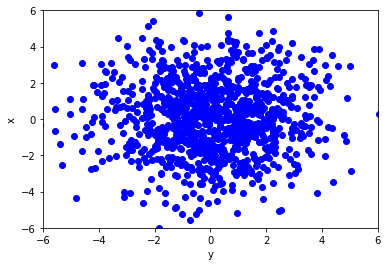
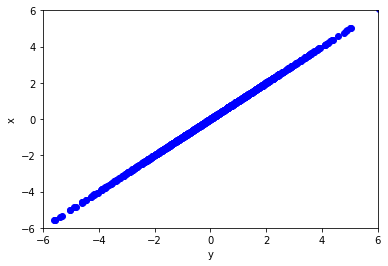
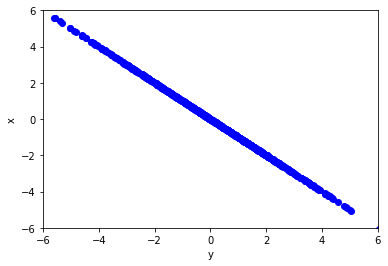
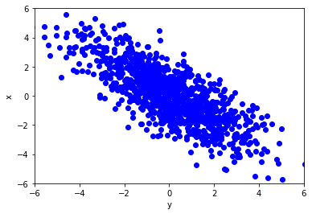
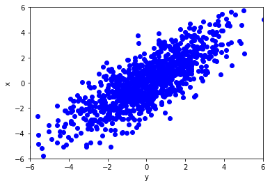

# Multidimensionale data

1. Ordered TOC
{:toc}

Het komt vaak voor dat we datasets hebben waarbij we meerdere variabelen tegelijkertijd hebben gemeten. Bijvoorbeeld als een steekproef doen onder de bevolking waarbij we allerlei gegevens tegelijkertijd opvragen zoals leeftijd, inkomen, gezinssamenstelling etc. Ook in natuurkundige experimenten komen multidimensionale datasets veel voor. 

Voor elke variabelen kunnen we het gemiddelde en de standaard deviatie meten met behulp van de formules die we in ['Basisbegrippen'](/blok-1/theorie-basisbegrippen) hebben geïntroduceerd. Echter we kunnen nu ook kijken naar hoe en of de waarde van een variable afhangt van een andere variabel in de dataset. Dit noemen we correlatie. Ook kunnen we berekenen of een spreiding in een variable afhangt van de waarde van een andere variabele. We noemen die co-variantie. Hieronder introduceren we eerst co-variantie, daaronder komt correlatie aan bod.

## Variantie en covariantie

De variantie geeft zoals eerder besproken (onder ['Basisbegrippen'](/blok-1/theorie-basisbegrippen)) een maat voor
de spreiding van een dataset aan. Bij een 2D dataset waarbij een variabele wordt aangegeven op de $$x$$-as en een andere
variabelen op de $$y$$-as wordt de mate van spreiding o.a. aangegeven met de *covariantie*.

De covariantie bij een 2D dataset geeft aan in welke mate de data verspreid is over het twee dimensionale vlak.

Voor twee variabelen $$x$$ en $$y$$ wordt de covariantie aangeduid met $$cov(x,y)$$ en gegeven door:

$$cov(x,y) = E((x-E_x)(y-E_y))$$

Hier staat $$E$$ voor de *verwachtingswaarde*. De verwachtingswaarde voor
$$x$$ en $$y$$ worden respectievelijk aangegeven met $$E_x$$ en $$E_y$$. De formule geeft dus aan dat de covariantie gelijk is aan de verwachtingswaarde van het verschil tussen de waarde van de variabele $$x$$ en de verwachtingswaarde van $$x$$ vermenigvuldigd met het verschil tussen de variabele $$y$$ en de verwachtingswaarde van $$y$$.

Als voor waardes $$x$$ die bovengemiddeld zijn, overwegend samen gaan met relatief hoge waardes van $$y$$, dan hebben we te maken met een positieve 
waarde voor de covariantie. Als bij de waarden voor relatief hoge waardes van $$x$$ de waardes van $$y$$ voornamelijk onder de verwachtingswaarde liggen, dan is de covariantie negatief.
Als de covariantie gelijk is aan nul dan is er, gemiddeld over de hele dataset, geen afhankelijkheid. Het kan zijn dat voor delen van de dataset wel degelijk een positieve covariantie bestaat, deze wordt dan opgeheven door een ander gedeelte met een negatieve covariantie. 

De covariantie geeft dus aan in hoeverre waarden van de ene variabele toenemen/afnemen bij toenemende waarden van de andere variabele. De covariantie is een heel nuttige maat maar lastig te interpreteren vanwege de dimensies die, net als bij de variantie, niet dezelfde zijn als de variabelen zelf. <a href="https://www.youtube.com/watch?v=KDw3hC2YNFc"> Hier</a> kun je een filmpje zien die co-variantie uitlegt. Eenvoudiger is om naar de correlatie coëfficiënt te kijken. 

Met de volgende formules kun je de covariantie van een dataset uitrekenen: 

* Voor discrete verdelingen geldt : 
$${\displaystyle cov(x,y) = \sum_n (x-<{x}>)\cdot (y-<{y}>)}.$$

* Voor continue verdelingen geldt: 
$${\displaystyle cov(x,y) = \int_{-\infty}^{\infty}\int_{-\infty}^{\infty}xy \cdot f(x,y) dy dx }$$

## Correlatie 

De correlatiecoëfficiënt $$\rho$$ is gedefinieerd als:

$$\rho_{x,y} = \frac{cov_{x,y}}{\sigma_x \sigma_y}$$  

Hierbij is $$cov_{x,y}$$ de covariantie tussen variabele $$x$$ en variabele $$y$$, en zijn $$\sigma_x$$ en $$\sigma_y$$ de standaardafwijkingen van variabele $$x$$ en $$y$$ respectievelijk.

Als er geen correlatie is tussen de twee variabelen, dan is
correlatiecoëfficiënt gelijk aan nul. Is de correlatiecoëfficiënt tussen de twee variabelen gelijk aan $$1$$ of aan $$-1$$ dan zijn de twee
variabelen maximaal afhankelijk. In het geval van een correlatiecoëfficiënt gelijk aan $$1$$ is dit een positief lineair verband, in het geval van een correlatiecoëfficiënt gelijk aan $$-1$$ is dit een lineair verband met negatieve helling. 

Hieronder zijn een aantal 2D datasets weergegeven met verschillende correlatiecoëfficiënten:

Dataset met een correlatiecoëfficiënt $$\rho_{x,y} = 0 $$:

{:width="60%"}

Dataset met een correlatiecoëfficiënt $$\rho_{x,y} = 1 $$:

{:width="60%"}

Dataset met een correlatiecoëfficiënt $$\rho_{x,y} = -1 $$:

{:width="60%"}

Datasets met een correlatiecoëfficiënt $$\rho_{x,y} = -0.8$$ en $$\rho_{x,y} = 0.8$$:

{:width="45%"}{:width="45%"}

Datasets met een correlatiecoëfficiënt $$\rho_{x,y} = -0.3$$ en $$\rho_{x,y} = 0.3$$:

{:width="45%"}{:width="45%"}

Hoe dichter de correlatiecoëfficiënt bij een waarde van $$1$$ of $$-1$$ zit des te groter is de afhankelijkheid van de variabelen. Hoe te dichter de correlatiecoëfficiënt bij nul zit des te kleiner is de correlatie tussen de variabelen. Je kunt <a href="https://www.youtube.com/watch?v=ugd4k3dC_8Y">hier</a> een filmpje vinden waarin correlatie ook wordt uitgelegd.

Er zijn meerdere 'spelletjes' op internet waarbij je kunt oefenen met het herkennen en raden van de correlatiecoëfficiënt
van twee variabelen. Kijk bijvoorbeeld eens bij [Geogebra-Correlatie game](https://www.geogebra.org/m/KE6JfuF9) of 
[Guess the correlation](http://guessthecorrelation.com/).

