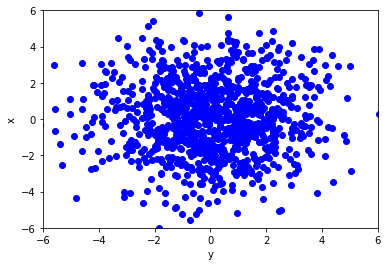
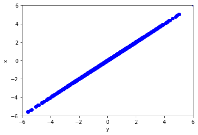
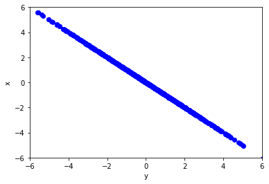
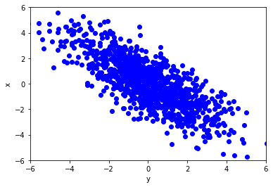
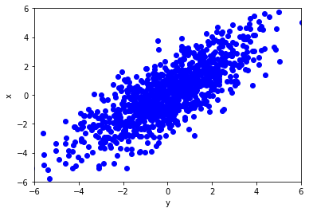
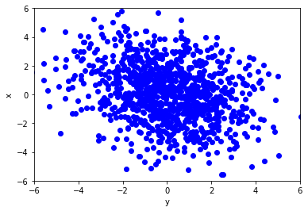
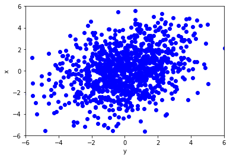

# Correlatie en causaliteit

1. Ordered TOC
{:toc}

## Variantie en covariantie

De variantie geeft zoals eerder besproken (onder ['Basisbegrippen'](/blok-1/theorie-basisbegrippen)) een maat voor
de spreiding van een dataset aan. Bij een 2D dataset waarbij een variabele wordt aangegeven op de $$x$$-as en een andere
variabelen op de $$y$$-as wordt de mate van spreiding o.a. aangegeven met de *covariantie*.

De covariantie bij een 2D dataset geeft aan in welke mate de data verspreid is over het twee dimensionale vlak.

Voor twee variabelen $$x$$ en $$y$$ wordt de covariantie aangeduid met $$cov(x,y)$$ en gegeven door:

$$cov(x,y) = E((x-E_x)(y-E_y))$$

Hier staat $$E$$ voor de *verwachtingswaarde*. De verwachtingswaarde voor
$$x$$ en $$y$$ worden respectievelijk aangegeven met $$E_x$$ en $$E_y$$. De formule
geeft dus aan dat de covariantie gelijk is aan de verwachtingswaarde van
het verschil tussen de waarde van de variabele $$x$$ en de verwachtingswaarde 
van $$x$$ vermenigvuldigd met het verschil tussen de variabele $$y$$ en de verwachtingswaarde
van $$y$$.

Als bij zowel de variabele $$x$$ als de variabele $$y$$ de waarden overwegend 
boven de verwachtingswaarde liggen, dan hebben we te maken met een positieve 
waarde voor de covariantie. Als de waarden voor zowel de variabele $$x$$ als
$$y$$ voornamelijk onder de verwachtingswaarde liggen, dan is de covariantie ook positief.
De covariantie is negatief als de ene variabele overwegend boven de verwachtingswaarde
ligt en de andere er overwegend onder.

De covariantie geeft dus aan in hoeverre waarden van de ene variabele toenemen/afnemen bij toenemende
waarden van de andere variabele, het geeft alleen niet aan hoe sterk de samenhang tussen de variabelen is.
Een parameter die vergelijkbaar is met de covariantie maar ook aangeeft hoe sterk
de samenhang tussen de variabelen is wordt de *correlatie* genoemd. 

## Correlatie 

De correlatie van een 2D dataset geeft aan in hoeverre de variabele weergegeven op
de $$x$$-as **lineair** afhangt van de variabele weergegeven op de $$y$$-as (en andersom).

De mate van correlatie wordt aangegeven met de *correlatiecoëfficiënt* $$\rho_{x,y}$$.

De correlatiecoëfficiënt is gedefinieerd als:

$$\rho_{x,y} = \frac{cov_{x,y}}{\sigma_x \sigma_y}$$  

Hierbij is $$cov_{x,y}$$ de covariantie tussen variabele $$x$$ en variabele $$y$$, en zijn $$\sigma_x$$ en 
$$\sigma_y$$ de standaardafwijkingen van variabele $$x$$ en $$y$$ respectievelijk.

Als er geen correlatie is tussen de twee variabelen van de 2D dataset, dan zijn
de twee variabelen niet lineair afhankelijk van elkaar en is de correlatiecoëfficiënt
gelijk aan nul. Is de correlatiecoëfficiënt tussen de twee variabelen gelijk aan $$1$$ of aan $$-1$$ dan zijn de twee
variabelen perfect lineair afhankelijk van elkaar. In het geval van een correlatiecoëfficiënt gelijk
aan $$1$$ is dit een positief lineair verband, in het geval van een correlatiecoëfficiënt gelijk
aan $$-1$$ is dit een lineair verband met negatieve helling. 

Hieronder zijn een aantal 2D datasets weergegeven met verschillende correlatiecoëfficiënten:

Dataset met een correlatiecoëfficiënt $$\rho_{x,y} = 0 $$:

{:width="60%"}

Dataset met een correlatiecoëfficiënt $$\rho_{x,y} = 1 $$:

{:width="60%"}

Dataset met een correlatiecoëfficiënt $$\rho_{x,y} = -1 $$:

{:width="60%"}

Datasets met een correlatiecoëfficiënt $$\rho_{x,y} = -0.8$$ en $$\rho_{x,y} = 0.8$$:

{:width="35%"}

{:width="35%"}

Datasets met een correlatiecoëfficiënt $$\rho_{x,y} = -0.3$$ en $$\rho_{x,y} = 0.3$$:

{:width="35%"}

{:width="35%"}

Hoe dichter de correlatiecoëfficiënt bij een waarde van $$1$$ of $$-1$$ zit des te groter
is de lineaire afhankelijkheid van de variabelen. Hoe te dichter de correlatiecoëfficiënt bij nul zit
des te minder is de correlatie tussen de variabelen.

Er zijn meerdere 'spelletjes' op internet waarbij je kunt oefenen met het herkennen ne raden van de correlatiecoëfficiënt
van een 2D dataset. Kijk bijvoorbeeld eens bij [Geogebra-Correlatie game](https://www.geogebra.org/m/KE6JfuF9) of 
[Guess the correlation](http://guessthecorrelation.com/)

## Causaliteit

