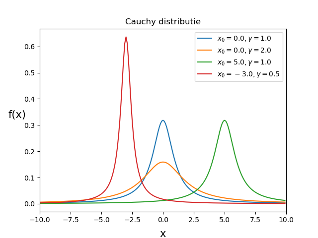

# Wet van Grote Aantallen
<!--REF\label{/module-2/wet-van-grote-aantallen}-->

In opgave M1.4 hebben we gezien hoe de spreiding van het steekproef gemiddelde steeds kleiner wordt als we meer data gebruiken om het gemiddelde te bepalen. De gemeten waardes liggen steeds dichter bij elkaar.
Dit is een belangrijke observatie. Het geeft aan dat hoe meer data we hebben, hoe nauwkeuriger we ons resultaat weten. Je voelt misschien al aan dat dit niet altijd op gaat. Wanneer dit wel en wanneer dit niet opgaat zullen we hier bespreken. 

We bespreken hier twee regels, of wetten, de $$\sqrt{n}$$-wet en de wet van grote aantallen. De eerste wet zegt dat we een gemiddelde, onder bepaalde voorwaarden, steeds beter kennen als we meer datapunten meenemen. De tweede wet zegt dat het steekproef gemiddelde langzaam zal convergeren naar het gemiddelde van de populatie naarmate de steekproef steeds groter wordt.

## De $$\sqrt{n}$$-wet
Stel dat we een grootheid willen weten die de som is van twee onafhankelijke variabelen die beide stochastisch verdeeld zijn. Dit betekent dat beide variabelen gemeten kunnen worden maar ook dat de waardes die we meten een onderliggende verdeling volgen die afhangt van een kansproces. We hebben hier dus twee onafhankelijke stochasten, die we $$X$$ en $$Y$$ noemen. De verwachtingswaarde van de som $$X+Y$$ is gelijk aan:

$$\displaystyle{ E(X+Y)= E(X)+E(Y) }.$$ 

Ofwel de verwachtingswaarde van de som is gelijk aan de verwachtingswaarde van $$X$$ plus de verwachtingswaarde van $$Y$$. 
De verwachtingswaarde is hier niets anders dan het steekproefgemiddelde. Dus 

$$\displaystyle{ E(X) = \frac{1}{n} \sum_i^n X_i}.$$

We kunnen ook naar de spreiding van waardes van de som $$(X+Y)$$ kijken. 
Als $$X$$ en $$Y$$ onafhankelijk zijn dan geldt ook:

$$\displaystyle{Var(X+Y)= Var(X)+Var(Y)}.$$

Het ziet er misschien ingewikkeld uit, maar het enige wat we doen is een nieuwe variabele definiëren die de som is van twee variabelen. De som van stochasten is zelf ook een stochast. De variantie op de som vinden we via de [regels](/module-2/foutenpropagatiei) van de foutenpropagatie. 

Stel nu dat we dit uitbreiden. En we nemen de som van $$n$$ onafhankelijk stochasten, $$X_1,X_2,...,X_n$$  die elk *dezelfde* onderliggende verdeling kennen. Dat wil zeggen dat ze allemaal dezelfde verwachtingswaarde en dezelfde variantie hebben. Je kan dit bijvoorbeeld zien als $$n$$ onafhankelijke metingen van eenzelfde grootheid van een steekproef.

De formule voor de som $$S_n$$, kunnen we nu schrijven als:

$$\displaystyle{ S_n = X_1 + X_2 + ... + X_n.}$$ 

En de verwachtingswaarde van $$S_n$$ is dan:

$$\displaystyle { E( S_n ) = E( X_1 + X_2 + ... + X_n ) = E(X_1) + E(X_2) + ... + E(X_n).}$$

Omdat we eerder stelden dat elke stochast *dezelfde* onderliggende verdeling betekent dit dat 

$$\mu_{X_1} =\mu_{X_2} = ... = \mu_{X_n} \equiv \mu.$$

Als de verwachtingswaarde (steekproefgemiddelde) van een enkele stochast $$E(X_i)$$ gelijk is aan het populatiegemiddelde $$\mu$$ dan geldt nu voor de verwachtingswaarde van de som:  

$$\displaystyle{ E(S_n)= \mu \cdot n} .$$

En als de variantie van de steekproef is gelijk aan de variantie van de populatie $$Var(X_i) = \sigma^2$$, dan geldt

$$\displaystyle{ Var(S_n) = n \cdot \sigma^2 } .$$ 

ofwel de standaardafwijking van de som is gelijk aan:

$$\displaystyle{ s_{(S_n)} = \sqrt{n} \cdot \sigma } .$$ 

In plaats van naar de eigenschappen van de som $$S_n$$ te kijken, kunnen we ook naar de eigenschappen van het gemiddelde van de stochasten $$X_i$$ kijken. We hoeven hiervoor alleen maar de waarde van de som te delen door het aantal metingen $$n$$. 

Behalve de som $$S_n$$ kunnen we ook het gemiddelde van de stochasten, $$G_n$$, definieren. Dit gemiddelde is gedefinieerd als: 

$$\displaystyle{ G_n = \frac{S_n}{n}.}$$

De variabele $$n$$ mogen we zien als een constante en daarom kunnen we
gebruik maken van de regels die we in het vorige hoofdstuk hebben afgeleid (in het eerste voorbeeld)

$$\displaystyle{ E(cX) = c \cdot E(x),\\ Var(cX) = c^2 \cdot Var(X).}$$

De verwachtingswaarde van het gemiddelde $$G_n$$ is dus gelijk aan: 

$$\displaystyle{ E\left( G_n \right) = E\left( \frac{S_n}{n} \right) = \frac{E\left( S_n \right)}{n} = \frac{(n \cdot \mu)}{n} =\mu.}$$

Precies wat we verwachten. De verwachtingswaarde van de steekproef is gelijk aan de verwachtingswaarde van de populatie. Voor de standaardafwijking vinden we 

$$\displaystyle{ Var(G_n) = Var\left( \frac{S_n}{n}\right)  = \frac{Var\left( S_n \right)}{n^2}  = \frac{n \cdot \sigma^2}{ n^2} = \frac{\sigma^2}{n}.}$$

Dit betekent dat **de standaardafwijking voor het gemiddelde $$G_n$$** kan worden geschreven als

$$\displaystyle{ s_{(G_n)} = \frac{\sigma}{\sqrt{n}}.}$$

Dit is een belangrijk resultaat. Het zegt dat we het gemiddelde van een steekproef steeds beter kennen als we meer metingen verrichten. 
Denk bijvoorbeeld aan de ton met N kogels waarvan de massa's van de kogels een Normale distributie hebben met een gemiddelde $$\mu$$ en een standaardafwijking $$\sigma$$, de onzekerheid op het bepaalde gemiddelde massa van een steekproef gelijk is aan $$\sigma/\sqrt{n}$$. Hoe meer kogels we wegen en meenemen in het berekende steekproefgemiddelde, hoe nauwkeuriger we dit gemiddelde kennen. 

## De wet van Grote Aantallen
Intuïtief voelen we aan dat hoe meer metingen we doen, hoe meer informatie we hebben, en hoe nauwkeuriger ons resultaat is. We hebben in de $$\sqrt{n}$$-wet al gezien dat de standaardafwijking op een gemeten stochast afneemt met 1/$$\sqrt{n}$$. We laten nu zien dat we, in de meeste gevallen, ook kunnen verwachten dat de gemeten steekproefgemiddelde steeds meer in de buurt komt van het populatiegemiddelde. 

De **wet van grote aantallen** zegt dat het berekende steekproef gemiddelde, $$<{X}>$$, van een distributie met een eindige variantie, convergeert naar het populatie gemiddelde $$\mu$$ voor steeds grote steekproeven: 

$${\displaystyle lim_{n \to \infty} P( \mid \lt X \gt - \mu \mid \gt \epsilon) = 0 } $$

Ofwel de kans dat het steekproef gemiddelde meer afwijkt van het populatie gemiddelde dan een heel klein getal, convergeert naar 0 voor oneindig grote steekproeven. 
Voor eindige populaties is dit natuurlijk zeker waar. Maar denk hier ook aan  oneindig grote, of nagenoeg oneindig grote populaties, zoals bijvoorbeeld als je de gemiddelde massa van het electron wilt bepalen. 

**Tip:** In deze [video](https://www.youtube.com/watch?v=MntX3zWNWec) wordt de wet van grote aantallen nogmaals duidelijk uitgelegd. 

Als je de wet goed leest zie je dat er een voorwaarde aan vast zit. Namelijk dat de variantie van de stochast eindig moet zijn, en dat dus de verwachtingswaarde van de stochast bepaald is. Er bestaan distributies, zoals de [Cauchy](https://nl.wikipedia.org/wiki/Cauchy-verdeling) of de [Landau](https://en.wikipedia.org/wiki/Landau_distribution) distributie waarvoor dit dus niet geldt. Deze distributies hebben oneindig lange staarten. In het figuur hier<!--FIG , in Fig. \ref{fig:CauchyDistributie}--> zie je hoe de Cauchy distributie eruit ziet.

{:width="80%"} 

Wiskundig gezien kan de wet van grote aantallen dus weleens voor problemen zorgen. In Natuurkundige experimenten zijn verdelingen uiteindelijk vaak beknot door bijvoorbeeld de eindigheid van energie. Voor Natuurkundige experimenten gaat de wet van grote aantallen eigenlijk altijd wel op. 

Overigens noemen we deze wet van grote aantallen de *zwakke* wet van grote aantallen, er bestaat ook een *sterke* wet. We gaan hier niet in op de kleine verschillen tussen deze twee wetten, online kun je er eventueel genoeg over vinden.
 

