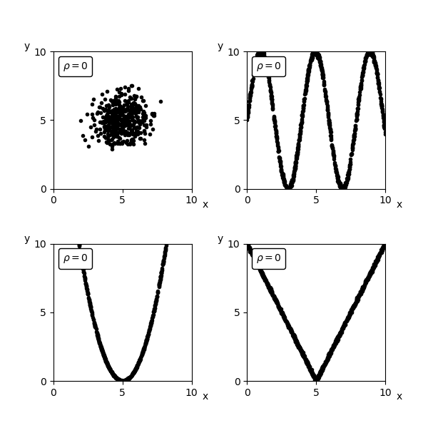

# Meerdimensionale datasets
<!--REF\label{/module-2/meerdimensionale-data}-->
1. Ordered TOC
{:toc}

Het komt vaak voor dat we datasets hebben waarbij we meerdere variabelen tegelijkertijd hebben gemeten. Bijvoorbeeld als we een steekproef doen onder de bevolking waarbij we allerlei gegevens tegelijkertijd opvragen zoals leeftijd, inkomen, gezinssamenstelling etc. We kunnen dan niet alleen naar verdelingen kijken van bijvoorbeeld alleen het inkomen, maar we kunnen ook naar het inkomen kijken *afhankelijk* van de leeftijd. Dit levert dus meer informatie op dan als we deze gegevens afzonderlijk zouden hebben verzameld. Ook in natuurkundige experimenten komen multidimensionale datasets veel voor. 

Voor elke afzonderlijke variabele kunnen we bijvoorbeeld het gemiddelde en de standaardafwijking berekenen met behulp van de formules die we in ['Basisbegrippen'](/module-1/basisbegrippen) hebben geïntroduceerd. Maar we kunnen nu ook kijken of de waarde van een observabele afhangt van een andere observabele in de dataset. Dit noemen we correlatie. Ook kunnen we berekenen of een spreiding in een variabele afhangt van de waarde van een andere variabele. We noemen die covariantie. Hieronder introduceren we eerst covariantie, daaronder komt correlatie aan bod.

## Variantie en covariantie

De variantie geeft zoals eerder besproken (onder ['Basisbegrippen'](/module-1/basisbegrippen)) een maat voor
de spreiding van een dataset aan. Bij een 2D dataset waarbij een variabele wordt aangegeven op de $$x$$-as en een andere
variabelen op de $$y$$-as wordt de mate van spreiding o.a. aangegeven met de *covariantie*.

De covariantie bij een 2D dataset geeft aan in welke mate de data verspreid is over het twee dimensionale vlak.

Voor twee variabelen $$x$$ en $$y$$ wordt de covariantie aangeduid met $$cov(x,y)$$ en gegeven door:

$${\displaystyle cov(x,y) = E \left( (x-E_x)(y-E_y) \right) }$$

Hier staat $$E$$ voor de *verwachtingswaarde*. De verwachtingswaarde voor $$x$$ en $$y$$ worden respectievelijk aangegeven met $$E_x$$ en $$E_y$$. De formule geeft dus aan dat de covariantie gelijk is aan de verwachtingswaarde van het verschil tussen de waarde van de variabele $$x$$ en de verwachtingswaarde van $$x$$ vermenigvuldigd met het verschil tussen de variabele $$y$$ en de verwachtingswaarde van $$y$$.

Als bovengemiddelde waardes van $$x$$ overwegend samen gaan met relatief hoge waardes van $$y$$, dan hebben we te maken met een positieve waarde voor de covariantie. Als bij bovengemiddelde waardes van $$x$$ de waardes van $$y$$ voornamelijk onder het gemiddelde van $$y$$ liggen, dan is de covariantie negatief.
Als de covariantie gelijk is aan nul dan is er, gemiddeld over de hele dataset, geen afhankelijkheid. Het kan zijn dat voor delen van de dataset wel degelijk een positieve covariantie bestaat, deze wordt dan opgeheven door een ander gedeelte met een negatieve covariantie. 
Als de covariantie nul is, betekent dat dus niet persé dat er geen afhankelijkheid is van $$x$$ ten opzichte van $$y$$. 

Met de volgende formules kun je de covariantie van een dataset uitrekenen: 

* Voor discrete verdelingen geldt: 
$${\displaystyle cov(x,y) = \frac{1}{n}\sum^n_i \left( x_i- \overline{x} \right) \cdot \left( y_i- \overline{y} \right)}.$$

* Voor continue verdelingen geldt: 
$${\displaystyle cov(x,y) = \int_{-\infty}^{\infty}\int_{-\infty}^{\infty}x~y \cdot f(x,y) ~dy ~dx }$$

De covariantie geeft dus aan in hoeverre waarden van de ene variabele toenemen/afnemen bij toenemende waarden van de andere variabele. De covariantie is een heel nuttige maat maar lastig te interpreteren vanwege de dimensies die, net als bij de variantie, niet dezelfde zijn als de variabelen zelf. Eenvoudiger is om naar de correlatiecoëfficiënt $$\rho$$ te kijken. 

 [Hier](https://www.youtube.com/watch?v=KDw3hC2YNFc) kun je een filmpje zien die covariantie uitlegt. 

## Correlatie 

De correlatiecoëfficiënt $$\rho$$ is gedefinieerd als:

$$\rho_{x,y} = \frac{cov(x,y)}{\sigma_x \sigma_y}$$  

Hierbij is $$cov(x,y)$$ de covariantie tussen variabele $$x$$ en variabele $$y$$, en zijn $$\sigma_x$$ en $$\sigma_y$$ de standaardafwijkingen van variabele $$x$$ en $$y$$ respectievelijk.
Deze reken je dus uit met de formule die hierboven is gedefinieerd.

Als er geen correlatie is tussen de twee variabelen, dan is
correlatiecoëfficiënt gelijk aan nul. Is de correlatiecoëfficiënt tussen de twee variabelen gelijk aan $$1$$ of aan $$-1$$ dan zijn de twee
variabelen maximaal afhankelijk. In het geval van een correlatiecoëfficiënt gelijk aan $$1$$ is dit een positief lineair verband, in het geval van een correlatiecoëfficiënt gelijk aan $$-1$$ is dit een lineair verband met negatieve helling. 

In het figuur,<!--FIG in figuur \ref{fig:Correlations}--> zijn een aantal 2D datasets weergegeven met verschillende correlatiecoëfficiënten. 

{:width="80%"}

Hoe dichter de correlatiecoëfficiënt bij een waarde van $$1$$ of $$-1$$ zit des te groter is de afhankelijkheid van de variabelen. Hoe dichter de correlatiecoëfficiënt bij nul zit des te kleiner is de correlatie tussen de variabelen. 

In het figuur,<!--FIG in figuur \ref{fig:Correlations0}--> zie je een aantal voorbeelden van datasets die allen een correlatiecoëfficiënt hebben met waarde $$\rho=0$$. Zoals je ziet hoeft een waarde van 0 niet te betekenen dat er helemaal geen verband is tussen de waardes van $$x$$ en $$y$$. Wat het wel zegt is dat er over de gehele dataset even veel bovengemiddelde punten van $$x$$ met een bovengemiddeld punt $$y$$ corresponderen als het omgekeerde.

{:width="80%"}

Je kunt [hier](https://www.youtube.com/watch?v=ugd4k3dC_8Y) een filmpje vinden waarin correlatie ook wordt uitgelegd.
Er zijn meerdere 'spelletjes' op internet waarbij je kunt oefenen met het herkennen en raden van de correlatiecoëfficiënt
van twee variabelen. Kijk bijvoorbeeld eens bij [Geogebra-Correlatie game](https://www.geogebra.org/m/KE6JfuF9) of 
[Guess the correlation](http://guessthecorrelation.com/).

## Correlatie en causaliteit
Soms betekent correlatie dat er oorzakelijk verband is tussen de twee observabelen. Dat wil zeggen dat de ene observabele invloed heeft op de andere observabele. 

Een voorbeeld hiervan is als je kijkt naar de ijsverkoop en de buitentemperatuur. Omdat het warm is buiten hebben mensen meer trek in een ijsje. Het is dus niet zo gek dat je er een verband tussen vindt. Dit verband noemen we een **causaal** verband. Iets wordt veroorzaakt door iets anders. 

In wetenschappelijk onderzoek zijn we altijd op zoek naar correlaties. Immers, die kunnen wijzen op onbekende wetten of onderliggende, nog onbekende fenomenen. 
Toch moet je behoorlijk oppassen om meteen een conclusie te trekken. Niet alle observabelen die gecorreleerd zijn, hebben een causaal verband. Het kan ook toeval zijn, als je maar genoeg variabelen tegen elkaar uitzet zal je er altijd wat vinden die toevallig een correlatie vertonen. Het kan ook komen door een verborgen parameter. Dit wordt ook wel Simpsons paradox genoemd.

Een bekend voorbeeld van een Simpsons paradox is een onderzoek naar veiligheid op de scheepvaart. Er is gebleken dat er een positieve correlatie is tussen het dragen van reddingsvesten en het aantal ongevallen waarbij mensen verdronken zijn. Dit is natuurlijk niet wat je verwacht! Voordat je adviseert om alle reddingsvesten weg te laten gooien is het goed om nog iets verder onderzoek te plegen. Wat blijkt, de reddingsvesten worden alleen aangetrokken bij slecht weer op zee. De verborgen parameter is dus het weer. Als we de data nog een keer goed bekijken en nu kijken naar alleen de categorie slecht weer dan zien we dat de overlevingskans juist vele malen hoger is als een reddingsvest wordt gedragen. 

De les die je hieruit moet leren is dat je altijd heel goed moet nadenken over wat een verborgen parameter zou kunnen zijn en niet zomaar de conclusie trekken dat een correlatie ook causaliteit impliceert. Het is goed om zo'n conclusie eerst te onderbouwen met een plausibele verklaring.

