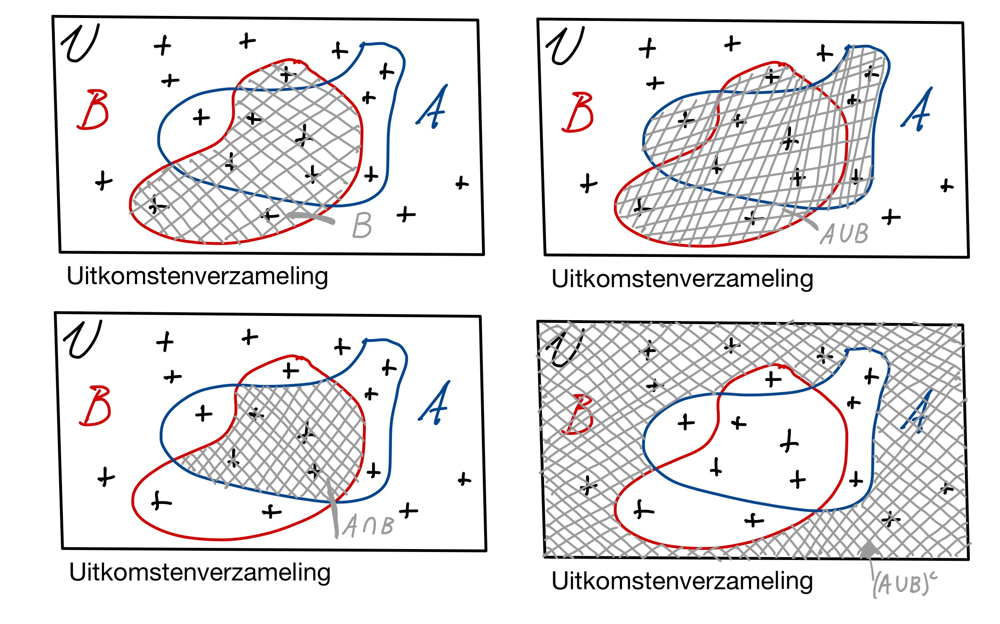

# Extra kansrekenregels
<!--REF\label{/module-2/extra-kansrekenregels}-->

1. Ordered TOC
{:toc}

In [module 1](/module-1/kanstheorie) hebben we de complement-regel, de en-regel en de of-regel geleerd voor het rekenen met kansen. Aan deze regels waren enkele voorwaarden verbonden. 

De of-regel geldt alleen als de metingen A en B wederzijds uitsluitend zijn. Dat betekent dat een meting A niet kan voorkomen als B gemeten is. 

> **Voorbeeld** We trekken een kaart uit een kaartendek en willen weten wat de kans is dat de kaart rood is en wat de kans is dat de kaart een waarde 4 heeft. Er bestaan rode kaarten met getal vier en in dit geval mogen we de kansen dus niet optellen: De kansen zijn niet wederzijds uitsluitend.
> 
> $$P(\text{rood of 4}) \neq P(\text{rood}) + P(4)$$

We breiden de regels hier verder uit en gaan kijken naar het combineren van kansen die niet wederzijds uitsluitend zijn. We kijken ook naar het begrip conditionele kans en introduceren Bayes theorema die gebruikt kan worden om informatie van kansen om te rekenen. 

## Begrippen

We introduceren eerst de begrippen die we nodig hebben in dit hoofdstuk. 

De **vereniging**, ook wel de unie, van $$A$$ en $$B$$ wordt genoteerd met $$A \cup B$$ en is de verzameling van alle elementen van A en B. 

De term $$(\text{A en B})$$ noemen we ook wel de **doorsnede**, of intersectie, van A en B. Het is het overlappende deel van elementen in de verzameling. De doorsnede wordt ook wel genoteerd met $$A \cap B$$. 

Het **complement** van $$A$$ wordt genoteerd met $$A^c$$ en is het deel van de uitkomstenverzameling dat *niet* in $$A$$ ligt. 

Bovenstaande definities kunnen we ook visueel weergeven in Venn diagrammen. <!--FIG Deze vind je in Fig. \ref{fig:Venn}.-->

{:width="80%"}

## De of regel wanneer A en B niet wederzijds uitsluitend zijn
In het geval A en B niet wederzijds uitsluitend zijn dan geldt:  

$$P(\text{A en B}) \equiv P(A \cap B) >0.$$

De kans dat A of B gemeten wordt is dan:

$$P(\text{A of B}) = P(A) + P(B) - P(\text{A en B}).$$

> **Voorbeeld** De kans dat een getrokken kaart rood is en een vier als uitkomst heeft is $$\frac{2}{52}$$. De kans dat een getrokken kaart òf rood is òf een vier is nu gelijk aan 
> 
> $$P\left(\frac{1}{2}\right) + P\left(\frac{4}{52}\right) - P\left(\frac{2}{52}\right) = \frac{28}{52}.$$

## Conditionele kans
Een conditionele kans wordt geschreven als $$P(A \mid B)$$ en kun je lezen als "Wat is de kans op meting $$A$$ gegeven dat de bekend is dat geldt $$B$$". We hebben dus al wat informatie over de meting (namelijk de uitkomst ligt in elk geval in $$B$$) en we willen weten wat de kans op uitkomst $$A$$ is. 
Een conditionele kans kan je niet zomaar omkeren: 

$$P(A \mid B)\not\equiv P(B \mid A).$$  

Een sprekend voorbeeld hiervan is de volgende. De kans dat een persoon zwanger is gegeven dat de persoon een vrouw is, $$P(\text{zwanger} \mid \text{vrouw})$$, is niet gelijk aan de kans dat iemand een vrouw is gegeven dat de persoon zwanger is, $$P(\text{vrouw} \mid \text{zwanger})$$. De laatste kans is duidelijk gelijk aan 1. Als je zwanger bent ben je zeker een vrouw. De eerste kans is een stuk kleiner!

De conditionele kans kunnen we berekenen met:  

$$\displaystyle{P(A \mid B) = \frac{P(A \cap B)}{P(B)}}.$$

De noemer in deze vergelijking, $$P(B)$$, noemen we ook wel een normalisatie  term. De kans $$P(A \cap B)$$ moet genormaliseerd worden naar de kans $$P(B)$$, immers het is al een gegeven dat $$B$$ waar is. 

Visueel is dit wellicht het meest eenvoudige om te zien. Als het gegeven is dat de uitkomst in het deelgebied B ligt, dan is de kans dat het ook de waarde A bezit gelijk aan het oppervlak van de overlap tussen A en B gedeeld door het oppervlak van B. Dat de uitkomst in B ligt weten we al, dus we moeten de kans 'normaliseren' naar B. 

## Bayes theorema
Met behulp van de conditionele kans formule kunnen we nu Bayes theorema afleiden.  

Een belangrijke stap is om te realiseren dat de doorsnede van $$A$$ en $$B$$ natuurlijk precies hetzelfde is als de doorsnede van $$B$$ en $$A$$. En dus geldt: 

$$\displaystyle{P(A \cap B) \equiv P(B \cap A).}$$

Als we de formule van de conditionele kans nu anders opschrijven vinden we de vergelijking

$$\displaystyle{P(A \cap B) = P(A \mid B) \cdot P(B).}$$

Deze vergelijking combineren we nu met de vergelijking voor $$P(B \cap A)$$:

$$\displaystyle{P(B \mid A) \cdot P(A) \equiv P(A \mid B) \cdot P(B),}$$ 

ofwel 

$$\displaystyle P(A \mid B) = \frac{P(B \mid A) \cdot P(A)}{P(B)}.$$

Deze formule heet het Bayes theorema en blijkt een van de meest krachtige formules om kansen te berekenen. Het beste is om dit te demonstreren met een voorbeeld.

> **Voorbeeld** Een patiënt komt bij de huisartsenpost met pijnklachten in de buik, de doktersassistent vermoedt een blaasontsteking en onderzoekt de urine met een zogeheten combinatietest. 
> 
> De test is relatief betrouwbaar. Slechts in 5% van de tests volgt er een positieve testuitslag terwijl de patiënt niet ziek is. Dit noem je een fout-positieve uitslag en noteren we hier als $$P(+ \mid \text{niet ziek})$$. In 3% van de gevallen is de testuitslag fout-negatief; de patiënt heeft een blaasontsteking maar de uitslag is toch negatief. De fout-negatieve kans noteren we met $$P(- \mid \text{ziek})$$.
> 
>  Voordat de testuitslag bekend is weet de assistent al wat de *voorafkans* is, de voorafkans is de kans dat een patiënt met die type klachten een blaasontsteking heeft. Dit weet men door jarenlange ervaring in de praktijk. De voorafkans is verschillend voor kinderen ($$0.20$$) en volwassen ($$0.60$$). Kinderen hebben ook vaak om andere reden buikpijn. 
> 
>   
> 
> De testuitslag is positief. **Wat is nu de kans dat de patiënt daadwerkelijk een blaasonsteking heeft?**  
> Wat we dus willen weten is de kans $$P(\mathrm{ziek} \mid +)$$, namelijk wat is de kans dat de patiënt ziek is gegeven de positieve testuitslag. 
> 
> We gebruiken Bayes theorema om dit te berekenen. 
> 
> $$\displaystyle{ P(\mathrm{ziek} \mid +) = \frac{P(+ \mid \mathrm{ziek}) \cdot P(\mathrm{ziek}) }{P(+)}.}$$
> 
> 
> We kennen $$P(+\mid \mathrm{niet ~ziek}) = 0.05$$, namelijk dit is de fout-positief en we kennen de fout-negatief $$P(- \mid \mathrm{ziek}) = 0.03$$. De voorafkans is $$P(\mathrm{ziek})$$ hangt af van de leeftijd van de patiënt (kind/volwassene). Voor Bayes theorema moeten we ook nog de kans op uberhaupt een positieve testuitslag weten, dit is $$P(+)$$. Deze kunnen we berekenen met de volgende formule: 
> 
> $$\displaystyle{P(+) = P(+\mid \mathrm{ziek})\cdot P(\mathrm{ziek}) + P(+ \mid \mathrm{niet ~ziek})\cdot P(\mathrm{niet~ ziek}).}$$
> 
> Namelijk, er zijn twee opties. Je krijg een positieve uitslag en je bent inderdaad ziek. Of je krijgt een positieve uitslag terwijl je helemaal niet ziek bent. In beide gevallen moet je dit vermenigvuldigen met de kans op de bijbehorende toestand (ziek of niet ziek). We zijn er hierbij vanuit gegaan dat een testuitslag altijd positief of negatief is. 
> 
> 
> De kans $$P(+ \mid \text{niet ziek})$$ hebben we al gezien, dat is de fout-positief. De kans $$P(+ \mid \text{ziek})$$ is gelijk aan het complement van de fout-negatief dus $$P(+ \mid \text{ziek}) = 1 - P(- \mid \text{ziek}).$$ Immers als je ziek bent heb je $$3\%$$ kans op een negatieve uitslag, alle andere kansen zijn dus positief $$(100-3)\%.$$ 
> 
> 
> Invullen voor kinderen geeft:
> 
> $$\displaystyle{P(+) = (1-0.03)\cdot 0.20 + 0.05 \cdot (1 - 0.20) = 0.234 ~.}$$
> 
> We vullen dit in in Bayes theorema:
> 
> $$\displaystyle{ P(\mathrm{ziek} \mid +) = \frac{P(+ \mid \mathrm{ziek}) \cdot P(\mathrm{ziek}) }{P(+)} = \frac{(1-0.03) \cdot 0.20}{0.234} = 0.83.}$$ 
> 
> Van de kinderen met een positieve test uitslag heeft dus $$83\%$$ ook 
> daadwerkelijk een blaasontsteking. Dit is een stuk lager dan we misschien zouden verwachten. De test is namelijk betrouwbaar, in $$97\%$$ van de gevallen met blaasonsteking geeft de test immers het juiste resultaaat. Deze afwijking heeft te maken met de lage voorafkans bij kinderen; het is nog redelijk waarschijnlijk dat het kind niet ziek is maar een fout-positieve uitslag heeft.
> 
> De kans dat het kind niet ziek is bij een positieve uitslag is dus $$1-0.83 = 0.17 = 17\%$$. 
>
>
> Reken nu zelf de kans $$P(\mathrm{ziek} \mid +)$$ uit voor een volwassene en controleer dat dit gelijk is aan $$0.97$$. Deze kans is veel groter dan bij de kinderen. Dit heeft alles te maken met de grotere voorafkans.

We hebben in deze twee voorbeelden gezien hoe we informatie over conditionele kansen kunnen omzetten. Het theorema van Bayes maakt het mogelijk om nieuwe informatie te gebruiken. De achterafkans wordt berekend met een test uit voorafkans (ook wel prior), een testuitslag en een normalisatie. De normalisatie is in het geval van het voorbeeld de kans $$P(+)$$, de kans dat er uberhaupt een positieve uitslag volgt. 

Voordat de patiënt de test afnam konden we alleen afgaan op de praktijkervaring van de assistent. Een blaasontsteking bij een kind is onwaarschijnlijk (slechts $$20\%$$) en bij een volwassene waarschijnlijk ($$60\%$$). Na het uitvoeren van de test hebben we meer informatie, maar nog steeds is het belangrijk om de ervaring van de assistent mee te nemen (de voorafkans), maar ook mee te nemen hoe groot de kans is op een positieve testuitslag (de normalisatie). Dat een patiënt daadwerkelijk een blaasontsteking heeft is in beide gevallen (kind/volwassene) waarschijnlijk, maar bij een kind is het misschien goed om ook nog even wat andere oorzaken uit te sluiten.

