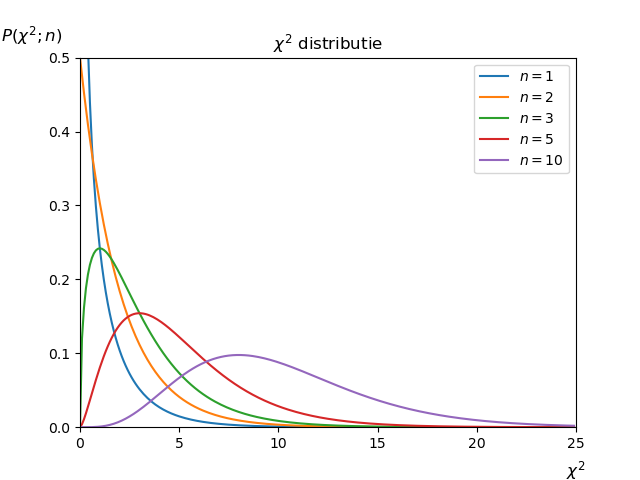

## De $$\chi^2$$ distributie

De $$\chi^2$$ distributie is een maat voor het verschil tussen de voorspelde waardes en het kwadraat van het verschil. Als de functie $$f$$ de data goed beschrijft zal de $$\chi^2$$ klein zijn. Als de $$\chi^2$$ dus groot blijft na het optimaliseren van de parameters van $$f$$ dan is er duidelijk iets misgegaan. Het kan zijn dat de functie $$f$$ de datapunten niet goed *kan* beschrijven, maar het kan ook zijn dat als je minimalisatie uitvoert met een computer deze het minimum niet goed heeft weten te vinden. 
Als daarentegen de $$\chi^2$$ heel klein is gaat er ook iets mis. Waarschijnlijk heb je de onzekerheden op de datapunten heel erg overschat. 
Hoe groot je verwacht dat de waarde van $$\chi^2$$ is na het optimaliseren van de kleinste kwadraten methode kun je bepalen. We gaan hieronder daar verder op in.

We hebben gezien in het hoofdstuk over de kleinste kwadraten methode, dat de $$\chi^2$$ gedefinieerd is als het kwadratische gewogen verschil tussen de meetwaardes en de voorspelde waardes:  

$${\displaystyle  \chi^2 = \sum^N_{i=1} \left( \frac{y_i-f(x_i;\hat{a},\hat{b},..)}{\sigma_i} \right)^2.}$$ 

Let op dat we hier de geoptimaliseerde parameters $$\hat{a}$$ van de functie hebben ingevuld. Deze waarde voor $$\chi^2$$ is dus al geminimaliseerd voor de paramaters van $$f$$.

De $$\chi^2$$ verdeling is een kansdichtheidsverdeling, en voldoet dus ook aan de voorwaardes hiervan. De functie ziet er als volgt uit:  

$${\displaystyle P(\chi^2;n) = \frac{2^{-n/2}}{\Gamma (n/2)} \chi^{n-2} e^{-\chi^2/2}.}$$

Zoals je ziet hangt de $$\chi^2$$ kans af van een parameter $$n$$, dit is het aantal meetpunten in de som ($$N$$) gereduceerd met het aantal parameters van de functie $$f$$. We noemen $$n$$ het aantal *vrijheidsgraden*. De $$\Gamma$$ in de noemer is een speciale wiskundige functie. Deze zal pas in jullie tweede jaar volledig worden uitgelegd. Op dit moment kun je hem simpelweg interpreteren als een functie waar een normalisatie term uitkomt. Voorbeelden: $$Gamma(1/2) = \sqrt{\pi}$$, $$Gamma(1) = 1$$ en $$Gamma(3/2) = 1/2 \sqrt{\pi}$$.

> Voorbeeld Stel we hebben 10 meetwaardes en we gebruiken de kleinste kwadraten methode om 2 parameters van een functie $$f$$ te optimaliseren. We hebben dan $$n=10-2=8$$ vrijheidsgraden.

Hieronder zie je hoe de $$\chi^2$$ eruit ziet voor verschillende waardes van $$n$$.  

{:width="80%"} 

De $$\chi^2$$ distributie heeft een gemiddelde $$\mu = n$$ en een variantie van $$var = 2n$$. We verwachten dus een $$\chi^2$$ van ongeveer **1 per vrijheidsgraad**  te vinden. Als de $$\chi^2$$ per vrijheidsgraad veel kleiner of veel groter is dan 1 weten we dat er een probleem is, de functie $$f(x;\hat{a},\hat{b},...)$$ lijkt de data niet goed te beschrijven.

