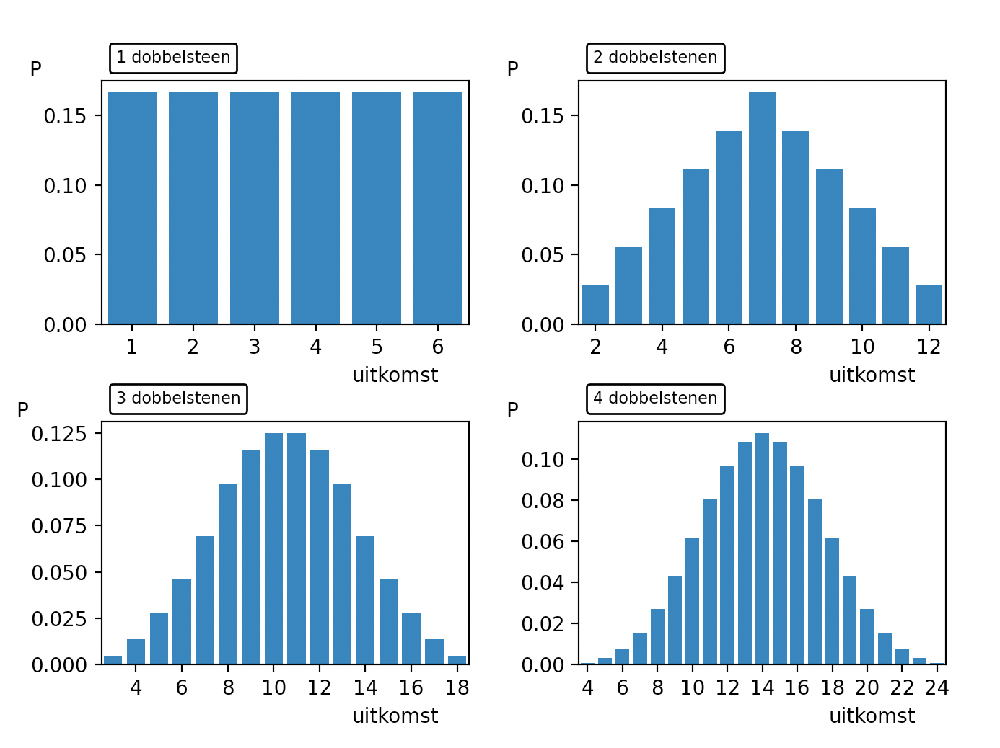

# De Centrale Limietstelling
<!--REF\label{/module-3/de-centrale-limietstelling}-->

Stel dat we een schatter hebben die afhangt van meerdere meetwaardes. Deze meetwaardes hebben elk hun eigen onzekerheden die bijvoorbeeld uniform of poisson verdeeld zijn. Hoe ziet de verwachte kansverdeling van de schattter er dan uit?  In dit hoofdstuk zullen we zien dat deze vaak de Normaalverdeling volgen.  

> **Voorbeeld: Twee dobbelstenen gooien** 
> We gooien een enkele (eerlijke) dobbelsteen. De uitkomstenverzameling is $$\mathscr{U} = \{1,2,3,4,5,6\}$$. De kans op elk van deze uitkomsten is gelijk, dat wil zeggen:
> 
>  $$\displaystyle{P(1) = P(2) = P(3) = P(4) = P(5) = P(6) = \frac{1}{6}.}$$
>
> De uitkomsten verdeling noemen we dus uniform.  
> 
> We nemen nu twee dobbelstenen en kijken naar de uitkomsten van de twee dobbelstenen samen. De som is gedefinieerd als: 
> 
>  $$\displaystyle{W_2 = D_1 + D_2.}$$
> 
> Waarbij we de uitkomst van elke individuele dobbelsteen hebben weergegeven als $$D_1$$ en $$D_2$$. De uitkomst van de worp met twee dobbelstenen noteren we hier met $$W_2$$. 
> Je zou misschien denken dat de kansverdeling van de uitkomstenverzameling van het experiment met twee dobbelstenen ook weer uniform is. Immers zijn de onderliggende kansdistributies van $$D_1$$ en $$D_2$$ beiden uniform. Toch is dat niet zo.  
> De uitkomsten verzameling van $$W_2$$ is:
> 
>  $${\displaystyle \mathscr{U}_2 = \{2,3,4,5,6,7,8,9,10,11,12\}.}$$ 
> 
>  De kans op deze uitkomsten is niet gelijk. Er bestaat bijvoorbeeld maar één manier om de uitkomst $$W_2 = 12$$ te krijgen, namelijk met $$D_1 = 6$$ *en* $$D_2 = 6$$. Maar bijvoorbeeld de uitkomst $$W_2 = 3 $$ kunnen we op twee manieren verkrijgen: $$D_1 = 1, D_2 = 2$$ en $$D_1 = 2, D_2 = 1$$.  
> **De kansverdeling van $$W_2$$ is dus niet uniform.**

We zien in het voorbeeld met de dobbelstenen al dat de als we twee metingen combineren die elk uniform verdeeld zijn de som van de metingen duidelijk niet unifom verdeeld is. 

We werken het voorbeeld van de dobbelstenen nog verder uit. 

> **Voorbeeld Veel dobbelstenen gooien**
> We bekijken in dit voorbeeld hoe de kansdistributies eruit zien van experimenten waarbij we met meerdere dobbelstenen tegelijk gooien. Als we een enkele dobbelsteen gooien dan weten we dat we een uniforme distributie verwachten. Gooien we met twee dobbelstenen dan hebben we in het vorige experiment al gezien dat de kansdistributie van de uitkomstenverzameling zeker niet uniform is. 
> 
> Hieronder zie je de kansdistributies voor experimenten waarbij met 1,2,3 en 4 dobbelstenen tegelijk wordt geworpen.
> 
> {:width="80%"}
> 
> We zien dat kansdistributie van de uitkomsten voor het experiment met 1 dobbelsteen uniform is. Voor het experiment met 2 dobbelstenen lijkt het op een piramide vorm. Daarna zien we dat de vorm steeds meer een Normaalverdeling benadert.

We hebben in het voorbeeld hierboven gekeken naar het combineren van metingen waarvan de uitkomsten uniform verdeeld zijn. Maar eenzelfde soort resultaat krijg je ook als je bijvoorbeeld meetwaardes die exponentieel verdeeld zijn, of als de meetwaardes elk hun eigen onderliggende verdeling hebben. Zoals bijvoorbeeld als je uniforme kansen combineert met exponentïele.

De Centrale Limietstelling verklaart waarom zoveel grootheden Normaal zijn verdeeld.

>De **Centrale Limietstelling** zegt dat als je $$n$$ onafhankelijk stochasten $$x_j$$ hebt, waarvan elke stochast zijn eigen verdeling heeft met gemiddelde  $$\mu_j$$ en variantie $$\sigma^2_j$$ (die niet persé dezelfde hoeven te zijn!), de som van deze stochasten $$\sum_j x_j$$ een normale verdeling zal volgen met het gemiddelde $$\sum_j \mu_j$$ en de variantie $$\sum_j \sigma^2_j$$. 

De Centrale Limietstelling (Engels: Central Limit Theorem of CLT) is zonder meer de meest belangrijke stelling in de statistiek en in data analyses. De Centrale Limietstelling verklaart waarom we in de natuur zoveel parameters vinden die Normaal zijn verdeeld.

Wat deze stelling zegt is dat als je een combinatie hebt van vele bronnen van onzekerheden, de uiteindelijke verdeling de Normaalverdeling zal hebben. En het maakt hierbij niet uit hoe de onderliggende verdelingen van de onzekerheden die je combineert eruit zien. 

Er is één voorwaarde en dat is dat de onderliggende verdelingen een gedefinieerd gemiddelde en variantie moeten hebben. 
Dat is een belangrijke voorwaarde. Wiskundig kun je laten zien dat bijvoorbeeld stochasten die volgens de Cauchy of Landau verdeeld zijn bij combinatie geen Normaal verdeling opleveren. Toch is die beperking niet heel groot. In de natuur zijn praktisch alle stochastische verdelingen beperkt en voldoen dus aan de Centrale Limietstelling.

De convergentie van de distributie naar de Normaal verdeling hangt af van de onderliggende stochastische verdelingen. 

Het bewijs van deze stelling is bijzonder ingewikkeld en zullen we hier niet behandelen. Eventueel kun je 
[hier](http://www.cs.toronto.edu/~yuvalf/CLT.pdf) verder lezen over de bewijsstelling.

Meestal is er in de natuur of in experimenten sprake van een combinatie van een grote hoeveelheid toevalligheden die een rol spelen bij de onzekerheid van een meting. Hetzelfde geldt vaak voor de eigenschappen van een populatie, de natuurlijke verdeling van deze eigenschappen zijn vaak ook Normaal verdeeld om dezelfde reden.

Denk maar eens aan de vorming van een zandkorrel of van een ster. Het is dan begrijpelijk dat de sterren in een bolhoop een Normale massa verdeling kennen. Of de grootte van de zandkorrel op een strand. 
Bij de vorming van een ster of zandkorrel zijn er ook vele toevalligheden die invloed hebben op de grootte van zo'n object.

**Twee leuke video's die de Centrale Limietstelling illustreren vindt kun je [hier](https://www.youtube.com/watch?v=jvoxEYmQHNM) en [hier](https://www.khanacademy.org/math/ap-statistics/sampling-distribution-ap/sampling-distribution-mean/v/central-limit-theorem) vinden.** 
