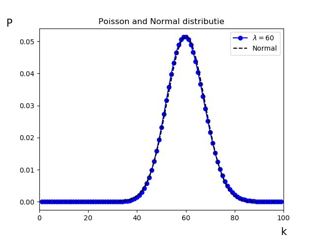

# De Centrale Limietstelling
<!--REF\label{/module-3/de-centrale-limietstelling}-->

Stel dat we een schatter hebben die afhangt van meerdere grootheden. Deze metingen van deze grootheden hebben elk hun eigen onzekerheden en kunnen bijvoorbeeld uniform of Poisson verdeeld zijn. Hoe ziet de verwachte kansverdeling van de schatter er dan uit?  In dit hoofdstuk zullen we zien dat schatters die van veel grootheden afhangen vaak de Normale verdeling volgen.  

> **Voorbeeld Twee dobbelstenen gooien.** 
> We gooien eerst een enkele (eerlijke) dobbelsteen. De uitkomstenverzameling is $$\mathscr{U} = \{1,2,3,4,5,6\}$$. De kans op elk van deze uitkomsten is gelijk, dat wil zeggen:
> 
> $$P(1) = P(2) = P(3) = P(4) = P(5) = P(6) = \frac{1}{6}$$
>
> De uitkomsten verdeling noemen we dus uniform.  
> 
> We werpen nu twee dobbelstenen en kijken naar de uitkomsten van de twee dobbelstenen samen. De som is gedefinieerd als: 
> 
> $${W_2 = D_1 + D_2.}$$
> 
> Waarbij we de uitkomst van elke individuele dobbelsteen hebben weergegeven als $$D_1$$ en $$D_2$$. De uitkomst van de worp met twee dobbelstenen noteren we hier met $$W_2$$. 
> Je zou misschien denken dat de kansverdeling van de uitkomstenverzameling van het experiment met twee dobbelstenen ook weer uniform is. Immers zijn de onderliggende kansdistributies van $$D_1$$ en $$D_2$$ beiden uniform. Toch is dat niet zo.  
> De uitkomsten verzameling van $$W_2$$ is:
> 
> $${\mathscr{U}_2 = \{2,3,4,5,6,7,8,9,10,11,12\}.}$$ 
> 
>  De kans op elk van deze uitkomsten is niet gelijk. Er bestaat bijvoorbeeld maar één manier om de uitkomst $$W_2 = 12$$ te krijgen, namelijk met $$D_1 = 6$$ *en* $$D_2 = 6$$. Maar bijvoorbeeld de uitkomst $$W_2 = 3 $$ kunnen we op twee manieren verkrijgen: $$D_1 = 1, D_2 = 2$$ en $$D_1 = 2, D_2 = 1$$.  
> **De kansverdeling van $$W_2$$ is dus niet uniform.**

We zien in het voorbeeld met de dobbelstenen dat als we twee metingen combineren die elk uniform verdeeld zijn de som van de metingen duidelijk niet uniform verdeeld is. 

We werken het voorbeeld van de dobbelstenen nog verder uit. 

> **Voorbeeld Veel dobbelstenen gooien**
> We bekijken in dit voorbeeld hoe de kansdistributies eruitzien van experimenten waarbij we met meerdere dobbelstenen tegelijk gooien. Als we een enkele dobbelsteen gooien dan weten we dat we een uniforme distributie verwachten. Gooien we met twee dobbelstenen dan hebben we in het vorige experiment al gezien dat de kansdistributie van de uitkomstenverzameling van de worp zeker niet uniform is. 
> 
> Hieronder zie je de kansdistributies voor experimenten waarbij met 1,2,3 en 4 dobbelstenen tegelijk wordt geworpen.
> 
> {:width="80%"}
> 
> We zien dat kansdistributie van de uitkomsten voor het experiment met 1 dobbelsteen uniform is. Voor het experiment met 2 dobbelstenen lijkt het op een piramidevorm. Daarna zien we dat de vorm steeds meer een Normaalverdeling benadert.

We hebben in het voorbeeld hierboven gekeken naar het combineren van metingen waarvan de uitkomsten uniform verdeeld zijn. Maar eenzelfde soort resultaat krijg je ook als je bijvoorbeeld meetwaardes die exponentieel verdeeld zijn, of als de meetwaardes elk hun eigen onderliggende verdeling hebben. Zoals bijvoorbeeld als je uniforme kansen combineert met exponentiële.

De **Centrale Limietstelling** zegt dat als je $$n$$ onafhankelijk stochasten $$x_j$$ hebt, waarvan elke stochast zijn eigen verdeling heeft met gemiddelde  $$\mu_j$$ en variantie $$\sigma^2_j$$, **de som van deze stochasten $$\sum_j^n x_j$$ een Normaalverdeling zal volgen** met het gemiddelde $$\sum_j^n \mu_j$$ en de variantie $$\sum_j^n \sigma^2_j$$, als $$n \to \infty$$. Hierbij hoeven de populatiegemiddeldes van de stochasten, noch de varianties hiervan ($$\mu_j$$ en $$\sigma^2_j$$) dezelfde te zijn.

De Centrale Limietstelling (Engels: Central Limit Theorem of CLT) zegt dat als we $$n \to \infty$$ stochasten optellen, de som van deze stochasten een Normaalverdeling zal volgen. Het maakt hierbij niet uit wat voor vorm de kansverdelingen de stochasten hebben, ze kunnen exponentieel, uniform, Normaal verdeeld zijn om welke vorm dan ook hebben. 

Er is één voorwaarde en dat is dat de onderliggende verdelingen een gedefinieerd gemiddelde en eindige variantie moeten hebben. 
Dat is een belangrijke voorwaarde. Wiskundig kun je laten zien dat bijvoorbeeld stochasten die volgens de Cauchy of Landau verdeeld zijn bij combinatie geen Normaalverdeling opleveren. Toch is die beperking niet heel groot. In de natuur zijn praktisch alle stochastische verdelingen beperkt en voldoen dus aan de Centrale Limietstelling.

De convergentiesnelheid van de distributie naar de Normaalverdeling hangt af van de onderliggende stochastische verdelingen. Bijvoorbeeld hoef je minder uniform verdeelde stochasten bij elkaar op te tellen om een Normaalcurve te benaderen dan stochasten die van zichzelf exponentieel verdeeld zijn.

De Centrale Limietstelling is zonder meer de meest belangrijke stelling in de statistiek. De Centrale Limietstelling verklaart waarom we in de natuur zoveel parameters vinden die Normaal zijn verdeeld.

Het bewijs van deze stelling is bijzonder ingewikkeld en zullen we hier niet behandelen. Eventueel kun je 
[hier](http://www.cs.toronto.edu/~yuvalf/CLT.pdf) verder lezen over de bewijs stelling.

**Twee leuke video's die de Centrale Limietstelling illustreren kun je [hier](https://www.youtube.com/watch?v=jvoxEYmQHNM) en [hier](https://www.khanacademy.org/math/ap-statistics/sampling-distribution-ap/sampling-distribution-mean/v/central-limit-theorem) vinden.** 

Meestal is er in de natuur of in experimenten sprake van een combinatie van een grote hoeveelheid toevalligheden die een rol speelt bij de onzekerheid van een meting. Hetzelfde geldt vaak voor de eigenschappen van een populatie, de natuurlijke verdeling van deze eigenschappen zijn vaak ook Normaal verdeeld om dezelfde reden.

Denk maar eens aan de vorming van een zandkorrel of van een ster. Het is dan begrijpelijk dat de sterren in een bolhoop een Normale massa verdeling kennen. Of de grootte van de zandkorrel op een strand. 
Bij de vorming van een ster of zandkorrel zijn er vele toevalligheden die invloed hebben op bijvoorbeeld de grootte van zo'n object.

## Overeenkomsten tussen de Poisson en de Normale verdeling

Als laatste bekijken we nogmaals de Poisson verdeling en laten we in het voorbeeld hieronder zien dat voor grotere waardes van $$\lambda$$ de Poisson steeds meer overeenkomt met een Normale verdeling.

De Poisson onzekerheid zien we veel terug omdat het de onzekerheid op telexperimenten beschrijft, en veel van de metingen die we uitvoeren zijn telexperimenten. Voor een verwachtingswaarde van $$\lambda$$ vinden we een standaardafwijking van $$\sqrt{\lambda}$$ en zoals we al eerder hebben gezien mogen we deze bij het uitvoeren van een experiment vaak zien als de onzekerheid op de verwachtingswaarde zelf.

We herhalen de formule van de Poisson vergelijking hier: 

$${\displaystyle P(k;\lambda) =  \frac{\lambda^k e^{-\lambda}}{k!}}.$$

{:width="60%"} 

Zoals we <!--FIG in Fig. \ref{fig:PoissonDistributie2}--> zien is de Poisson verdeling asymmetrisch. Vooral voor lage waardes van $$\lambda$$ is dit goed zichtbaar. Voor grotere waardes van $$\lambda$$ zien we dat de verdeling steeds meer symmetrisch is en ook steeds meer overeenkomsten vertoont met een Normale verdeling. Dit komt door de Centrale Limietstelling. 
**We verwachten voor grotere waardes van $$\lambda$$ dat de Poisson de Normale verdeling zal gaan volgen.** 
We leggen dit uit aan de hand van een voorbeeld. 

> **Voorbeeld** Stel dat we  in een experiment tellingen uitvoeren per tijdsinterval. De meetwaarde die we vinden in één tijdsinterval, $$k$$, is het aantal waarnemingen per tijdsinterval $$\Delta t.$$ We zouden het tijdsinterval ook kunnen opdelen in bijvoorbeeld 100 stukjes. We verwachten nu $$k_{\text{kort}} = k/100$$ waarnemingen te meten per tijdsinterval van $$\Delta t_{\text{kort}}= 1/100 \times \Delta t.$$
Deze kortere tijdsintervallen volgen ook de Poisson statistiek, immers we hebben de voorwaardes van het experiment veranderd, maar het is nog steeds een telexperiment.   
> 
> Rachid en Belia voeren een telexperiment tegelijkertijd op twee manieren uit. Rachid noteert 100 uitkomsten elke 10 secondes en Belia wacht precies 1000 secondes en noteert precies 1 uitkomst. De metingen van Rachid noemen we $$r_i$$ en de meting van Belia noemen we $$b$$. De 100 metingen van Rachid zijn 100 onafhankelijke stochasten. Dit omdat je verwacht dat de meetwaardes statistische fluctuaties hebben (stochastisch) en omdat de ene meting geen invloed heeft op de volgende meting (onafhankelijk).   
> 
> De  fluctuaties volgen de Poisson statistiek (telexperiment). Als de verwachting op 1 enkele meting gelijk is aan $$\lambda_r$$, dan is de spreiding (variantie) van de punten ook gelijk aan $$\lambda_r$$. De standaardafwijking is dus gelijk aan $$\sqrt{\lambda_r}$$. Kijk hiervoor ook nog eens naar het hoofdstuk 
> [Kansdichtheidsfuncties](/module-1/verdelingsfuncties).   Voor de meting van Belia verwachten we als uitkomst $$\lambda_b$$ met een standaardafwijking $$\sqrt{\lambda_b}$$.   
> 
> We weten in dit experiment dat precies geldt dat $$\sum_i^{100} r_i \equiv b$$. Immers  Rachid en Belia zitten naast elkaar en nemen dezelfde getallen waar. Rachid telt zijn 100 uitkomsten bij elkaar op en de Centrale Limietstelling zegt nu dat de som van deze 100 stochasten de Normale verdeling zal benaderen. Ofwel de verwachting van de som van de 100 uitkomsten van Rachid heeft de waarde $$\sum_i^{100} \lambda_r$$ en de standaardafwijking op deze verwachting is, redelijk, Normaal verdeeld (niet exact omdat $$n$$ is groot maar nog geen $$\infty$$).   
> 
> De verwachtingswaarde van de uitkomst van het experiment van Belia zoals eerder gezegd gelijk aan $$\lambda_b$$ en deze moet overeenkomen met de verwachtingswaarde van de som van de 100 uitkomsten van Rachid. De onzekerheid op de verwachte uitkomst van het experiment van Belia hoort de Poisson verdeling te volgen (want telexperiment), maar we zien nu ook dat de som van de uitkomsten van Rachid de Normaalcurve zal benaderen. Hieruit kunnen we concluderen dat voor stochasten die de Poisson verdeling volgen we verwachten dat de Poisson verdeling steeds meer de Normaalcurve zal benaderen voor hogere waardes van $$\lambda$$.   
  

We illustreren de gelijkenis van de Poisson en Normale verdeling door de twee functies over elkaar heen weer te geven voor een waarde van $$\lambda=60$$. Deze vergelijken we nu met de Normaalverdeling met $$\mu =60$$ en $$\sigma = \sqrt{60}$$. <!--FIG Zie figuur \ref{fig:PoissonNormalDistributie}.-->

{:width="80%"}

Het is duidelijk dat de overeenkomst tussen de Poisson verdeling en de Normale verdeling bij deze waarde van $$\lambda$$ al heel groot is.

Er blijven natuurlijk verschillen, zo is de Poisson verdeling een discrete verdeling een standaardafwijking die afhangt van de verwachtingswaarde. Maar de grote gelijkenis verklaart wel waarom we, voor grotere waardes van $$\lambda$$, gebruik mogen maken van vergelijkingen die eigenlijk alleen voor de Normale verdeling gelden. Zoals bijvoorbeeld de regels voor de foutenpropagatie.
