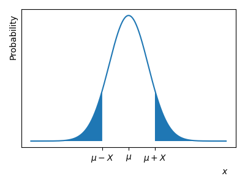

# De Normaalverdeling
<!--REF\label{/module-3/normaalverdeling}-->

1. Ordered TOC
{:toc}

We hebben in het hoofdstuk [De Centrale Limietstelling](/module-3/de-centrale-limietstelling) gezien waarom onzekerheden op metingen zo vaak Normaal zijn verdeeld. Het is nu duidelijk dat de Normaalverdeling een belangrijke rol speelt in de statiek. In dit hoofdstuk bekijken we nogmaals de Normaalverdeling en introduceren we de zogeheten $$z$$-score methode die we later gaan toepassen bij de $$\chi^2$$-methode en bij het toetsen van hypotheses.

## De Normaalverdeling

Allereerst herhalen we de formule die jullie ook al in Module 1 hebben gezien. De Normaalverdeling is gedefinieerd als:

$${\Large \displaystyle f(x) = \frac{1}{\sigma \sqrt{2 \pi}} e^{-\frac{1}{2}\left( \frac{x-\mu}{\sigma} \right)^2} .}$$

De functie heeft twee parameters, $$\mu$$ en $$\sigma$$. De verwachtingswaarde van de Normale verdeling is precies $$\mu$$ en de standaardafwijking is precies gelijk aan $$\sigma$$. (De notering is niet toevallig!)

In de figuur hieronder, <!--FIG \ref{fig:NormaleDistributie2},--> zie je enkele voorbeelden van de Normale verdeling voor verschillende waardes voor $$\mu$$ en $$\sigma$$. 

{:width="60%"}

Er is geen relatie tussen de het gemiddelde $$\mu$$ en de standaardafwijking $$\sigma$$, lage waardes van $$\mu$$ kunnen een grotere of kleinere standaardafwijking hebben. (Anders dan bij de Poisson verdeling.) We zien dat voor hogere waardes voor $$\sigma$$ de datapunten meer verspreid zijn. 

> **Voorbeeld** Stel nu dat we een meting doen $$L$$ en we kennen het populatiegemiddelde $$\mu_L = 10.0$$ cm met een spreiding van $$\sigma_L = 2.0$$ cm. De kans dat we een meting doen die $$L=4.0$$ cm oplevert is dan niet zo groot. Als de spreiding rond het populatiegemiddelde daarentegen groter is, bijvoorbeeld $$\sigma=5.0$$ cm dan is de kans veel groter dat de meting een waarde van  $$L=4.0$$ cm oplevert. 

Als de uitkomsten uit een experiment Normaal verdeeld zijn, en we kennen $$\mu$$ en $$\sigma$$, dan kunnen we de kans op een bepaalde uitkomst exact berekenen. Hoe grotere de afstand met $$\mu$$, hoe kleiner de kans op dat meetresultaat. Hoe groter de standaardafwijking $$\sigma$$, hoe meer verpreid de meetuikomsten zijn en hoe groter de kans op een grotere afstand ten op zichte van het gemiddelde $$\mu$$. 
Deze kansen kunnen we exact berekenen met behulp van de Normaalverdeling. 

## Z-score en waarschijnlijkheden

Om de kans op een bepaalde meetuikomst uit te drukken maken we gebruik van de oppervlaktes onder de Normaalverdeling. 
Dit kunnen we schematisch weergeven.

Het oppervlak onder de Normaalkromme behorende bij de kans om een waarde $$X< x$$ te vinden, kun je als volgt schematisch weergeven 
<!--FIG in figuur \ref{fig:NormaalLinks}-->. Dit noemen we ook wel de *linkszijdige overschrijding* en we berekenen de *onderkans*. 
 
{:width="90%"}

Het oppervlak onder de Normaalkromme behorende bij de kans om een waarde $$X> x$$ te vinden, is hier schematisch weergegeven
<!--FIG in figuur \ref{fig:NormaalRechts}-->. Dit noemen we ook wel de *rechtszijdige overschrijding* en we berekenen de *bovenkans*.
 
{:width="90%"}

Het oppervlak onder de kromme van een Normaalverdeling is lastig uit te rekenen, zie bijvoorbeeld de uitleg op [wikipedia](https://en.wikipedia.org/wiki/Gaussian_integral). We maken hierom een tussenstap en berekenen eerst de 
zogenoemde $$z$$-score. Stel een dataset is Normaal verdeeld met gemiddelde $$\mu$$ en standaardafwijking $$\sigma$$, de $$z$$-score, voor een bepaalde gemeten waarde $$x$$, is dan gelijk aan:

$$Z = \frac{x-\mu}{\sigma}.$$  

Het oppervlak onder de Normaalkromme, behorende bij de kans op een bepaalde waarde, hangt op de volgende manier van de $$z$$-score af.

De kans om een waarde $$X< x$$ te vinden is gelijk aan:

$$P(X< x) = P\left( Z<\frac{x-\mu}{\sigma} \right)$$

De kans om een waarde $$X>x$$ te vinden is gelijk aan:

$$P(X>x) = 1 - P(X< x) = 1-P\left( Z<\frac{x-\mu}{\sigma} \right)$$

Dit kun je zelf nagaan door schetsen te maken van de bijbehorende oppervlakken onder de normaalkromme.

**Als je de $$z$$-score hebt berekend, kun je uit een voorberekende  [tabel](https://www.ztable.net/) aflezen wat de bijbehorende overschrijdingskans is.** 

Hieronder laten we in twee voorbeelden zien hoe je deze methode toepast.

> **Voorbeeld Onderkans:** Een stochast $$X$$ is Normaal verdeeld met gemiddelde $$\mu = 20$$ en standaardafwijking $$\sigma=2$$. De kans op een waarde $$X<16$$ is nu gelijk aan
> 
> $$\begin{aligned} P(X<16) &= P\left(Z<\frac{x-\mu}{\sigma}\right) \\ &= P\left(Z<\frac{16-20}{2}\right) \\ &= P(Z<-2). \end{aligned}$$
>
> Dit is een linkszijdige overschrijding. In de z-score tabel kunnen we nu de bijbehorende kans waarde opzoeken. Dit is een waarde van $$0.02275$$.
> We schrijven dus 
>
> $$P(X<16) = P\left(Z<\frac{x-\mu}{\sigma}\right) = 0.02275.$$
>
> Er is in dit geval dus een kans van 0.02 dat we bij de gegeven dataset een waarde onder de 15 zullen vinden.

 

> **Voorbeeld Bovenkans:** Een stochast $$X$$ is Normaal verdeeld met gemiddelde $$\mu = 20$$ en standaardafwijking $$\sigma=2$$, de kans op een waarde $$X>22$$ is nu gelijk aan
> 
> $$\begin{aligned}P(X>22) &= 1-P(X<22) \\ &= 1-P\left(Z<\frac{x-\mu}{\sigma}\right) \\ &= 1 - P\left(Z<\frac{22-20}{2}\right) \\ &= 1 - P(Z<1).\end{aligned}$$
>
> Dit is een rechtszijdige overschrijding. In de z-score tabel kunnen we nu de bijbehorende kans waarde opzoeken. Dit is een waarde van $$0.84134$$.
We schrijven dus 
>
> $$P(X>22) = 1 - P\left(Z<\frac{x-\mu}{\sigma}\right) = 1-0.84134 = 0.15866.$$
>
> Er is in dit geval dus een kans van 0.16 dat we bij de gegeven dataset een waarde boven de 22 zullen vinden.

Bij een tweezijdige overschrijdingskans bereken we de waarde van een absolute afstand tot het gemiddelde. We berekenen dit door 
de kans op een waarde groter dan de gestelde waarde opgeteld bij de kans op een waarde kleiner dan de gestelde waarde:

$${\displaystyle \begin{aligned}P(|x-\mu|>X) &= P\left(Z<\frac{-X}{\sigma}\right) + P\left(Z>\frac{X}{\sigma} \right)\\ &= 2\cdot P\left( Z>\frac{X}{\sigma} \right). \end{aligned}}$$ 

Het oppervlak onder de Normaalkromme behorende bij de kans om een waarde $$|x - \mu|> X$$ te vinden, is hier schematisch weergegeven
<!--FIG in figuur \ref{fig:NormaalDubbel}-->.

{:width="90%"}

> **Voorbeeld Dubbelzijdige kans:** Een stochast $$X$$ is Normaal verdeeld met gemiddelde $$\mu = 20$$ en standaardafwijking $$\sigma=4$$. De kans op een waarde die meer afwijkt dan 2 van het gemiddelde is nu gelijk aan
> 
> $$\begin{aligned} P(|x-\mu| > 2) &= 2 \times P\left(Z > \frac{X}{\sigma}\right) \\  &= 2 \times P\left(Z > \frac{2}{4}\right) \\  &= 2\times P\left( Z > 0.5 \right).  \end{aligned}$$ 
> 
> In de z-score tabel kunnen we nu de bijbehorende kans waarde opzoeken. Dit is een waarde van $$(2 \times 0.30854) = 0.69146$$.
> We schrijven dus 
>
> $$P(|x - \mu| >X) =  0.69146.$$
>
> Er is in dit geval dus een kans van 0.69 dat we bij de gegeven dataset een waarde vinden die in absolute zin meer dan 2 afwijkt van het gemiddelde.

