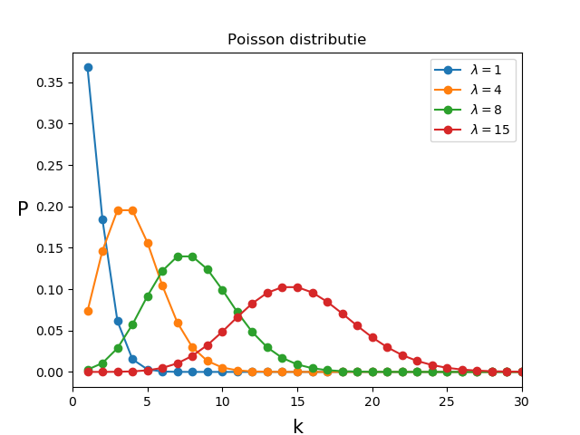
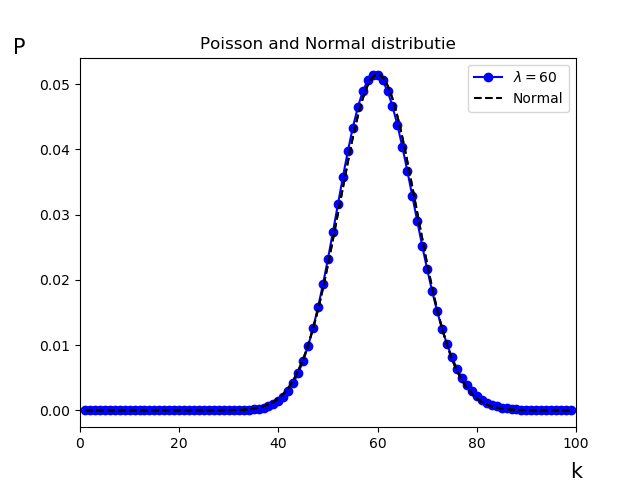
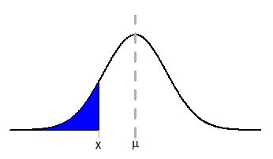
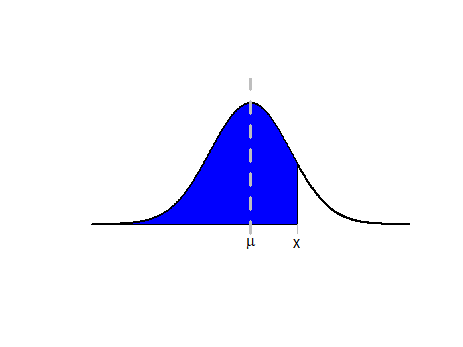
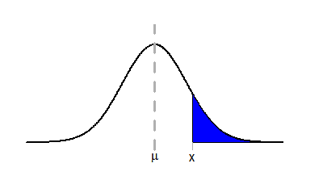
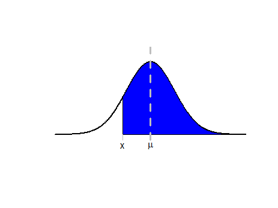

# De Normaalverdeling
<!--REF\label{/module-3/normaalverdeling}-->

1. Ordered TOC
{:toc}

De Normaalverdeling is een van de drie belangrijkste distributies in de statistische data analyse. Samen met de Poisson verdeling en de $$\chi^2$$ verdeling.  
(De Poisson verdeling omdat het de onzekerheid op tel-experimenten beschrijft, de $$\chi^2$$ wordt in de volgende hoofdstukken in deze module beschreven.)
We hebben in het hoofdstuk [De Centrale Limietstelling](/module-3/de-centrale-limietstelling) gezien waarom onzekerheden op waarnemingen zo vaak Normaal zijn verdeeld. 

## Poisson en Normaal
Voordat we verder gaan over de normaalverdeling bekijken we eerst kort de Poissonverdeling. We hebben in module 1 al even kort gezien hoe deze verdeeld is. De Poisson is uitermate belangrijk in experimenten omdat het de onzekerheid op tel experimenten beschrijft. Voor een verwachtingswaarde van $$\lambda$$ vinden we een standaarddeviatie van $$\sqrt{\lambda}$$ en zoals we al eerder hebben gezien mogen we deze bij het uitvoeren van een experiment vaak zien als de onzekerheid op de verwachtingswaarde zelf.

$${\displaystyle P(k;\lambda) =  \frac{\lambda^k e^{-\lambda}}{k!}}.$$

{:width="80%"}

Zoals we hier<!--FIG in Fig. \ref{fig:PoissonDistributie2}--> zien is de Poisson verdeling is asymmetrisch, vooral voor lage waardes van $$\lambda$$. Voor grotere waardes van $$\lambda$$ zien we dat de verdeling steeds symmetrischer is en ook steeds meer overeenkomsten vertoont met een normaal verdeling. 

Om dit te visualiseren tonen we de twee functies over elkaar heen voor een waarde van $$\lambda=60$$. Deze vergelijken we nu met de normaal verdeling met $$\mu =60$$ en $$\sigma = \sqrt{60}$$. <!--FIG Zie figuur \ref{fig:PoissonNormalDistributie}.-->

{:width="80%"}

Er blijven natuurlijk verschillen, zo is de Poissonverdeling een discrete verdeling, maar de grote gelijkenis verklaart wel waarom we, voor grotere waardes van $$\lambda$$ gebruik mogen maken van vergelijkingen die eigenlijk alleen voor de Normale verdeling gelden. Zoals bijvoorbeeld de regels voor de foutenpropagatie.

## Z-waardes en waarschijnlijkheden
We richten ons nu op de Normaalverdeling en herhalen nogmaals de vergelijking. 

$${\displaystyle f(x) = \frac{1}{\sigma \sqrt{2 \pi}} e^{-\frac{1}{2}(\frac{x-\mu}{\sigma})^2} }.$$

De functie heeft twee parameters, $$\mu$$ en $$\sigma$$, de notering is niet toevallig. De verwachtingswaarde van de normaal verdeling is precies $$\mu$$ en de standaarddeviatie is precies $$\sigma$$. 

Hier<!--FIG in figuur \ref{fig:NormaleDistributie}--> zie je enkele voorbeelden van de Normale verdeling met verschillende waardes voor $$\mu$$ en $$\sigma$$. 

{:width="80%"}

We zien dat voor hogere waardes voor $$\sigma$$ de datapunten meer verspreidt zullen zijn. Met andere woorden als de onzekerheid op een meting wordt uitgedrukt met de standaarddeviatie $$\sigma$$ en de onzekerheid is groter, dat is de spreiding van de onderliggende kansdichtheidsverdeling ook groter. 

Stel nu dat we een meting doen $$L$$ en we kennen het populatiegemiddelde $$\mu_L = 10.0$$ cm met een spreiding van $$\sigma_L = 2.0$$ cm. De kans dat we een meting doen $$L=4.0$$ cm is dan niet zo groot. Als de spreiding op het populatiegemiddelde daarentegen groter is, bijvoorbeeld $$\sigma=5.0$$ cm dan is de kans veel groter om de meting van  $$L=4.0$$ cm te doen. 

We kunnen dit uitdrukken met behulp van de Z-waarde ofwel Z-score. 

Het oppervlak onder de normaalkromme behorende bij de kans om een waarde $$X< x$$ te vinden, is hier<!--FIG in figuur \ref{fig:NormaleVerdeling_1} en \ref{fig:NormaleVerdeling_2}--> schematisch weergegeven: 

{:width="70%"}
{:width="70%"}

Het oppervlak onder de normaalkromme behorende bij de kans om een waarde $$X> x$$ te vinden, is hier<!--FI\
G in figuur \ref{fig:NormaleVerdeling_3} en \ref{fig:NormaleVerdeling_4}--> schematisch weergegeven:

{:width="70%"}
{:width="70%"}

Om dit oppervlak uit te rekenen gebruiken we de zogenoemde *Z-toets*. Stel een dataset met $$n > 30$$ datapunten is normaal verdeeld met gemiddelde $$\mu$$ en standaardafwijking $$\sigma$$. De $$Z-score$$, voor een bepaalde observatiewaarde $$x$$, is dan gelijk aan:

$$Z = \frac{x-\mu}{\sigma}$$  

<!--De p-waarde, oftewel de kans op de geobserveerde uitkomst met de gegeven dataset-->

Stel een stochastische variabele $$X$$, met $$n > 30$$ datapunten, is normaal verdeeld met gemiddelde $$\mu$$ en standaardafwijking $$\sigma$$. 

<!--Dan wordt de Z-score voor een waarde $$x$$ van de stochast $$X$$ gegeven door:

$$Z = \frac{x-\mu}{\sigma}$$-->

<!--In onderstaand overzicht staat bij elke gewenste kans de bijbehorende Z-score -->

Het oppervlak onder de normaalkromme, behorende bij de kans op een bepaalde waarde, hangt op de volgende manier van de z-score af.

De éénzijdige overschrijdingskans om een waarde $$X< x$$ te vinden is gelijk aan:

$$P(X< x) = P\left( Z<\frac{x-\mu}{\sigma} \right)$$

De éénzijdige overschrijdingskans om een waarde $$X>x$$ te vinden is gelijk aan:

$$P(X>x) = 1 - P(X< x>) = 1-P\left( Z<\frac{x-\mu}{\sigma} \right)$$

Dit kun je zelf nagaan door schetsen te maken van de bijbehorende oppervlakken onder de normaalkromme.

Bij de tweezijdige overschrijdingskans wordt de kans op een waarde groter dan de gestelde waarde opgeteld bij de kans op een waarde kleiner dan de gestelde waarde:

$$\begin{aligned}P(X=x) &= P(Z<\frac{x-\mu}{\sigma}) + P(Z>\frac{x-\mu}{\sigma})\\ &= P(Z<\frac{x-\mu}{\sigma}) + \left(1 - P(Z<\frac{x-\mu}{\sigma})\right) \\ &= 2\cdot P(Z<\frac{x-\mu}{\sigma}) - 1 \end{aligned}$$

Als je de z-score hebt berekend kun je uit de z-waarden [tabel](https://www.ztable.net/) aflezen wat $$P(Z<\frac{x-\mu}{\sigma})$$ is. 

> **Voorbeeld 1:** Een stochast $$X$$ is Normaal verdeeld met gemiddelde $$\mu = 20$$ en standaardafwijking $$\sigma=2$$. Bereken de kans op een waarde $$X<16$$.
> 
> Uitwerking: Het gaat hier om een eenzijdige overschijdingskans. Nu:
>
> $$\begin{aligned} P(X<16) &= P\left(Z<\frac{x-\mu}{\sigma}\right) \\ &= P\left(Z<\frac{16-20}{2}\right) \\ &= P(Z<-2) \end{aligned}$$
>
> Als we in de [tabel](https://www.ztable.net/) kijken dan hoort er een waarde van $$0.02275$$ bij deze Z-score.
>
> Dus 
>
> $$P(X<16) = P\left(Z<\frac{x-\mu}{\sigma}\right) = 0.02275$$
>
> Er is in dit geval dus een kans van 2% dat we bij de gegeven dataset een waarde onder de 15 zullen vinden.

> **Voorbeeld 2:** Een stochast $$X$$ is normaal verdeeld met gemiddelde $$\mu = 20$$ en standaardafwijking $$\sigma=2$$. Bereken de kans op een waarde $$X>22$$.
> 
> Uitwerking: Het gaat hier om een eenzijdige overschijdingskans. Nu:
>
> $$\begin{aligned}P(X>22) &= 1-P(X<22>) \\ &= 1-P\left(Z<\frac{x-\mu}{\sigma}\right) \\ &= 1 - P\left(Z<\frac{22-20}{2}\right) \\ &= 1 - P(Z<1)\end{aligned}$$
>
> Als we in de [tabel](https://www.ztable.net/) kijken dan hoort er een waarde van $$0.84134$$ bij deze Z-score.
>
> Dus 
>
> $$P(X>22) = 1 - P\left(Z<\frac{x-\mu}{\sigma}\right) = 1-0.84134 = 0.15866$$
>
> Er is in dit geval dus een kans van 15% dat we bij de gegeven dataset een waarde boven de 22 zullen vinden.

