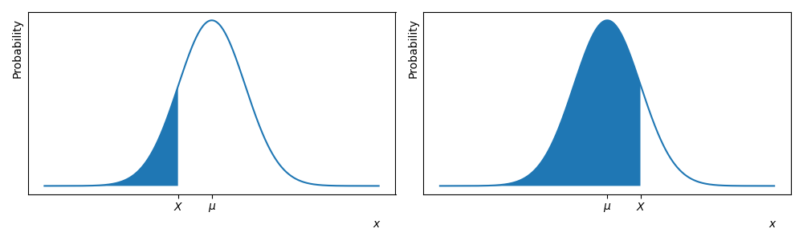

# De Normaalverdeling
<!--REF\label{/module-3/normaalverdeling}-->

1. Ordered TOC
{:toc}

We hebben in het hoofdstuk [De Centrale Limietstelling](/module-3/de-centrale-limietstelling) gezien waarom onzekerheden op metingen zo vaak Normaal zijn verdeeld. Het is nu duidelijk dat de Normaalverdeling een belangrijke rol speelt in de statiek. In dit hoofdstuk bekijken we nogmaals de Normaalverdeling en introduceren we de zogeheten $$z$$-score methode die we later gaan toepassen bij de $$\chi^2$$-methode en bij het toetsen van Hypotheses.

## De Normaalverdeling

Allereerst herhalen we de formule die jullie ook al in Module 1 hebben gezien. De normaalverdeling is gedefinieerd als:

$${\Large \displaystyle f(x) = \frac{1}{\sigma \sqrt{2 \pi}} e^{-\frac{1}{2}\left( \frac{x-\mu}{\sigma} \right)^2} .}$$

De functie heeft twee parameters, $$\mu$$ en $$\sigma$$. De verwachtingswaarde van de normaal verdeling is precies $$\mu$$ en de standaardafwijking is precies $$\sigma$$. (De notering is niet toevallig!)

In de figuur <!--FIG  \ref{fig:NormaleDistributie}--> zie je enkele voorbeelden van de Normale verdeling met verschillende waardes voor $$\mu$$ en $$\sigma$$. 

{:width="60%"}

We zien dat voor hogere waardes voor $$\sigma$$ de datapunten meer verspreidt zijn. Met andere woorden als de onzekerheid op een meting wordt uitgedrukt met de standaardafwijking $$\sigma$$ en de onzekerheid is groter, dat is de spreiding van de onderliggende kansdichtheidsverdeling ook groter. Er is geen relatie tussen de het gemiddelde $$mu$$ en de standaardafwijking $$\sigma$$, lage waardes van $$\mu$$ kunnen een grotere of kleinere standaardafwijking hebben. (Anders dan bij de Poisson verdeling.)

> **Voorbeeld** Stel nu dat we een meting doen $$L$$ en we kennen het populatiegemiddelde $$\mu_L = 10.0$$ cm met een spreiding van $$\sigma_L = 2.0$$ cm. De kans dat we een meting doen $$L=4.0$$ cm is dan niet zo groot. Als de spreiding op het populatiegemiddelde daarentegen groter is, bijvoorbeeld $$\sigma=5.0$$ cm dan is de kans veel groter om de meting van  $$L=4.0$$ cm te doen. 

Deze kansen kunnen we exact berekenen met behulp van de Normaalverdeling. 

## Z-score en waarschijnlijkheden

Om de kans op een bepaalde meting uit te drukken maken we gebruik van de oppervlaktes onder de Normaalverdeling. 
Dit kunnen we schematisch weergeven.

> **Voorbeeld: Onderkans**
> Het oppervlak onder de Normaalkromme behorende bij de kans om een waarde $$X< x$$ te vinden, kun je schematisch weergegeven. <!--FIG Zie figuur \ref{fig:NormaleVerdeling_1} en \ref{fig:NormaleVerdeling_2}.--> 
> 
> {:width="90%"}

 

> **Voorbeeld: Bovenkans**
> Het oppervlak onder de normaalkromme behorende bij de kans om een waarde $$X> x$$ te vinden, is hier<!--FIG in figuur \ref{fig:NormaleVerdeling_3} en \ref{fig:NormaleVerdeling_4}--> schematisch weergegeven:
>
> {:width="90%"}

Het oppervlak onder een van een Normaalverdeling is lastig uit te rekenen. We maken hierom een tussenstap en berekenen eerst de 
zogenoemde $$z$$-score. Stel een dataset is Normaalverdeeld met gemiddelde $$\mu$$ en standaardafwijking $$\sigma$$. De $$z$$-score, voor een bepaalde observatiewaarde $$x$$, is dan gelijk aan:

$$Z = \frac{x-\mu}{\sigma}.$$  

Het oppervlak onder de Normaalkromme, behorende bij de kans op een bepaalde waarde, hangt op de volgende manier van de $$z$$-score af.

De kans om een waarde $$X< x$$ te vinden is gelijk aan:

$$P(X< x) = P\left( Z<\frac{x-\mu}{\sigma} \right)$$

De kans om een waarde $$X>x$$ te vinden is gelijk aan:

$$P(X>x) = 1 - P(X< x>) = 1-P\left( Z<\frac{x-\mu}{\sigma} \right)$$

Dit kun je zelf nagaan door schetsen te maken van de bijbehorende oppervlakken onder de normaalkromme.

<!-- Bij de tweezijdige overschrijdingskans wordt de kans op een waarde groter dan de gestelde waarde opgeteld bij de kans op een waarde kleiner dan de gestelde waarde:

$${\displaystyle \begin{aligned}P(X=x) &= P\left(Z<\frac{x-\mu}{\sigma}\right) + P\left(Z>\frac{x-\mu}{\sigma} \right)\\ &= P\left( Z<\frac{x-\mu}{\sigma}\right) + \left(1 - P\left( Z<\frac{x-\mu}{\sigma}\right) \right) \\ &= 2\cdot P\left( Z<\frac{x-\mu}{\sigma} \right) - 1 \end{aligned}.}$$ -->

**Als je de $$z$$-score hebt berekend, kun je uit een voorberekende  [tabel](https://www.ztable.net/) aflezen wat de bijbehorende overschrijdingskans is.** 

Hieronder laten we in twee voorbeelden zien hoe je deze methode toepast.

> **Voorbeeld 1:** Een stochast $$X$$ is Normaal verdeeld met gemiddelde $$\mu = 20$$ en standaardafwijking $$\sigma=2$$. Bereken de kans op een waarde $$X<16$$.
> 
> Uitwerking: Het gaat hier om een eenzijdige overschijdingskans. Nu:
>
> $$\begin{aligned} P(X<16) &= P\left(Z<\frac{x-\mu}{\sigma}\right) \\ &= P\left(Z<\frac{16-20}{2}\right) \\ &= P(Z<-2) \end{aligned}$$
>
> Als we in de [tabel](https://www.ztable.net/) kijken dan hoort er een waarde van $$0.02275$$ bij deze $$z$$-score.
>
> Dus 
>
> $$P(X<16) = P\left(Z<\frac{x-\mu}{\sigma}\right) = 0.02275$$
>
> Er is in dit geval dus een kans van 0.02 dat we bij de gegeven dataset een waarde onder de 15 zullen vinden.

 

> **Voorbeeld 2:** Een stochast $$X$$ is normaal verdeeld met gemiddelde $$\mu = 20$$ en standaardafwijking $$\sigma=2$$. Bereken de kans op een waarde $$X>22$$.
> 
> Uitwerking: Het gaat hier om een eenzijdige overschijdingskans. Nu:
>
> $$\begin{aligned}P(X>22) &= 1-P(X<22>) \\ &= 1-P\left(Z<\frac{x-\mu}{\sigma}\right) \\ &= 1 - P\left(Z<\frac{22-20}{2}\right) \\ &= 1 - P(Z<1)\end{aligned}$$
>
> Als we in de [tabel](https://www.ztable.net/) kijken dan hoort er een waarde van $$0.84134$$ bij deze $$z$$-score.
>
> Dus 
>
> $$P(X>22) = 1 - P\left(Z<\frac{x-\mu}{\sigma}\right) = 1-0.84134 = 0.15866$$
>
> Er is in dit geval dus een kans van 0.16 dat we bij de gegeven dataset een waarde boven de 22 zullen vinden.

