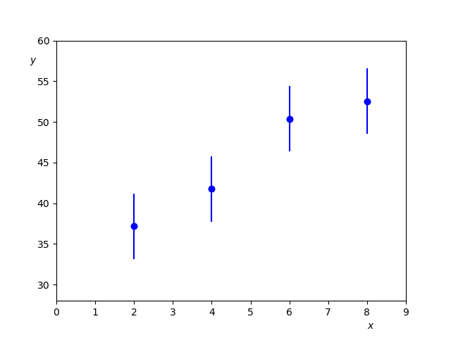
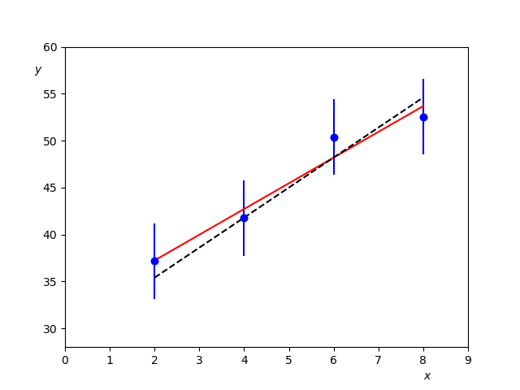
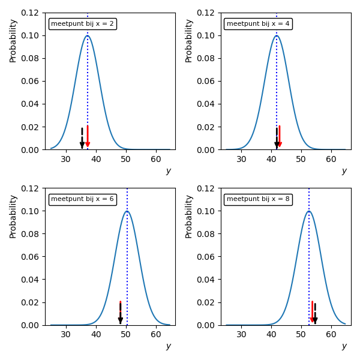

# De Kleinste-Kwadraten Methode
<!--REF\label{/module-3/kleinste-kwadraten}-->

1. Ordered TOC
{:toc}

In labexperimenten meten we vaak een bepaalde grootheid waarbij we een andere grootheid variëren. Zo krijgen we bijvoorbeeld datapunten van een observabele $$y$$ waarbij we een andere grootheid $$x$$ variëren. Meestal doen we dit als we een bepaald verband verwachten tussen de twee grootheden.

In dit hoofdstuk introduceren we een krachtige methode om onbekende parameters te schatten uit het verband van de gevonden meetwaardes. 

Deze methode heet de kleinste kwadraten methode en wordt ook wel lineaire regressie, of $$\chi^2$$-fitten genoemd. De methode kan wiskundig worden afgeleid met behulp met 'maximale waarschijnlijkheid principes'. 

## De kleinste-kwadraten methode

Een van de meest krachtige schatters is de methode van de kleinste-kwadraten. 
Met de kleinste kwadraten methode minimaliseren we het kwadratisch verschil tussen een set metingen en de voorspelde waardes op die metingen, waarbij de voorspelling afhangt van één of meerdere parameters. De voorspelling kunnen we uitdrukken in een functie.

> **Voorbeeld: Meetwaardes**
> We beginnen met een voorbeeld. Stel dat we een set metingen hebben die er als volgt <!--FIG (Fig. \ref{fig:VoorbeeldLeastSquares0} --> uitziet. 
>
> {:width="60%"}
> 
> We vermoeden een lineair verband tussen de grootheden $$x$$ en $$y$$ met parameters $$a$$ en $$b$$. 

De parameters van de functie $$\theta_i$$ willen we nu afschatten met behulp van de metingen. De geschatte waardes van $$\theta_i$$ noemen we $$\hat{\theta_i}$$. Oftewel, $$\hat{\theta_i}$$ zijn de waardes van parameters $$\theta$$ waarbij de functie de meetwaardes optimaal beschrijft. 

> **Voorbeeld: Lineair verband**
> In het figuur <!--FIG \ref{fig:VoorbeeldLeastSquares}, --> zien we twee voorbeelden van oplossingen van een functie $$y=a+b\cdot x,$$ de rode lijn en de gestreepte zwarte lijn. De vraag is nu hoe bepaal je welke combinatie van de paramaters $$a$$ en $$b$$ het beste de data beschrijft? 
> 
> {:width="60%"}
> 
> Als we een schatter kunnen definïeren voor onze functie dan vinden we de geschatte optimale waardes van $$a$$ en $$b$$ . Deze noemen we $$\hat{a}$$ en $$\hat{b}$$. Oftewel, $$\hat{a}$$ en $$\hat{b}$$ zijn de waardes van $$a$$ en $$b$$ waarbij de lineaire functie onze dataset optimaal beschrijft. Dit schatten van de waardes van $$\hat{a}$$ en $$\hat{b}$$ noemen we ook wel fitten. 

We introduceren nu een definitie van de $$\chi^2$$ schatter. Deze methode noemen we ook wel de kleinste kwadraten methode.

> Stel dat we een functie $$f(x;\theta)$$ hebben die waardes van $$y$$ voorspelt. En we hebben een dataset met $$n$$ waardes voor $$x: {x_1,x_2,...,x_n}$$ met corresponderende waardes voor $$y: {y_1,y_2,...,y_n}$$ waarbij elke waarde van $$y$$ gemeten is met precisie $$\sigma_i$$. Nu kunnen we de som nemen van het kwadratische verschil van alle punten in de dataset met de voorspelde waardes $$f(x_i;\theta)$$, geschaald met de onzekerheden $$\sigma_i$$. Deze som noemen we $$\chi^2:$$
>
$${\displaystyle \chi^2 = \sum_{i=1}^N \left( \frac{y_i - f(x_i;\theta)}{\sigma_i}\right)^2 .}$$
>
> Dit is de definitie van de $$\chi^2$$ schatter.

De meest optimale waarde voor $$\theta$$ geeft de kleinste $$\chi^2$$. Door de $$\chi^2$$ te minimaliseren vinden we de optimale schatting $$\hat{\theta}$$. 

Door het kwadraat te gebruiken en niet het absolute verschil tussen de datapunten en de voorspelling geven we meer waarde aan de punten die ver van de voorspelling afliggen. 

> **Voorbeeld: Afstanden**
> In onderstaande figuur is elk datapunt van de meetset apart weergeven. Voor elke meetwaarde zien we een normaalverdeling die gecentreerd is op de meetwaarde met als breedte de betreffende meetfout. Ook zijn in de grafiek de voorspelde waardes weergegeven met pijlen die volgen uit de functie met de gepostuleerde waardes van $$a$$ en $$b$$. De rode (zwart gestreepte) pijlen horen bij de rode (zwart gestreepte) lijn uit het figuur <!--FIG  (\ref{fig:VoorbeeldLeastSquares})-->uit het vorige voorbeeld. 
>
>{:width="80%"}
>
> De afstanden tussen de voorspelde waardes en de gemeten waardes zijn de ingredïenten van de kleinste kwadraten methode.

In de meeste gevallen kunnen we het minimum van de $$\chi^2$$ algebraïsch vinden. Als we nu kijken naar een functie die afhangt van slechts één parameter $$a$$ dan kunnen we het minimum vinden op het punt dat de afgeleide gelijk is aan nul: 

$${\displaystyle \frac{\partial \chi^2}{\partial a} =0.}$$

Dit geeft: 

$${\displaystyle \frac{\partial \chi^2}{\partial a} = \sum_{i=1}^N \frac{1}{\sigma_i^2} \frac{\partial f(x_i;a)}{\partial a} \left( y_i - f\left( x_i;a\right) \right) = 0 .}$$

De betreffende waarde van $$a$$ waarvoor dit geldt is de schatter van $$a$$, genoteerd als $$\hat{a}$$.

In de vergelijkingen hierboven hebben we maar één afhankelijke parameter gezien maar dit principe kun je ook toepassen op functies met meerder afhankelijke parameters die je dan tegelijkertijd oplost.

Een andere, niet analytische oplossing kan gevonden worden met een  computerprogramma door de $$\chi^2$$ voor veel waardes van $$a$$ en $$b$$ uit te rekenen en uit deze set van waardes het punt met de laagste $$\chi^2$$ te bepalen. 
Uiteraard werkt dat ook voor functies met meerder onbekende (ook wel vrije) parameters kennen. 

Twee filmpjes die het principe van de kleinste kwadraten goed illustreren vind je [hier](https://www.youtube.com/watch?v=YwZYSTQs-Hk) en [hier](https://www.youtube.com/watch?v=0T0z8d0_aY4).

Om in te schatten **hoe goed** je fit gelukt is moeten we eerst meer weten over de $$\chi^2$$-distributie. Daar gaat het volgende hoofdstuk over.

In opgave M3.1 ga je het principe van de kleinste kwadraten toepassen.

