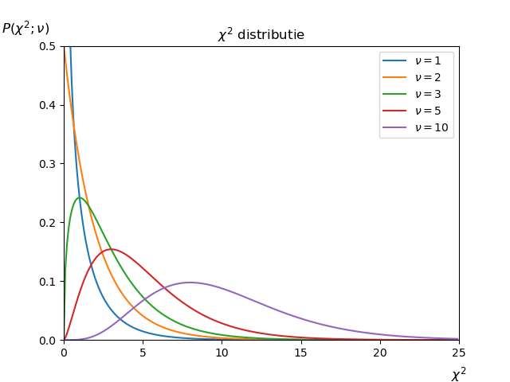

# De $$\chi^2$$ distributie
<!--REF\label{/module-3/chi-2}-->

1. Ordered TOC
{:toc}

We hebben in het vorige hoofdstuk over de kleinste-kwadraten methode de definitie van de $$\chi^2$$ schatter gezien. 
De $$\chi^2$$ is een maat voor het verschil tussen de voorspelde en de gemeten waardes. Als een functie $$f$$ de data goed beschrijft voor de geoptimaliseerde parameters van de functie, dan zal de $$\chi^2$$ klein zijn. Als de $$\chi^2$$ dus groot blijft na het optimaliseren van de parameters van $$f$$ dan is er iets misgegaan. Het kan zijn dat de functie $$f$$ de datapunten niet goed *kan* beschrijven, maar het kan bijvoorbeeld ook zijn dat als je minimalisatie uitvoert met een computer, deze het minimum niet goed heeft weten te vinden. 

Als daarentegen de $$\chi^2$$ heel klein is gaat er waarschijnlijk ook iets mis. Misschien heb je de onzekerheden op de datapunten heel erg overschat. 

Maar wat is precies heel groot of heel klein? Wat is de verwachtingswaarde van de $$\chi^2$$? Deze vragen gaan we in dit hoofdstuk beantwoorden.

## De $$\chi^2$$-toets

We hebben gezien in het hoofdstuk over de kleinste kwadraten methode, dat de $$\chi^2$$ gedefinieerd is als het kwadratische gewogen verschil tussen de meetwaardes en de voorspelde waardes:  

$${\displaystyle  \chi^2 = \sum^N_{i=1} \left( \frac{y_i-f(x_i;\hat{a},\hat{b},..)}{\sigma_i} \right)^2.}$$ 

Let op dat we hier de geoptimaliseerde parameters $$(\hat{a}, \hat{b}, ...)$$ van de functie hebben ingevuld. Deze waarde voor $$\chi^2$$ is dus al geminimaliseerd voor de parameters van $$f$$.

De $$\chi^2$$ verdeling zelf is een kansdichtheidsverdeling, en voldoet dus ook aan de voorwaardes hiervan. Dat wil zeggen dat het oppervlakte onder de $$\chi^2$$-curve is genormaliseerd. De functie ziet er als volgt uit:  

$${\displaystyle P(\chi^2;\nu) = \frac{2^{-\nu/2}}{\Gamma (\nu/2)} \chi^{n-2} e^{-\chi^2/2}.}$$

De $$\Gamma$$ in de noemer is een speciale wiskundige functie. Deze zal pas in het tweede jaar volledig worden uitgelegd. Op dit moment kun je hem simpelweg interpreteren als een functie waar een normalisatie term uitkomt. Het is best een gekke functie, voorbeelden van uitkomsten: $$\Gamma(1/2) = \sqrt{\pi}$$, $$\Gamma(1) = 1$$ en $$\Gamma(3/2) = 1/2 \sqrt{\pi}$$.
Als je al meer wilt weten over de $$\Gamma$$-functie dan kun je daar bijvoorbeeld [hier](https://nl.wikipedia.org/wiki/Gammafunctie) meer over lezen. 

Zoals je ziet hangt de $$\chi^2$$ kans ook af van een parameter $$\nu$$, dit is het aantal meetpunten, $$n$$, gereduceerd met het aantal parameters van de functie $$f$$. We noemen $$\nu$$ het aantal **vrijheidsgraden** (Engels: degrees of freedom). Het aantal vrijheidsgraden bereken je als volgt

$${\displaystyle \nu = \textrm{aantal meetpunten} - \textrm{aantal vrije parameters}.}$$

Hoe meer meetpunten je gebruikt in je fit, des te groter de verwachte $$\chi^2$$, omdat er groter aantal waardes wordt gesommeerd. Het aantal gefitte parameters speelt ook een rol. Hoe meer *vrijheid* een functie heeft des te makkelijker het is om alle meetpunten nauwkeurig te beschrijven. 

> **Voorbeeld: Bepalen van het aantal vrijheidsgraden.** Stel we hebben 10 meetwaardes en we gebruiken de kleinste kwadraten methode om 2 parameters van een functie $$f$$ te optimaliseren. We hebben dan $$\nu=10-2=8$$ vrijheidsgraden.

Hier<!--FIG in figuur \ref{fig:ChiSquareDistributie}--> zie je hoe de $$\chi^2$$-curve eruit ziet voor verschillende waardes van $$\nu$$.   

{:width="80%"} 

De $$\chi^2$$ distributie heeft een verwachtingswaarde $$\mu = \nu$$ en een variantie van $$var(\chi^2) = 2 \cdot \nu$$. Voor een gefitte functie met $$\nu$$ vrijheidsgraden verwachten we dus een waarde voor de $$\chi^2$$ te vinden die ongeveer gelijk is aan het aantal vrijheidsgraden van de fit. 

Met behulp van de $$\chi^2$$-curve kunnen we de overschrijdingskansen uitrekenen en aangeven hoe waarschijnlijk het is dat een functie $$f$$ met geoptimaliseerde parameters $$\hat{a},\hat{b},...$$ de waarnemingen uit het experiment beschrijft.
Je kan nu de overschrijdingskansen voor verschillende waardes van $$\chi^2$$ en vrijheidsgraden $$\nu$$ bepalen, bijvoorbeeld met behulp van [deze tabel](/appendix/chi-kwadraat-toets). 

Het is gemakkelijker om de waarde van de $$\chi^2$$ direct te delen door het aantal vrijheidsgraden. De verwachtingswaarde voor de ratio $$\chi^2/\nu$$ is dan altijd gelijk aan 1 en de variantie is gelijk aan $$var(\chi^2/\nu) = 2/\nu$$. (Deze laatste stap kan je controleren door toepassing van de regels van de foutenpropagatie.) 
We definiëren de **gereduceerde** $$\chi^2$$ als: 

$${\displaystyle \chi^2_\nu = \frac{\chi^2}{\nu}.}$$

De gereduceerde $$\chi^2$$ wordt ook wel geschreven als $$\chi^2/df$$, $$\chi^2_{red}$$ of $${\tilde{\chi}}^2$$. Je kan met de gereduceerde $$\chi^2_\nu$$ ook zonder de tabel al makkelijk inschatten of de fit aan de $$\chi^2$$ toets voldoet. Namelijk je verwacht dan voor de $$\chi^2_\nu$$ een waarde van ongeveer 1 te vinden. 

Als nu $$\chi^2_\nu$$ veel afwijkt van 1 dan is het waarschijnlijk dat er een probleem is met de fit. Het kan zijn dat de functie de relatie tussen de datapunten niet goed beschrijft, of dat er iets mis is met de onzekerheden op de datapunten. 

Doorgaans betekent een veel te kleine gereduceerde chi-kwadraat ($$\chi^2_\nu \ll 1$$) dat de onzekerheden op de meetwaardes overschat zijn. Een te grote waarde ($$\chi^2 \gg 1$$) betekent meestal dat de functie de datapunten niet goed kan beschrijven of dat de onzekerheden zijn onderschat. 

## Het Akaike Informatie Criterium
Stel dat je een dataset hebt waarvan je niet zeker weet door welke functie deze het beste wordt beschreven. Je probeert twee functies uit, $$f_1$$ en $$f_2$$. Voor beide functies schat je de beste waardes voor de vrije parameters. De geminimaliseerde $$\chi^2$$ waardes noemen we dan $$\chi^2_1$$ en $$\chi^2_2$$. Als algemene vuistregel geldt dat de functie met de kleinste geminimaliseerde $$\chi^2_\nu$$ de data het beschrijft. Als in dat geval de betreffende $$\chi^2_\nu$$ dicht bij 1 ligt werkt deze vuistregel goed. 

> **Voorbeeld 1** Stel dat we een dataset hebben met 10 gemeten waardes. We proberen twee functies uit: 
> 
> - $$f_1(x;a,b) = a\cdot x +b,$$ 
> - $$f_2(x;a) = a\cdot x.$$
> 
> De geminimaliseerde $$\chi^2$$ voor de twee functies zijn: $$\chi^2_1 = 4.0$$ en $$\chi^2_2 = 13.0.$$  
> 
> De $$\chi^2_\nu$$  is voor de twee functies:
> 
> - $$\chi^2_{\nu,1} = 4.0/(10-2) = 0.50,$$ 
> - $$\chi^2_{\nu,2} = 13.0/(10-1) = 1.44.$$
> 
> Op basis van de vuistregel zou je functie $$f_2$$ kiezen. 

 

> **Voorbeeld 2** Stel dat we een dataset hebben met 10 gemeten waardes. We proberen twee functies uit:
> 
> - $$f_1(x;a,b) = a\cdot x +b,$$ 
> - $$f_2(x;a) = a\cdot x.$$
> 
> De geminimaliseerde $$\chi^2$$ voor de twee functies zijn: $$\chi^2_1 = 6.0$$ en $$\chi^2_2 = 9.0$$.
> 
> De $$\chi^2_\nu$$  is voor de twee functies:
> 
> - $$\chi^2_{\nu,1} = 6.0/(10-2) = 0.75$$ 
> - $$\chi^2_{\nu,2} = 9.0/(10-1) = 1.0.$$
> 
> Op basis van de vuistregel zou je functie $$f_2$$ kiezen. 

Als de gereduceerde chi-kwadraat echter veel kleiner is dan 1 dan kun je betwijfelen of de bijbehorende functie wel echt de beste is. Je zou dan de waarde kunnen kiezen die het dichtste bij 1 bevindt. Maar de $$\chi^2$$ is niet helemaal symmetrisch en het kan zijn dat je dan toch de verkeerde keuze maakt. Dit is lastig in te schatten zonder de overschrijdingskansen exact uit te rekenen. 

Beter is om dan het Akaike Informatie Criterium te gebruiken om uit te vinden welke functie het beste aan een dataset fit. Stel dat je een dataset hebt waarbij je $$n$$ meetwaardes hebt die je beschreven hebt met een functie met $$p$$ vrije parameters met een geminimaliseerde $$\chi^2$$. Dan heeft het Akaike Informatie Criterium de volgende waarde: 

$${\displaystyle AIC  = \chi^2 + 2p + \frac{2p(p+1)}{n-p-1}.}$$

Als we deze AIC berekenen voor beide functies dan is de functie met **de laagste AIC** de meest optimale.

> **Voorbeeld 1** Stel dat we een dataset hebben met 10 gemeten waardes. We proberen twee functies uit:
> 
> - $$f_1(x;a,b) = a\cdot x +b,$$ 
> - $$f_2(x;a) = a\cdot x.$$
> 
> Als geminimaliseerde $$\chi^2$$ voor de twee functies vinden we: $$\chi^2_1 = 4.0$$ en $$\chi^2_2 = 13.0$$. 
> 
> De AIC waarde voor de twee functies zijn nu: 
> 
>  - $$AIC_1 = 4.0 + 4 + 12/7 = 9.7$$
>  - $$AIC_2 = 13.0 + 2 + 4/8 = 15.5.$$
> 
> Op basis van het Akaike Informatie criterium zou je functie $$f_1$$ kiezen. 

 

> **Voorbeeld 2** Stel dat we een dataset hebben met 10 gemeten waardes. We proberen twee functies uit:
> 
> - $$f_1(x;a,b) = a\cdot x +b,$$ 
> - $$f_2(x;a) = a\cdot x.$$
> 
> Als geminimaliseerde $$\chi^2$$ voor de twee functies vinden we: $$\chi^2_1 = 6.0$$ en $$\chi^2_2 = 9.0$$.
> 
> De $$\chi^2$$ per vrijheidsgraad is voor de twee functies:
> 
>  - $$AIC_1 = 6.0 + 4 + 12/7 = 11.8$$
>  - $$AIC_2 = 9.0 + 2 + 4/8 = 11.5$$
> 
> Op basis van de vuistregel zou je functie $$f_2$$ kiezen. 

