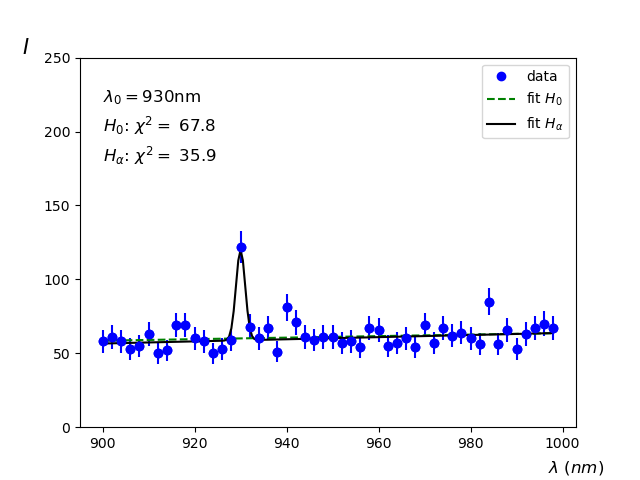
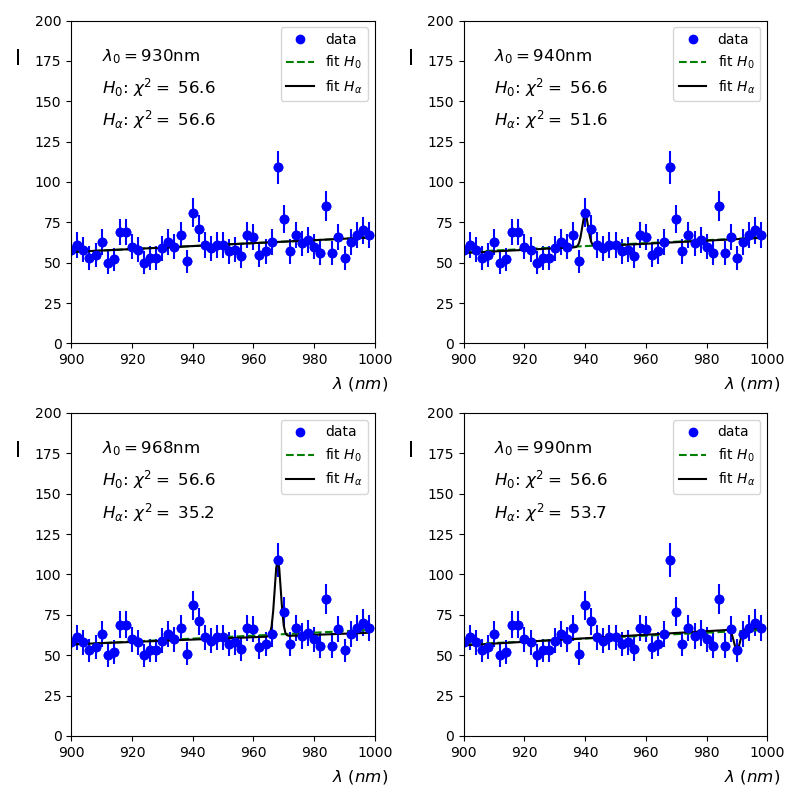
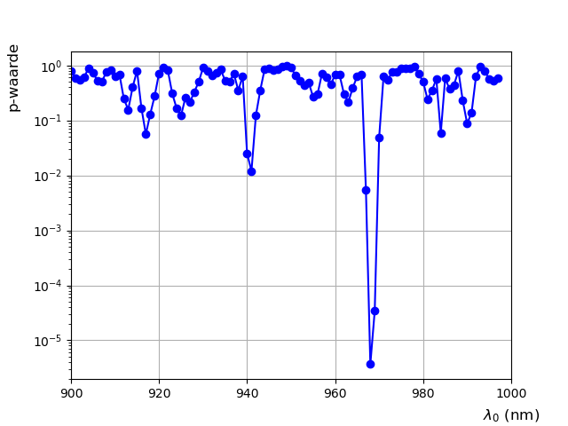

# Hypothese toetsen II
<!--REF\label{/module-4/hypothese-toetsen-2}-->

1. Ordered TOC
{:toc}

In module 3 hebben we uitgelegd hoe het toetsen van een hypothese in zijn werk gaat. We hebben gezien dat er vier belangrijke stappen zijn. Eerst stellen we de hypothese op die we willen toetsen en ook de nulhypothese. Vervolgens is het belangrijk om een statistiek te vinden die gevoelig is voor de stelling. Met andere woorden, een statistiek waarmee we de hypothese kunnen toetsen. We kiezen vervolgens een significantieniveau ($$p$$-waarde) waarbij we $$H_0$$ of $$H_\alpha$$ kunnen verwerpen. Daarna meten we de p-waarde met behulp van een meting en bekijken we of we de $$H_0$$ stelling kunnen verwerpen. We hebben ook gezien wat de $$z$$-score betekent. 

In dit hoofdstuk leggen we nu een bijzondere vorm van hypothese toetsen uit waarbij we gebruik maken van de kleinste kwadraten methode en de daarbij berekende $$\chi^2$$. 

## De Wald test
De Wald test is een bijzondere test die kan worden gebruikt om met behulp van de kleinste kwadraten methode een hypothese te toetsen. 

We definiëren twee functies. De eerste functie, $$f_0$$, beschrijft de dataset onder de hypothese $$H_0$$, de tweede functie, $$f_\alpha$$, beschrijft de dataset onder de alternatieve hypothese $$H_\alpha$$. Vervolgens fitten we beide functies aan een gemeten dataset. Het verschil in de geminimaliseerde $$\chi^2$$ voor beide functies definiëren we als 

$$\Delta \chi^2 = \chi^2_0 - \chi^2_\alpha.$$ 

Dit chi-kwadraat verschil ($$\Delta \chi^2$$)  gebruiken we vervolgens om een p-waarde te berekenen, met behulp van een opzoektabel, en de hypothese toets uit te voeren. 

Bij de Wald test gelden strikte voorwaardes voor het opstellen van de twee functies. De functies mogen slechts in één vrije parameter verschillen, verder moeten ze geheel identiek zijn. De $$H_0$$ hypothese wordt hierbij beschreven met het *minste* aantal vrije parameters. Alle parameters die $$H_0$$ kent, kent $$H_\alpha$$ ook.

> **Voorbeeld: Opstellen functies** Als de nulhypothese wordt beschreven door een functie $$f_0(x;a,b)$$ dan wordt de alternatieve hypothese beschreven door een functie $$f_\alpha(x;a,b,c)$$ waarbij de parameters $$a$$ en $$b$$ identiek zijn en ook de relatie tussen $$x$$ en deze twee parameters gelijk is. 

Als aan de bovengenoemde voorwaarde wordt voldaan dan wordt de $$\Delta \chi^2$$ beschreven door een $$\chi^2$$ functie met vrijheidsgraad $$n=1$$. En zoals we in module 3 hebben beschreven is de $$\chi^2$$ zelf een kansdichtheidsverdeling. We kunnen in dat geval de bepaalde $$\Delta \chi^2$$ direct omrekenen naar een waarschijnlijkheid, en deze is gelijk aan de p-waarde van de hypothese toets.

> **Voorbeeld: Wald test** Stel dat we met behulp van spectroscopie willen onderzoeken of een chemisch element $$X$$ aanwezig is in een sample. Als het chemische element $$X$$ aanwezig is dan verwachten we een verhoogde intensiteit te zien bij de emissielijn van het specifieke element. We verwachten ook een achtergrondspectrum te zien. Dat wil zeggen we meten over alle golflengtes normaal gesproken een bepaalde intensiteit, ook zonder dat het chemische element aanwezig is. We kunnen nu de twee functies opstellen, één die het  achtergrondspectrum beschrijft ($$I_0$$) en één die de emissielijn beschrijft ($$I_\alpha$$). 
> 
> Stel dat de achtergrond een lineaire functie volgt  
> 
> $$ I_0(\lambda;a,b) = a+ b\cdot \lambda.$$   
> Waarbij $$\lambda$$ de golflengte is. 
> De emissielijn van $$X$$, verwachten we rond 930 nm en de resolutie van de spectroscoop is 1 nm. De intensiteit van de emissielijn wordt dan beschreven door: 
>  
> $$ I_\alpha(\lambda;J,\lambda_0, \sigma) = J \cdot \frac{1}{\sigma \sqrt{2 \pi}} e^{-\frac{1}{2}\left(\frac{\lambda - \lambda_0}{\sigma}\right)^2}.$$ 
>  
> We zien dat er in de functie die de emissielijn beschrijft precies één vrije parameter is, namelijk  $$J$$ die de  intensiteit van de signaalpiek beschrijft. De andere parameters $$\lambda_0$$ en $$\sigma$$ zijn bekend en worden in de fit dus niet vrijgelaten.
>   
> De functie $$f_0$$ wordt in dit geval gelijkgesteld aan de functie die de verwachte intensiteit van de achtergrond (of nulhypothese) beschrijft: $$f_0= I_0$$. De vrije parameters in deze fit zijn $$a$$ en $$b$$.  
> 
> De functie $$f_\alpha$$ die de alternatieve hypothese beschrijft is nu gelijk aan de verwachte achtergrond, plus de eventuele aanwezige emissielijn van het element $$X$$ (het signaal): $$f_\alpha = I_0 + I_\alpha$$. De vrije parameters in deze fit zijn $$a,b$$ en $$J$$. Er is dus maar één parameter verschillend ten opzichte van $$f_0$$ en we voldoen dus aan het criterium van de Wald methode.  
> 
> We spreken af dat we de nulhypothese mogen verwerpen als de p-waarde kleiner is dan $$1 \cdot 10^{-6}.$$
>   
>   
> We voeren nu ons experiment uit en fitten de dataset met de functie $$f_0$$ en met de functie $$f_\alpha$$. Het verschil in de geoptimaliseerde $$\chi^2$$'s voor de nul- en de alternatieve hypothese is gelijk aan $$\Delta \chi^2 = \chi^2_0 - \chi^2_\alpha$$. 
>
> {:width="60%"}
>   
> In de grafiek <!--FIG in figuur \ref{fig:Spectrum}--> zien we een duidelijk piekje rond 930 nm, precies waar we het signaal van het chemische element $$X$$ door $$H_\alpha$$ voorspeld is. De fit resultaten van beide hypotheses zijn in het plaatje weergegeven. Met het verschil in $$\chi^2$$ kunnen we nu een p-waarde uitrekenen. In dit geval is die gelijk aan $$1.6\cdot 10^{-8}$$. Het is dus uitermate waarschijnlijk dat we het chemische element $$X$$ hebben aangetoond in de spectraalanalyse.

De berekende p-waarde wordt vaak weer omgerekend in een $$z$$-score. De reden waarom dit gedaan wordt is omdat de waardes van de $$z$$-score over het algemeen wat makkelijker liggen. Het is zeg maar een handigere manier om een kans uit te drukken. In het voorbeeld hierboven komt de kans van $$1.6\cdot 10^{-8}$$ overeen met een $$z$$-score van 5.5. Ga maar na, het laatste spreekt een stuk makkelijker uit. 

In het voorbeeld hierboven hebben we een nulhypothese (waarbij alleen een achtergrondspectrum aanwezig is) vergeleken met alternatieve hypothese waarbij een element $$X$$ bestaat en we de emissielijn meten in het spectrum. We hebben een kans gevonden (de p-waarde) van $$1.6\cdot 10^{-8}$$ dat de geobserveerde dataset past bij de nulhypothese. Dit is een uitermate kleine kans en omdat deze kleiner is dan het vooraf afgesproken significantieniveau mogen we de nulhypothese verwerpen. 

## p-Waarde scan

In het voorbeeld hierboven is er een duidelijke stelling over de golflengte van de emissielijn van het element $$X$$, namelijk $$\lambda_0= 930$$ nm. Stel nu dat dat niet zo is, dat we niet weten bij welke golflengte we de emissielijn zouden waarnemen. In dat geval zouden we een extra vrije parameter hebben in de functie die $$H_\alpha$$ beschrijft. Omdat we dan meer dan 1 vrije parameter hebben kunnen we de Wald methode niet toepassen. Wat we in dat geval wèl kunnen doen is een zogeheten p-waarde scan uitvoeren. We fixeren dan telkens de waarde van de golflengte van de emissielijn en berekenen voor elk van deze golflengtes de p-waarde. Als er een emissielijn aanwezig is die sterk genoeg is zullen we op die locatie een dip zien in de p-waarde. 

We moeten ook bij deze toets van tevoren bepalen bij welke p-waarde we de nulhypothese verwerpen.

> **Voorbeeld: p-waarde scan** 
> Nu voeren we een vergelijkbaar experiment uit met een spectrometer en is er een deeltje Y dat we wellicht kunnen waarnemen. Echter, in dit geval is er geen voorspelde waarde van de golflengte $$\lambda_0$$, ook kennen we de verwachte intensiteit niet. We kunnen de Wald test hierdoor niet zomaar uitvoeren. Immers moeten we precies één vrije parameter extra fitten in de $$H_\alpha$$ hypothese ten opzichte van de $$H_0$$ hypothese, en we zouden nu zowel $$J$$ als $$\lambda_0$$ moeten fitten. 
> 
> De oplossing vinden we door één van de parameters te fixeren, deze houden we constant. We kunnen dan de p-waarde scannen als functie van de gefixeerde parameter. In het voorbeeld hier scannen we over de golflengte $$\lambda_0$$. Voor elke gekozen (en gefixeerde) waarde van $$\lambda_0$$ kunnen we de Wald test uitvoeren en de p-waarde berekenen. Door steeds een andere waarde van $$\lambda_0$$ te kiezen en de berekeningen van de Wald test te herhalen, kunnen we langzaam over het gemeten spectrum scannen.
> 
> We laten de fit nu voor vier waardes van $$\lambda_0$$ <!--FIG in figuur \ref{fig:SpectrumFits}--> zien. Voor elke waarde van $$\lambda_0$$ fitten we nu de twee functies waarbij we er even van uitgaan dat de spectraallijn van element Y zich precies daar bevindt. 
>   
> {:width="80%"}  
> 
> We zien voor de fit met waarde $$\lambda_0 = 930~\text{nm}$$ dat de $$\Delta \chi^2$$ gelijk is aan 0. Maar als we goed kijken in het plaatje zien we ook geen enkel piekje bij $$\lambda=930~\text{nm}$$. Bij de waardes van $$\lambda = 940$$ en $$980~\text{nm}$$ zien we wel een klein piekje. Maar vooral bij de waarde van $$\lambda = 968~\text{nm}$$ is een grote piek te vinden. 
>  
> Als we alle p-waardes van de scan (maar dan over alle waardes van $$\lambda_0$$) nu grafisch weergeven dan krijgen we het volgende resultaat<!--FIG zie figuur \ref{fig:Emissiescan}-->.  
> 
> {:width="60%"}  
> 
> Je ziet nu dat er op een aantal plekken in het spectrum een kleine afwijking van de $$H_0$$ hypothese te zien is. Deze komen allemaal overeen met golflengtes waar op het oog een piekje zichtbaar lijkt. Op slechts één locatie is er een heel duidelijke afwijking zichtbaar, precies bij 968 nm. De $$\Delta \chi^2$$ is op dat punt 21.4  en dit kunnen we omrekenen naar een p-waarde van $$3.7 \cdot 10^{-6}.$$
> 

Eigenlijk hadden  we van tevoren ook bij dit experiment een significantieniveau moeten afspreken waarbij we de aanwezigheid van het chemische element kunnen aantonen. Zodra de gemeten p-waarde onder deze afgesproken significantie zakt in de p-waarde scan kunnen we claimen het element te hebben aangetoond. Als we hem weer bij een waarde van $$1 \cdot 10^{-6}$$ hadden afgesproken hadden we ook in de p-waarde scan het element $$Y$$ kunnen claimen. 

De Wald test is een krachtige methode om hypotheses te toetsen. We gaan hem in opdracht M4.1 toepassen. 