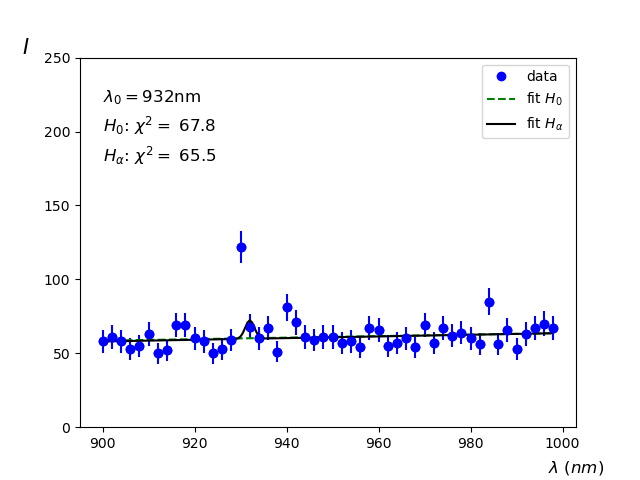

1. Ordered TOC
{:toc}

# Interpreteren van $$\chi^2$$

We hebben in module 3 gezien hoe we met behulp van de kleinste-kwadraten methode een $$\chi^2$$ kunnen minimaliseren. Hierbij gaan we ervan uit dat we een functie $$f$$ hebben gedefinieerd die één of meerdere vrije parameters heeft. De beste waarde voor de parameter(s) vinden we via het optimaliseren van de $$\chi^2$$. 

We gaan in deze module bekijken hoe we de geminimaliseerde $$\chi^2$$ kunnen inzetten om: 

1. te bekijken welke functie een dataset beter beschrijft. Dit doen we met behulp van de Akaike Informatie Criterium.

2. hypotheses te toetsen. Hiervoor maken we gebruik van de Wald test.

## Akaike Informatie Criterium
Stel dat je een dataset hebt waarvan je niet zeker weet door welke functie deze wordt beschreven. Je probeert twee functies uit, $$f_1$$ en $$f_2$$. En je minimaliseert voor beide functies de $$\chi^2$$, deze zijn dan $$\chi^2_1$$ en $$\chi^2_2$$. Als algemene vuistvuistregelregel geldt dat degene met de kleinste $$\chi^2$$ per vrijheidsgraad de beste is. Als in dat geval de betreffende $$\chi^2$$ dicht bij 1 ligt werkt deze vuistregel goed. Als deze echter veel kleiner is dan 1 dan kun je betwijfelen of de bijbehorende functie wel echt de beste is. 

> **Voorbeeld 2** Stel dat we een dataset hebben met 10 gemeten waardes. We proberen twee functies uit:  
> $$f_1(x;a,b) = a\cdot x +b$$ en $$f_2(x;a) = a\cdot x$$ 
> Als geminimaliseerde $$\chi^2$$ voor de twee functies vinden we: $$\chi^2_1 = 4.0$$ en $$\chi^2_2 = 13.0$$.  
> De $$\chi^2$$ per vrijheidsgraad is voor de twee functies:  
> $$\chi^2_1/\text{vrijheidsgraad} = 4.0/(10-2) = 0.5$$ en  
> $$\chi^2_2/\text{vrijheidsgraad} = 13.0/(10-1) = 1.44$$. 
> Op basis van de vuistregel zou je functie $$f_1$$ kiezen. 

> **Voorbeeld 2** Stel dat we een dataset hebben met 10 gemeten waardes. We proberen twee functies uit:  
> $$f_1(x;a,b) = a\cdot x +b$$ en $$f_2(x;a) = a\cdot x$$ 
> Als geminimaliseerde $$\chi^2$$ voor de twee functies vinden we: $$\chi^2_1 = 6.0$$ en $$\chi^2_2 = 9.0$$.  
> De $$\chi^2$$ per vrijheidsgraad is voor de twee functies:  
> $$\chi^2_1/\text{vrijheidsgraad} = 6.0/(10-2) = 0.75$$ en  
> $$\chi^2_2/\text{vrijheidsgraad} = 9.0/(10-1) = 1.0$$. 
> Op basis van de vuistregel zou je functie $$f_1$$ kiezen. 

Beter is om dan het Akaike Informatie Criterium kun je gebruiken om uit te vinden welke functie het beste aan een dataset fit. Stel dat je een dataset hebt waarbij je $$N$$ meetwaardes hebt die je beschreven hebt met een functie met $$p$$ vrije parameters met een geminimaliseerde $$\chi^2$$. Dan heeft het Akaike Informatie Criterium de volgende waarde: 

$${\displaystyle AIC  = \chi^2 + 2p + \frac{2p(p+1)}{N-p-1}.}$$

Als we deze $$AIC$$ berekenen voor beide functies dan is de functie met de laagste $$AIC$$ de meest optimale.

> **Voorbeeld 1** Stel dat we een dataset hebben met 10 gemeten waardes. We proberen twee functies uit:  
> $$f_1(x;a,b) = a\cdot x +b$$ en $$f_2(x;a) = a\cdot x$$ 
> Als geminimaliseerde $$\chi^2$$ voor de twee functies vinden we: $$\chi^2_1 = 4.0$$ en $$\chi^2_2 = 13.0$$.  
> De AIC waarde voor de twee functies zijn nu:  
> $$AIC_1 = 4.0 + 4 + 12/7 = 9.7 $$ 
> $$AIC_2 = 13.0 + 2 + 4/8 = 15.5 $$ 
> Op basis van het Akaike Informatie criterium zou je functie $$f_1$$ kiezen. 

> **Voorbeeld 2** Stel dat we een dataset hebben met 10 gemeten waardes. We proberen twee functies uit:  
> $$f_1(x;a,b) = a\cdot x +b$$ en $$f_2(x;a) = a\cdot x$$ 
> Als geminimaliseerde $$\chi^2$$ voor de twee functies vinden we: $$\chi^2_1 = 6.0$$ en $$\chi^2_2 = 9.0$$.  
> De $$\chi^2$$ per vrijheidsgraad is voor de twee functies:  
> $$AIC_1 = 6.0 + 4 + 12/7 = 11.8 $$ 
> $$AIC_2 = 9.0 + 2 + 4/8 = 11.5 $$ 
> Op basis van de vuistregel zou je functie $$f_2$$ kiezen. 

## Wald test
De Wald test is een bijzondere test die kan worden gebruikt om met behulp van de kleinste kwadraten methode een hypothese te toetsen. 

Het idee is om aan een set meetwaardes twee functies te fitten. De eerste functie, $$f_0$$, beschrijft de dataset onder de hypothese $$H_0$$, de tweede functie, $$f_1$$, beschrijft de dataset onder de alternatieve hypothese $$H_1$$. Het verschil in de geminimaliseerde $$\chi^2$$ voor beide  functies wordt gedefinieerd als $$\Delta \chi^2 = \chi^2_1 - \chi^2_2$$. Deze $$\Delta \chi^2$$ kan direct worden gebruikt om een p-waarde te berekenen. 

Er zijn hierbij strikte voorwaardes voor het opstellen van de twee functies. De functies mogen slechts in 1 parameter verschillen, verder moeten ze geheel identiek zijn. De $$H_0$$ hypothese wordt hierbij beschreven met het *minste* aantal vrije parameters. 

> **Voorbeeld** Als de nulhypothese wordt beschreven door een functie $$f_0(x;a,b)$$ dan wordt de alternatieve hypothese beschreven door een functie $$f_1(x;a,b,c)$$ waarde de parameters $$a$$ en $$b$$ identiek zijn en ook de relatie tussen $$x$$ en deze twee parameters gelijk is. 

Alleen als aan de bovengenoemde voorwaarde wordt voldaan dan wordt de $$\Delta \chi^2$$ beschreven door een $$\chi^2$$ functie met vrijheidsgraad $$n=1$$. En zoals we in module 3 hebben beschreven is de $$\chi^2$$ zelf een kansdichtheidsverdeling. We kunnen in dat geval de $$\Delta \chi^2$$ direct omrekenen naar een waarschijnlijkheid en deze is gelijk aan de p-waarde.

> **Voorbeeld Wald test** Stel dat we een chemisch element willen traceren en gebruik maken van een spectroscopie. Als het chemische element $$X$$ aanwezig is dan verwachten we een verhoogde intensiteit te zien bij de golflengte van de emissielijn van het specifieke element. We verwachten ook een achtergrond te zien. Dat wil zeggen we meten over alle golflengtes normaal gesproken een bepaalde intensiteit, ook zonder dat het chemische element aanwezig is. We kunnen nu de twee functies opstellen. Stel dat de achtergrond een lineaire functie volgt:  
> $$ I_0(\lambda;a,b) = a+ b\cdot \lambda$$ 
> Waarbij $$\lambda$$ de golflengte is.  
> De emissielijn van $$X$$, verwachten we rond 930nm en de resolutie van de spectroscoop is 1nm deze wordt dan beschreven door:  
> $$ I_1(\lambda;J,\mu=930nm,\sigma=1nm) = J \cdot \frac{1}{1nm \sqrt{2 \pi}} e^{-\frac{1}{2}(\frac{\lambda - 930nm}{1nm})^2}$$ 
> We zien dat in principe er geen vrije parameters zijn in deze fit, behalve een schaalfactor $$J$$ die de hoeveelheid intensiteit van het signaal schaalt.  
> De functie $$f_0$$ wordt in dit geval gelijk gesteld aan de functie die de achtergrond (of nulhypothese) beschrijft: $$f_0= I_0$$. De vrije parameters in deze fit zijn $$a$$ en $$b$$.  
> De functie $$f_1$$ die de alternatieve hypothese beschrijft is nu gelijk aan de achtergrond, plus het signaal: $$f_1 = I_0 + I_1$$. De vrije parameters in deze fit zijn $$a,b$$ en $$J$$. We voldoen dus aan het criterium van de Wald methode.  
> Het verschil in de geoptimaliseerde $$\chi^2$$'s voor de nul- en de alternatieve hypothese is gelijk aan $$\Delta \chi^2 = \chi^2_0 - \chi^2_1$$. 
> We gaan even naar de data kijken. We hebben het spectrum waargenomen dat hieronder wordt getoond.  
> 
>
> In de grafiek zien we een duidelijk piekje rond 930nm, precies waar we het signaal van het chemische element $$X$$ door $$H_1$$ voorspeld is. De fit resultaten van beide hypotheses zijn in het plaatje weergegeven. Met het verschil in $$\chi^2$$ kunnen we nu een p-waarde uitrekenen. Die is in dit geval gelijk aan $$1.62\cdot 10^{-8}$$ dit komt overeen met een z-score van 5.52. Het is dus uitermate waarschijnlijk dat we het chemische element $$X$$ hebben aangetoond in de spectraal analyse.

In het voorbeeld hierboven is er een duidelijk stelling over de golflengte van de emissielijn van het element $$X$$. Stel nu dat dat niet zo is, dan zouden we een extra vrije parameter hebben in de functie die $$H_1$$ beschrijft. In dat geval kunnen we de Wald methode niet toepassen. Wat we in dat geval wèl kunnen doen is een zogeheten p-waarde scan uitvoeren. We variëren dan telkens de waarde van de golflengte van de emissielijn en berekenen voor elk van deze golflengtes de p-waarde. Als er een emissielijn aanwezig is die sterk genoeg is zullen we op die locatie een dip zien in de p-waarde. 

> **Voorbeeld p-waarde scan** Hieronder zie je de spectraalfit waarbij we het spectrum hebben gefit met een centrale waarde van de spectraallijn op 932nm. Zoals je ziet is de waarde voor $$J$$ die de intensiteit van een eventuele emissielijn op 932nm beschrijft, erg klein: De gefitte functie voor $$H_1$$ wijkt nauwelijks af van de functie die de $$H_0$$ hypothese beschrijft. De berekende p-waarde zal voor deze golflengte dan ook klein zijn. 5 
> 
> Als we alle p-waardes van de scan nu grafisch weergeven dan krijgen we onderstaand resultaat.
>  
> Je zit nu dat er op een aantal plekken in het spectrum een kleine afwijking van de $$H_0$$ hypothese te zien is. Op slecht 1 locatie is er een heel duidelijke afwijking zichtbaar. Precies bij 930nm.

