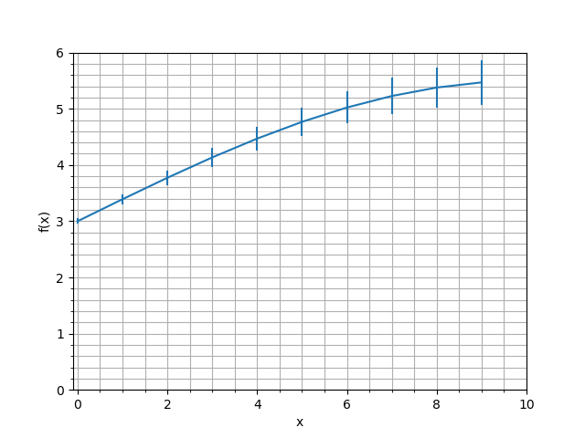

#Oefenopgaves als voorbereiding voor tussentoets 1

Lees goed het (lijstje)[/tussentoets-1/inhoud] door ter voorbereiding voor de tussentoets. Niet voor alle element op het lijstje zijn oefenopgaves.

**1** De leeftijdsverdeling van een groep studenten is: 

18.3 19.7 20.4 19.2 18.7 19.4 17.6 20.6 18.5 20.2

**a**  Bereken het gemiddelde, de mediaan, de standaard deviatie en de variantie. 
**b** De docent van de groep is 44.5 jaar oud. Bereken nu het gemiddelde, de standaard deviatie en de variantie waarbij je de leeftijd van de docent ook meeneemt.  

**2** Lees in de onderstaande grafiek het punt voor x=6 af en noteer het resultaat met de wetenschappelijke notatie. 

**3** Een bepaald soort knikkers heeft een gemiddelde diameter van 1.4 cm met een variantie van 0.2 cm$$^2$$. We willen de gemiddelde diameter bepalen en meten hiervoor de diameter van een enkele knikker op en vinden 1.5 cm. Wat is de fout op deze meting en wat is de onzekerheid?  

**4** We trekken kaarten uit een kaartendek. 
**a** Als we 1 kaart trekken, wat is dan de kans dat we een hartenkaart trekken? 
**b** Als we 1 kaart trekken, wat is dan de kans dat we een hartenkaart of een schoppenkaart pakken? 

**5** We hebben een zak met gekleurde snoepjes met een tekst erop. Er zijn 6 blauwe snoepjes en 4 rode. Er bestaan drie teksten: "Joepie", "Hoera!" en "Gefeliciteerd". De kans verdeling onder de rode snoepjes is P(Joepie) = 0.5 en P(Hoera) = 0.5. Er zijn geen rode snoepjes met gefeliciteerd.  
**a** Als je een snoepje uit de zak pakt, wat is de kans dat je een rood snoepje pakt? 
**b** Als je een snoepje uit de zak pakt, wat is dan de kans dat je een rood snoepje pakt met de tekst Gefeliciteerd? 

**6** Uit een experiment zijn 3 uitkomsten mogelijk voor de gedefinieerde stochast X: {0,1,2}. De kans op uitkomst 0 is: P(0)= 0.56. De kans op uitkomst 2 is P(2) = 0.34. 
**a** Wat is de uitkomstenverzameling van X? 
**b** Wat is de kans op uitkomst P(1)? 

**7** We definiëren een stochast, $$x$$, als de waarde van de worp van een eerlijke dobbelsteen. Wat is de verwachtingswaarde van deze stochast?  

**8** We hebben een plankje. Aan een kant van het plankje zetten we een 1, aan de andere kant een 2. We laten het plankje 1000 keer vallen van steeds dezelfde hoogte en we houden bij welke kant boven ligt als het plankje gevallen is. Van de 1000 keer ligt nummer 1 slechts 327 keer boven. Geef de uitkomst *kansen* grafisch weer. 

**9** Je gooit 10 keer met een dobbelsteen.  
**a** Wat is de kans dat je precies 6 keer een 6 gooit?  
**b** Wat is de kans dat je precies 1 keer een 6 gooit? 
**c** Wat is de kans dat je minder dan 3 keer een 6 gooit? 

**10** Een raketschild houdt 99% van de raketten tegen.  
**a** Als de tegenstander 20 raketten worden afgevuurd, wat is dan de kans dat het raketschild alle 20 tegen houdt?  
**b** Als er 50 raketten worden afgevuurd door de tegenstander, hoeveel raketten worden er dan gemiddeld tegengehouden?  

**11** In een bel centrum komen gemiddeld 100 telefoontjes per dag.  
**a** Wat is de verwachte onzekerheid op het aantal telefoontjes per dag? 
**b** Als er op een dag 70 telefoontjes binnenkomen. Is dat gek? 

**12** In een stad gebeuren jaarlijks 1020 ongelukken. Het afgelopen jaar zijn er maar 900 ongelukken geweest. De authoriteiten claimen dat dit komt door nieuwe regels in het verkeer.  
**a** Denk je dat deze verklaring klopt? 
**b** Als de getallen tien keer zo klein zouden zijn (102 en 90), zou je denken dat de verklaring dan nog klopt? 

**13** We verwachten op een dag gemiddeld 4.3 poststukken bij een klein bedrijf.  
**a** Op een dag komen er wel 7 binnen. Reken de kans uit dat dit gebeurt.  
**b** Reken de kans uit dat er 0 binnenkomen.  
